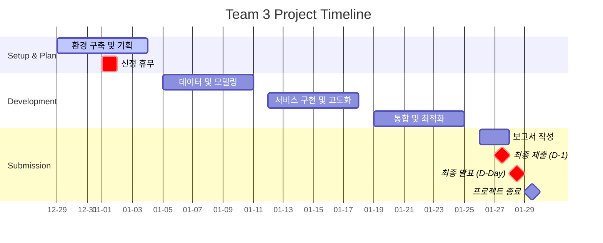
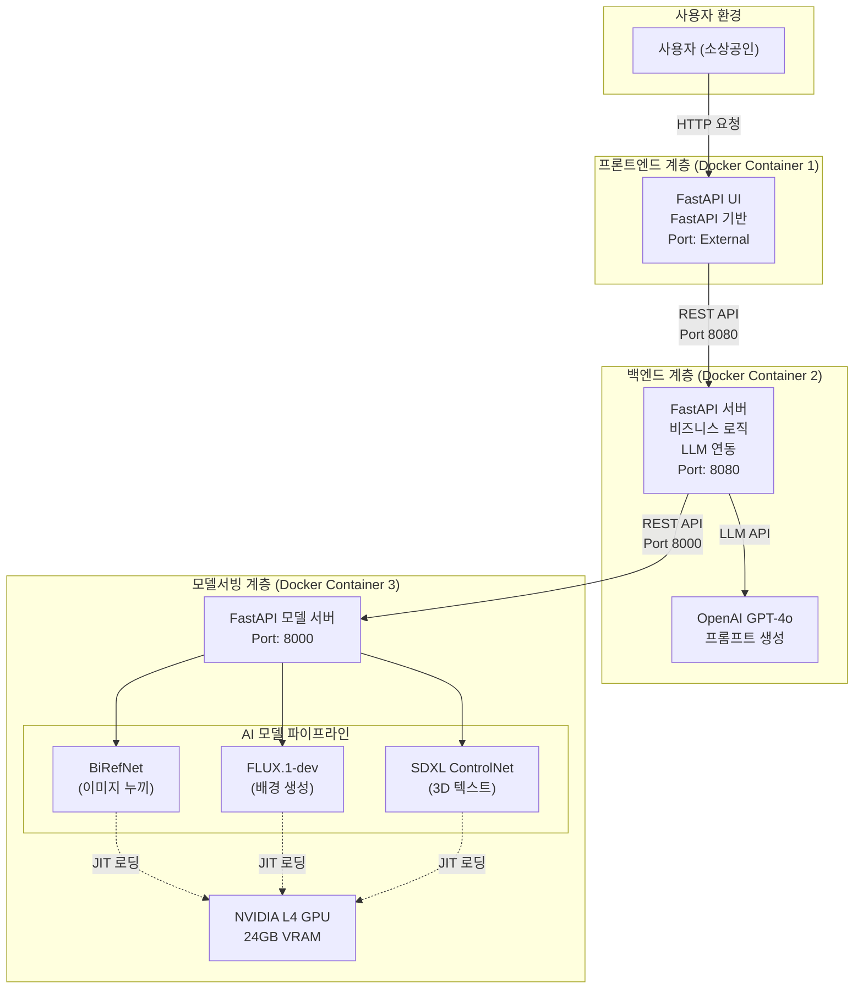
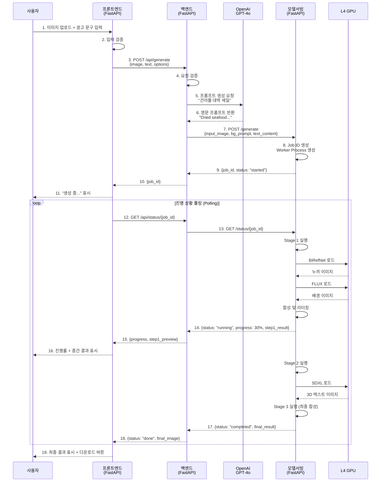

# Codeit AI 3팀 - 생성형 AI 기반 소상공인을 위한 광고 콘텐츠 제작 서비스 


---

## 프로젝트 개요
- 본 프로젝트의 목표는 **생성형 AI 기술을 활용하여 소상공인이 광고 콘텐츠를 손쉽게 제작할 수 있도록 서비스를 개발**하는 것입니다.
- 디자인 역량이나 전문 도구 없이도 **제품 이미지, 배너, 상세 페이지용 시각 자료, 메뉴판 이미지, 광고 문구** 같은 콘텐츠를 자동으로 생성하는 서비스를 구현합니다.
- 따라서 오프라인 중심의 사업자들이 온라인 마케팅에 쉽게 진입할 수 있도록 하는 것이 서비스의 목표입니다.
- **특화 타겟**: 전통시장 소상공인 (1차 특화: 건어물 상품)
- **기술 방향**: 이미지 기반 광고 제작 (영상 제외), 확장 가능한 설계 구조

---

## 프로젝트 기간
2025년 12월 29일 ~ 2026년 1월 28일
- 1차 목표: 2026년 1월 15일 (Hugging Face 모델 조합 서비스 구현)
- 2차 목표: 여유 시 모델 양자화 및 최적화
- 최종 제출: 2026년 1월 27일 19:00

---

## 팀 구성 및 역할

- 김명환: 아키텍처 설계 및 파이프라인 구성 (API, 데이터 포맷, 모델 서버), 모델 관리 서버 설계
- 김민혁: 텍스트 생성 및 조합 모델 개발
- 박지윤: PM (프로젝트 관리 및 일정 조율)
- 이건희: 백엔드 개발 (LLM 연동), 프론트엔드 개발, Google Cloud VM 서버 구성
- 이슬형: 이미지 특성 추출 및 이미지 생성

## 협업일지

팀원별 개발 과정 및 학습 내용을 기록한 협업일지입니다.
- [김명환 협업일지]({{- site.baseurl -}}/협업일지/김명환/)
- [김민혁 협업일지]({{- site.baseurl -}}/협업일지/김민혁/)
- [박지윤 협업일지]({{- site.baseurl -}}/협업일지/박지윤/)
- [이건희 협업일지]({{- site.baseurl -}}/협업일지/이건희/)
- [이슬형 협업일지]({{- site.baseurl -}}/협업일지/이슬형/)

- [팀 회의록]({{- site.baseurl -}}/회의록/)

---

## 프로젝트 기간
**2025.12.29(월) ~ 2026.01.28(수)**

- **1차 목표**: 2026.01.15 - Hugging Face 모델 조합 서비스 구현
- **2차 목표**: 여유 시 모델 양자화 및 최적화
- **최종 제출**: 2026.01.27 19:00
- **최종 발표**: 2026.01.28

**주요 마일스톤:**
- 12.29: 프로젝트 킥오프, 역할 분담, 벤치마킹 (Gemini Veo2 나노바나나)
- 12.30: GCP VM 환경 구축 (IP: 34.44.205.198)
- 01.15: 1차 MVP 완성 (이미지 기반 광고 생성)
- 01.27: 최종 제출 및 발표 자료 완성

**프로젝트 일정:**



**구조도 (High-Level Architecture)**



**시퀀스 다이어그램**



---

## 기술 스택
- Frontend: FastAPI
- Backend: FastAPI (선택), LLM 연동
- Model: HuggingFace (Stable Diffusion 계열), OpenAI API (프롬프트 엔지니어링)
- **MCP Server**: FastMCP (Model Context Protocol) - AI 서버 제어용 도구 인터페이스
- Infra: GCP VM (L4 GPU, 34.44.205.198, us-central1)
- Storage: OS 20GB + 데이터 200GB (바인드 마운트)
- Collaboration: GitHub, Discord, Notion

---

## MCP 서버 (nanoCocoa_mcpserver)

### 개요

nanoCocoa_mcpserver는 **FastMCP 표준**을 준수하여 개발된 Model Context Protocol 서버입니다.
nanoCocoa_aiserver REST API를 MCP 프로토콜로 브릿지하여, Claude Desktop/Code 등의 LLM 클라이언트에서 자연어로 광고 이미지를 생성할 수 있도록 합니다.

**아키텍처**:
```
Claude Desktop/Code (사용자)
    ↕ MCP Protocol (stdio transport)
nanoCocoa_mcpserver (MCP 브릿지)
    ↕ REST API
nanoCocoa_aiserver (AI 서빙 서버)
    ↕ GPU Models
NVIDIA L4 GPU
```

### 주요 기능

MCP 서버는 **8개의 도구(Tools)**를 제공합니다:

1. **`generate_ad_image`** - 전체 파이프라인 실행 (Step 1→2→3)
2. **`check_generation_status`** - 진행 상태 확인
3. **`stop_generation`** - 작업 중단
4. **`list_available_fonts`** - 사용 가능한 폰트 목록 조회
5. **`check_server_health`** - AI 서버 상태 및 시스템 리소스 확인
6. **`generate_background_only`** - Step 1만 실행 (배경 생성)
7. **`generate_text_asset_only`** - Step 2만 실행 (3D 텍스트 생성)
8. **`compose_final_image`** - Step 3만 실행 (최종 합성)

### 설치 및 실행

#### 1. 의존성 설치

```bash
# 프로젝트 루트에서
pip install -e .

# 또는 개발 의존성 포함
pip install -e ".[dev]"
```

#### 2. 환경 변수 설정

`.env` 파일 생성:

```bash
# nanoCocoa_aiserver 연결
AISERVER_BASE_URL=http://localhost:8000
AISERVER_TIMEOUT=600
AISERVER_CONNECT_TIMEOUT=10

# 폴링 설정
STATUS_POLL_INTERVAL=3.0
MAX_POLL_RETRIES=200

# 로깅 (stdio 사용 시 파일로만 출력)
LOG_LEVEL=INFO
```

#### 3. MCP 서버 실행

```bash
# 직접 실행
python -m nanoCocoa_mcpserver.server

# 또는 스크립트 사용 (설치 후)
nanococoa-mcpserver
```

### Claude Desktop 통합

#### macOS 설정

`~/Library/Application Support/Claude/claude_desktop_config.json` 수정:

```json
{
  "mcpServers": {
    "nanococoa-ad-generator": {
      "command": "python",
      "args": ["-m", "nanoCocoa_mcpserver.server"],
      "env": {
        "AISERVER_BASE_URL": "http://localhost:8000"
      }
    }
  }
}
```

#### Linux 설정

`~/.config/Claude/claude_desktop_config.json` 수정:

```json
{
  "mcpServers": {
    "nanococoa-ad-generator": {
      "command": "/home/user/miniconda3/envs/py311_ad/bin/python",
      "args": ["-m", "nanoCocoa_mcpserver.server"],
      "env": {
        "AISERVER_BASE_URL": "http://localhost:8000"
      }
    }
  }
}
```

**주의**: Python 경로는 절대 경로로 지정하세요!

```bash
# Python 경로 확인
which python
# 예: /home/user/miniconda3/envs/py311_ad/bin/python
```

### Claude Code 통합

```bash
# MCP 서버 추가
claude mcp add --transport stdio nanococoa-ad-generator -- python -m nanoCocoa_mcpserver.server

# MCP 서버 목록 확인
claude mcp list

# MCP 서버 제거
claude mcp remove nanococoa-ad-generator
```

### 사용 예시

Claude에게 자연어로 요청:

```
"제품 이미지(product.png)로 '여름 세일' 광고를 만들어줘.
배경은 햇살 가득한 해변으로 하고,
텍스트는 금색 풍선 스타일로 해줘."
```

Claude가 자동으로 `generate_ad_image` 도구를 호출하여 광고를 생성합니다.

### 테스트

#### MCP Inspector로 테스트

```bash
# MCP Inspector 설치 및 실행
npx @modelcontextprotocol/inspector python -m nanoCocoa_mcpserver.server

# 웹 브라우저에서 http://localhost:5173 접속
# 각 도구를 수동으로 테스트 가능
```

#### 단위 테스트 실행

```bash
# 모든 테스트 실행
pytest tests/nanoCocoa_mcpserver/

# 통합 테스트 (AI 서버 필요)
RUN_INTEGRATION_TESTS=true pytest tests/nanoCocoa_mcpserver/test_integration.py
```

### 추가 문서

- **상세 사용 가이드**: [examples/nanoCocoa_mcpserver/fastmcp_usage.md](examples/nanoCocoa_mcpserver/fastmcp_usage.md)
- **API 클라이언트 예제**: [examples/nanoCocoa_mcpserver/basic_usage.py](examples/nanoCocoa_mcpserver/basic_usage.py)
- **단계별 워크플로우**: [examples/nanoCocoa_mcpserver/step_based_workflow.py](examples/nanoCocoa_mcpserver/step_based_workflow.py)

---
