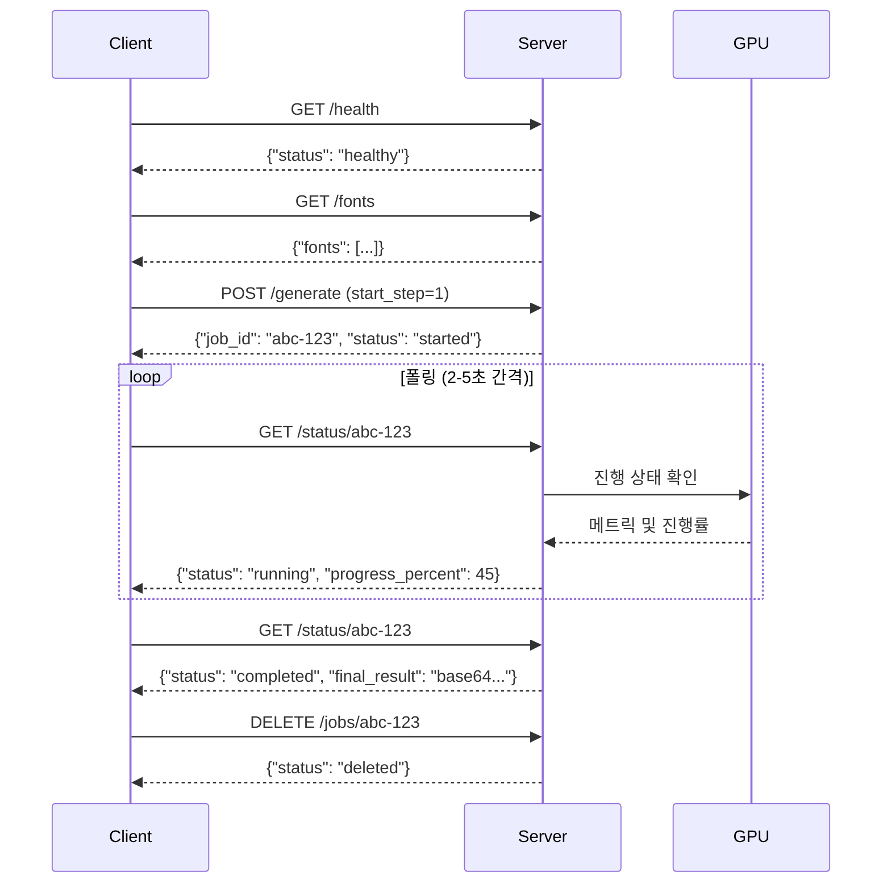

# nanoCocoa AI Server REST API 문서

## 1. 개요

nanoCocoa AI Server는 상품 이미지를 입력받아 배경을 생성하고 3D 텍스트 효과를 합성하여 완성된 광고 이미지를 제작하는 AI 광고 생성 서버입니다.

### 1.1. 서버 정보

- **이름**: L4 Optimized AI Ad Generator
- **버전**: 2.0.0
- **최적화**: Nvidia L4 GPU
- **기술 스택**: FastAPI, BiRefNet, FLUX-schnell, SDXL ControlNet

### 1.2. 주요 특징

- **동시성 제어**: 리소스 과부하 방지를 위해 한 번에 하나의 작업만 처리
- **Step 기반 실행**: 배경 생성 → 텍스트 생성 → 최종 합성을 단계별로 제어
- **중간 결과 재사용**: 각 단계의 결과물을 활용하여 중간부터 재시도 가능

### 1.3. 파이프라인 구조

```
Step 1: 배경 생성 및 합성 (약 80초)
  ├─ Segmentation: 상품 누끼 따기 (BiRefNet)
  ├─ Background Generation: 배경 이미지 생성 (Flux)
  └─ Inpaint Injection: 상품 + 배경 합성 (Flux Inpaint)

Step 2: 3D 텍스트 생성 (약 35초)
  ├─ Text Canvas Preparation: 텍스트 캔버스 생성
  ├─ Canny Edge Detection: 텍스트 윤곽선 추출
  ├─ SDXL Text Generation: 3D 텍스트 생성 (SDXL ControlNet)
  └─ Text Background Removal: 텍스트 배경 제거 (BiRefNet)

Step 3: 최종 합성 (약 5초)
  └─ Intelligent Composition: 배경 + 텍스트 합성
```

## 2. API 엔드포인트

### 2.1. Generation API

#### 2.1.1. POST /generate

**광고 생성 작업 시작**

새로운 생성 파이프라인을 비동기로 시작합니다.

**Request Body**

| 필드 | 타입 | 필수 | 기본값 | 설명 |
|------|------|------|--------|------|
| `start_step` | integer | 선택 | 1 | 시작 단계 (1: 전체, 2: 텍스트부터, 3: 합성만) |
| `text_content` | string \| null | 선택 | null | 광고 텍스트 (null이면 배경만 생성) |
| `product_image` | string | 조건부 | - | 상품 이미지 (Base64, start_step=1일 때 선택) |
| `bg_prompt` | string | start_step=1 | 기본 프롬프트 | 배경 생성 프롬프트 |
| `bg_negative_prompt` | string | 선택 | 기본 네거티브 | 배경 네거티브 프롬프트 |
| `bg_composition_prompt` | string \| null | 선택 | null | 배경 합성 프롬프트 |
| `bg_composition_negative_prompt` | string \| null | 선택 | null | 배경 합성 네거티브 프롬프트 |
| `step1_image` | string | 조건부 | - | Step 1 결과 (Base64, start_step≥2일 때 필수) |
| `text_model_prompt` | string | 선택 | 기본 프롬프트 | 3D 텍스트 스타일 프롬프트 |
| `negative_prompt` | string | 선택 | 기본 네거티브 | 텍스트 네거티브 프롬프트 |
| `font_name` | string \| null | 선택 | null | 폰트 파일 경로 (GET /fonts 참조) |
| `step2_image` | string | 조건부 | - | Step 2 결과 (Base64, start_step=3일 때 필수) |
| `composition_mode` | string | 선택 | "overlay" | 합성 모드 (overlay/blend/behind) |
| `text_position` | string | 선택 | "top" | 텍스트 위치 (top/center/bottom/auto) |
| `composition_prompt` | string \| null | 선택 | null | 합성 커스텀 프롬프트 |
| `composition_negative_prompt` | string \| null | 선택 | null | 합성 네거티브 프롬프트 |
| `composition_strength` | float | 선택 | 0.4 | 합성 변환 강도 (0.0~1.0) |
| `strength` | float | 선택 | 0.6 | Inpaint 강도 (0.0~1.0) |
| `guidance_scale` | float | 선택 | 3.5 | Guidance Scale (0.0~20.0) |
| `num_inference_steps` | integer | 선택 | 4 | Inference Steps (1~50) |

**Response 200 OK**

```json
{
  "job_id": "550e8400-e29b-41d4-a716-446655440000",
  "status": "started"
}
```

**Response 503 Service Unavailable**

```json
{
  "status": "busy",
  "message": "Busy. Retry after 25s",
  "retry_after": 25
}
```

**Headers**: `Retry-After: 25`

**Example Request (전체 파이프라인)**

```bash
curl -X POST "http://localhost:8000/generate" \
  -H "Content-Type: application/json" \
  -d '{
    "start_step": 1,
    "product_image": "iVBORw0KGgoAAAANSUhEUgAA...",
    "bg_prompt": "modern office workspace with natural light and plants",
    "text_content": "New Product",
    "font_name": "NanumSquare/NanumSquareB.ttf",
    "text_model_prompt": "silver metallic 3D text with shadow and reflection"
  }'
```

---

#### 2.1.2. GET /status/{job_id}

**작업 상태 및 결과 조회**

특정 작업의 현재 진행 상황과 중간/최종 결과물을 조회합니다.

**Path Parameters**

| 필드 | 타입 | 필수 | 설명 |
|------|------|------|------|
| `job_id` | string | 필수 | 작업 ID (UUID) |

**Response 200 OK**

```json
{
  "job_id": "550e8400-e29b-41d4-a716-446655440000",
  "status": "running",
  "progress_percent": 45,
  "current_step": "step2_text",
  "sub_step": "sdxl_text_generation",
  "message": "Generating 3D text...",
  "elapsed_sec": 95.3,
  "eta_seconds": 25,
  "step_eta_seconds": 15,
  "system_metrics": {
    "cpu_percent": 45.2,
    "ram_used_gb": 12.5,
    "ram_total_gb": 32.0,
    "ram_percent": 39.1,
    "gpu_info": [
      {
        "index": 0,
        "name": "NVIDIA L4",
        "gpu_util": 85.0,
        "vram_used_gb": 18.5,
        "vram_total_gb": 22.5,
        "vram_percent": 82.2
      }
    ]
  },
  "parameters": {
    "start_step": 1,
    "text_content": "New Product",
    "bg_prompt": "modern office workspace..."
  },
  "step1_result": "iVBORw0KGgoAAAANSUhEUgAA...",
  "step2_result": null,
  "final_result": null
}
```

**Status 값**

- `pending`: 대기 중
- `running`: 실행 중
- `completed`: 완료됨
- `failed`: 실패함
- `stopped`: 사용자가 중단함

**Response 404 Not Found**

```json
{
  "detail": "Job not found"
}
```

---

#### 2.1.3. POST /stop/{job_id}

**작업 강제 중단**

실행 중인 작업을 즉시 중단하고 GPU 리소스를 해제합니다.

**Path Parameters**

| 필드 | 타입 | 필수 | 설명 |
|------|------|------|------|
| `job_id` | string | 필수 | 작업 ID (UUID) |

**Response 200 OK**

```json
{
  "job_id": "550e8400-e29b-41d4-a716-446655440000",
  "status": "stopped"
}
```

**Response 404 Not Found**

```json
{
  "detail": "Job not found"
}
```

---

#### 2.1.4. GET /jobs

**모든 작업 목록 조회**

서버에 존재하는 모든 작업의 목록을 조회합니다.

**Response 200 OK**

```json
{
  "total_jobs": 5,
  "active_jobs": 1,
  "completed_jobs": 3,
  "failed_jobs": 1,
  "jobs": [
    {
      "job_id": "550e8400-e29b-41d4-a716-446655440000",
      "status": "running",
      "progress_percent": 45,
      "current_step": "step2_text",
      "message": "Generating 3D text...",
      "start_time": 1704758400.0
    },
    {
      "job_id": "660e8400-e29b-41d4-a716-446655440001",
      "status": "completed",
      "progress_percent": 100,
      "current_step": "step3_composite",
      "message": "All steps completed",
      "start_time": 1704757200.0
    }
  ]
}
```

---

#### 2.1.5. DELETE /jobs/{job_id}

**작업 삭제**

완료되었거나 실패한 작업을 메모리에서 삭제합니다.

**주의**: 실행 중인 작업은 먼저 `/stop/{job_id}`로 중단해야 합니다.

**Path Parameters**

| 필드 | 타입 | 필수 | 설명 |
|------|------|------|------|
| `job_id` | string | 필수 | 작업 ID (UUID) |

**Response 200 OK**

```json
{
  "job_id": "550e8400-e29b-41d4-a716-446655440000",
  "status": "deleted"
}
```

**Response 400 Bad Request**

```json
{
  "detail": "Cannot delete running job. Stop it first."
}
```

**Response 404 Not Found**

```json
{
  "detail": "Job not found"
}
```

---

### 2.2. Resources API

#### 2.2.1. GET /fonts

**사용 가능한 폰트 목록 조회**

서버의 `fonts` 디렉토리에서 사용 가능한 모든 폰트 목록을 조회합니다.

**Response 200 OK**

```json
{
  "fonts": [
    "NanumGothic/NanumGothic.ttf",
    "NanumGothic/NanumGothicBold.ttf",
    "NanumSquare/NanumSquareB.ttf",
    "NanumSquare/NanumSquareEB.ttf",
    "NanumSquare/NanumSquareL.ttf",
    "NanumSquare/NanumSquareR.ttf"
  ]
}
```

이 목록의 값을 `/generate` 요청의 `font_name` 필드에 입력하여 사용할 수 있습니다.

---

#### 2.2.2. GET /health

**서버 상태 체크**

서버의 현재 상태와 가용성을 확인합니다.

**Response 200 OK**

```json
{
  "status": "healthy",
  "server_time": 1704758400.123,
  "total_jobs": 5,
  "active_jobs": 0,
  "system_metrics": {
    "cpu_percent": 25.5,
    "ram_used_gb": 8.2,
    "ram_total_gb": 32.0,
    "ram_percent": 25.6,
    "gpu_info": [
      {
        "index": 0,
        "name": "NVIDIA L4",
        "gpu_util": 15.0,
        "vram_used_gb": 2.5,
        "vram_total_gb": 22.5,
        "vram_percent": 11.1
      }
    ]
  }
}
```

**Status 값**

- `healthy`: 사용 가능
- `busy`: 작업 실행 중

---

### 2.3. Help & Documentation API

#### 2.3.1. GET /help

**전체 API 사용 가이드**

nanoCocoa AI 광고 생성 서버의 전체 사용 가이드를 제공합니다.

**Response 200 OK**

API 사용법, 워크플로우 예시, Step 시스템 설명, 에러 핸들링, Best Practices 등을 포함한 상세 가이드를 반환합니다.

---

#### 2.3.2. GET /help/parameters

**파라미터 레퍼런스**

POST /generate 엔드포인트의 모든 파라미터에 대한 상세 레퍼런스를 제공합니다.

**Response 200 OK**

각 필드의 역할, 타입, 기본값, 예시를 포함한 상세 파라미터 문서를 반환합니다.

---

## 3. 워크플로우 예시

### 3.1. 기본 워크플로우 (전체 파이프라인)



**Step 1: 서버 상태 확인 (선택사항)**

```bash
curl -X GET "http://localhost:8000/health"
```

**Step 2: 폰트 목록 조회**

```bash
curl -X GET "http://localhost:8000/fonts"
```

**Step 3: 광고 생성 작업 시작**

```bash
curl -X POST "http://localhost:8000/generate" \
  -H "Content-Type: application/json" \
  -d '{
    "start_step": 1,
    "product_image": "<base64_image>",
    "bg_prompt": "modern office with natural lighting",
    "text_content": "New Product",
    "font_name": "NanumSquare/NanumSquareB.ttf"
  }'
```

**Response:**
```json
{
  "job_id": "abc-123",
  "status": "started"
}
```

**Step 4: 작업 진행 상태 폴링 (2-5초 간격)**

```bash
curl -X GET "http://localhost:8000/status/abc-123"
```

**Step 5: 완료 시 결과 다운로드**

`final_result` 필드에서 Base64 이미지를 추출하여 저장합니다.

**Step 6: 작업 정리 (선택사항)**

```bash
curl -X DELETE "http://localhost:8000/jobs/abc-123"
```

---

### 3.2. 텍스트만 다시 생성 (Step 2부터 재시작)

**시나리오**: 배경은 마음에 드는데 텍스트 스타일만 바꾸고 싶을 때

**Step 1: 이전 작업의 step1_result 가져오기**

```bash
curl -X GET "http://localhost:8000/status/previous-job-id"
```

**Step 2: Step 2부터 새 작업 시작**

```bash
curl -X POST "http://localhost:8000/generate" \
  -H "Content-Type: application/json" \
  -d '{
    "start_step": 2,
    "step1_image": "<step1_result_base64>",
    "text_content": "Different Text",
    "text_model_prompt": "gold metallic text with shadow",
    "font_name": "NanumGothic/NanumGothic.ttf"
  }'
```

---

### 3.3. 합성만 다시 하기 (Step 3만 실행)

**시나리오**: 배경과 텍스트는 그대로 두고 합성 방식만 변경

```bash
curl -X POST "http://localhost:8000/generate" \
  -H "Content-Type: application/json" \
  -d '{
    "start_step": 3,
    "step1_image": "<background_base64>",
    "step2_image": "<text_base64>",
    "composition_mode": "blend",
    "text_position": "center"
  }'
```

---

## 4. 에러 핸들링

### 4.1. HTTP 상태 코드

| 코드 | 설명 | 대응 방법 |
|------|------|-----------|
| 200 | 성공 | 정상 처리 |
| 400 | 잘못된 요청 | 파라미터 확인 및 수정 |
| 404 | Job ID 없음 | GET /jobs로 활성 작업 확인 |
| 503 | 서버 사용 중 | Retry-After 헤더의 시간만큼 대기 후 재시도 |

### 4.2. 503 Service Unavailable

다른 작업이 실행 중일 때 반환됩니다.

**Response Headers:**
```
Retry-After: 25
```

**Response Body:**
```json
{
  "status": "busy",
  "message": "Busy. Retry after 25s",
  "retry_after": 25
}
```

**대응 방법**: 헤더의 `Retry-After` 시간만큼 대기 후 재시도

---

### 4.3. Status Failed

작업 실행 중 오류가 발생한 경우 `status` 필드가 `"failed"`로 변경됩니다.

```json
{
  "job_id": "abc-123",
  "status": "failed",
  "message": "CUDA out of memory. Try reducing image size.",
  "error": "RuntimeError: CUDA out of memory..."
}
```

**대응 방법**: `message` 필드의 에러 정보를 확인하고 파라미터를 조정 후 새 작업을 시작합니다.

---

## 5. Best Practices

### 5.1. 폴링 주기

- **권장**: 2-5초 간격
- 너무 짧은 주기는 서버 부하를 증가시킵니다.

### 5.2. 서버 상태 확인

요청 전 `/health` 엔드포인트로 서버 상태를 확인합니다.

```bash
# healthy 상태일 때만 요청
if [ "$(curl -s http://localhost:8000/health | jq -r '.status')" = "healthy" ]; then
  # 작업 시작
  curl -X POST "http://localhost:8000/generate" ...
fi
```

### 5.3. 작업 정리

완료된 작업은 `DELETE /jobs/{job_id}`로 메모리에서 정리합니다.

### 5.4. 중간 결과물 재사용

`step1_result`, `step2_result`를 저장하여 재사용하면 시간과 리소스를 절약할 수 있습니다.

```python
# Step 1 결과 저장
response = requests.get(f"http://localhost:8000/status/{job_id}")
step1_result = response.json()["step1_result"]
with open("step1_result.txt", "w") as f:
    f.write(step1_result)

# Step 2부터 재시작
requests.post("http://localhost:8000/generate", json={
    "start_step": 2,
    "step1_image": step1_result,
    "text_content": "New Text"
})
```

### 5.5. GPU 메모리 모니터링

`/health` 또는 `/status/{job_id}`의 `system_metrics`를 확인하여 GPU 메모리 사용량을 모니터링합니다.

```python
response = requests.get("http://localhost:8000/health")
gpu_info = response.json()["system_metrics"]["gpu_info"][0]
vram_percent = gpu_info["vram_percent"]

if vram_percent > 90:
    print("Warning: GPU memory usage high")
```

---

## 6. 파라미터 상세 설명

### 6.1. start_step (시작 단계)

| 값 | 설명 | 필수 입력 |
|----|------|-----------|
| 1 | 전체 파이프라인 실행 | `product_image` (선택), `bg_prompt` |
| 2 | 텍스트 생성부터 시작 | `step1_image`, `text_content` |
| 3 | 합성만 실행 | `step1_image`, `step2_image` |

---

### 6.2. Prompt 작성 가이드

#### 6.2.1. bg_prompt (배경 프롬프트)

**좋은 예시:**
```
"luxury hotel lobby with warm lighting and marble floor"
"minimalist white studio with soft shadows"
"outdoor garden with flowers and sunlight"
```

**나쁜 예시:**
```
"nice background"
"good looking place"
```

**Tips:**
- 구체적인 장소, 분위기, 조명 포함
- 영문 권장 (한글도 지원하지만 영문이 더 정확)

---

#### 6.2.2. text_model_prompt (텍스트 스타일 프롬프트)

**좋은 예시:**
```
"gold metallic text with glossy surface"
"neon glowing text with pink and blue colors"
"stone carved text with rough texture"
"chrome reflective text with mirror finish"
```

**나쁜 예시:**
```
"nice text"
"3D text"
```

**Tips:**
- 재질, 효과, 색상을 명확히 명시
- "3D render of", "realistic", "cinematic lighting" 등의 키워드 활용

---

### 6.3. composition_mode (합성 모드)

| 모드 | 설명 | 사용 시나리오 |
|------|------|---------------|
| `overlay` | 텍스트를 배경 위에 명확하게 배치 (기본값) | 텍스트가 명확히 보여야 할 때 |
| `blend` | 텍스트를 배경과 자연스럽게 섞어 조화롭게 통합 | 자연스러운 통합이 필요할 때 |
| `behind` | 텍스트를 배경 뒤에 배치하여 깊이감 연출 | 3D 효과가 필요할 때 |

---

### 6.4. text_position (텍스트 위치)

| 위치 | 설명 |
|------|------|
| `top` | 상단 영역 |
| `center` | 중앙 영역 |
| `bottom` | 하단 영역 |
| `auto` | 배경 여백을 자동 감지하여 최적 위치 선정 |

---

### 6.5. 주요 하이퍼파라미터

#### strength (Inpaint 강도)

- **범위**: 0.0 ~ 1.0
- **기본값**: 0.6
- **설명**: 낮을수록 원본 보존, 높을수록 프롬프트 반영
- **권장값**: 
  - 상품 합성: 0.5 ~ 0.7
  - 배경 생성: 0.7 ~ 0.9

#### guidance_scale (Guidance Scale)

- **범위**: 0.0 ~ 20.0
- **기본값**: 3.5
- **설명**: 프롬프트 준수 정도
- **권장값**:
  - Flux: 3.0 ~ 4.0
  - SDXL: 7.0 ~ 10.0

#### num_inference_steps (Inference Steps)

- **범위**: 1 ~ 50
- **기본값**: 4
- **설명**: 샘플링 반복 횟수 (높을수록 품질 향상, 시간 증가)
- **권장값**:
  - Flux-schnell: 4 (빠른 생성에 최적화)
  - SDXL: 20 ~ 30

---

## 7. 추가 리소스

- **Swagger UI**: `http://localhost:8000/docs`
- **ReDoc**: `http://localhost:8000/redoc`
- **OpenAPI Schema**: `http://localhost:8000/openapi.json`
- **개발자 대시보드**: `http://localhost:8000/example_generation`

---

## 8. 클라이언트 예시

### 8.1. Python

```python
import requests
import base64
import time
from pathlib import Path

# 서버 URL
BASE_URL = "http://localhost:8000"

def encode_image(image_path: str) -> str:
    """이미지를 Base64로 인코딩"""
    with open(image_path, "rb") as f:
        return base64.b64encode(f.read()).decode()

def decode_image(base64_str: str, output_path: str):
    """Base64를 이미지로 디코딩"""
    img_data = base64.b64decode(base64_str)
    with open(output_path, "wb") as f:
        f.write(img_data)

def check_health() -> bool:
    """서버 상태 확인"""
    response = requests.get(f"{BASE_URL}/health")
    data = response.json()
    return data["status"] == "healthy"

def get_fonts() -> list:
    """폰트 목록 조회"""
    response = requests.get(f"{BASE_URL}/fonts")
    return response.json()["fonts"]

def generate_ad(input_image_path: str, bg_prompt: str, text_content: str, 
                font_name: str = None) -> str:
    """광고 생성 작업 시작"""
    # 이미지 인코딩
    input_image_b64 = encode_image(input_image_path)
    
    # 요청 데이터
    payload = {
        "start_step": 1,
        "product_image": input_image_b64,
        "bg_prompt": bg_prompt,
        "text_content": text_content,
        "font_name": font_name
    }
    
    # 작업 시작
    response = requests.post(f"{BASE_URL}/generate", json=payload)
    
    if response.status_code == 503:
        retry_after = response.json()["retry_after"]
        raise Exception(f"Server busy. Retry after {retry_after}s")
    
    return response.json()["job_id"]

def poll_status(job_id: str, interval: int = 3) -> dict:
    """작업 상태 폴링"""
    while True:
        response = requests.get(f"{BASE_URL}/status/{job_id}")
        data = response.json()
        
        status = data["status"]
        progress = data["progress_percent"]
        current_step = data["current_step"]
        
        print(f"Status: {status} | Progress: {progress}% | Step: {current_step}")
        
        if status == "completed":
            return data
        elif status == "failed":
            raise Exception(f"Job failed: {data['message']}")
        elif status == "stopped":
            raise Exception("Job stopped by user")
        
        time.sleep(interval)

def main():
    # 1. 서버 상태 확인
    if not check_health():
        print("Server is busy")
        return
    
    # 2. 폰트 목록 조회
    fonts = get_fonts()
    print(f"Available fonts: {len(fonts)}")
    
    # 3. 광고 생성
    job_id = generate_ad(
        input_image_path="product.png",
        bg_prompt="modern office with natural lighting",
        text_content="New Product",
        font_name=fonts[0] if fonts else None
    )
    print(f"Job started: {job_id}")
    
    # 4. 상태 폴링
    result = poll_status(job_id)
    
    # 5. 결과 저장
    if result["final_result"]:
        decode_image(result["final_result"], "output.png")
        print("Result saved to output.png")
    
    # 6. 작업 정리
    requests.delete(f"{BASE_URL}/jobs/{job_id}")
    print("Job cleaned up")

if __name__ == "__main__":
    main()
```

---

### 8.2. JavaScript (Node.js)

```javascript
const axios = require('axios');
const fs = require('fs');

const BASE_URL = 'http://localhost:8000';

// 이미지를 Base64로 인코딩
function encodeImage(imagePath) {
  const imageBuffer = fs.readFileSync(imagePath);
  return imageBuffer.toString('base64');
}

// Base64를 이미지로 디코딩
function decodeImage(base64Str, outputPath) {
  const imageBuffer = Buffer.from(base64Str, 'base64');
  fs.writeFileSync(outputPath, imageBuffer);
}

// 서버 상태 확인
async function checkHealth() {
  const response = await axios.get(`${BASE_URL}/health`);
  return response.data.status === 'healthy';
}

// 폰트 목록 조회
async function getFonts() {
  const response = await axios.get(`${BASE_URL}/fonts`);
  return response.data.fonts;
}

// 광고 생성 작업 시작
async function generateAd(inputImagePath, bgPrompt, textContent, fontName = null) {
  const inputImageB64 = encodeImage(inputImagePath);
  
  const payload = {
    start_step: 1,
    product_image: inputImageB64,
    bg_prompt: bgPrompt,
    text_content: textContent,
    font_name: fontName
  };
  
  try {
    const response = await axios.post(`${BASE_URL}/generate`, payload);
    return response.data.job_id;
  } catch (error) {
    if (error.response && error.response.status === 503) {
      const retryAfter = error.response.data.retry_after;
      throw new Error(`Server busy. Retry after ${retryAfter}s`);
    }
    throw error;
  }
}

// 작업 상태 폴링
async function pollStatus(jobId, interval = 3000) {
  while (true) {
    const response = await axios.get(`${BASE_URL}/status/${jobId}`);
    const data = response.data;
    
    const { status, progress_percent, current_step } = data;
    console.log(`Status: ${status} | Progress: ${progress_percent}% | Step: ${current_step}`);
    
    if (status === 'completed') {
      return data;
    } else if (status === 'failed') {
      throw new Error(`Job failed: ${data.message}`);
    } else if (status === 'stopped') {
      throw new Error('Job stopped by user');
    }
    
    await new Promise(resolve => setTimeout(resolve, interval));
  }
}

// 메인 함수
async function main() {
  try {
    // 1. 서버 상태 확인
    if (!await checkHealth()) {
      console.log('Server is busy');
      return;
    }
    
    // 2. 폰트 목록 조회
    const fonts = await getFonts();
    console.log(`Available fonts: ${fonts.length}`);
    
    // 3. 광고 생성
    const jobId = await generateAd(
      'product.png',
      'modern office with natural lighting',
      'New Product',
      fonts[0] || null
    );
    console.log(`Job started: ${jobId}`);
    
    // 4. 상태 폴링
    const result = await pollStatus(jobId);
    
    // 5. 결과 저장
    if (result.final_result) {
      decodeImage(result.final_result, 'output.png');
      console.log('Result saved to output.png');
    }
    
    // 6. 작업 정리
    await axios.delete(`${BASE_URL}/jobs/${jobId}`);
    console.log('Job cleaned up');
    
  } catch (error) {
    console.error('Error:', error.message);
  }
}

main();
```

---

### 8.3. cURL

```bash
#!/bin/bash

BASE_URL="http://localhost:8000"
INPUT_IMAGE="product.png"
OUTPUT_IMAGE="output.png"

# 1. 서버 상태 확인
echo "Checking server health..."
HEALTH=$(curl -s "$BASE_URL/health" | jq -r '.status')
if [ "$HEALTH" != "healthy" ]; then
  echo "Server is busy"
  exit 1
fi

# 2. 폰트 목록 조회
echo "Getting fonts..."
FONT=$(curl -s "$BASE_URL/fonts" | jq -r '.fonts[0]')
echo "Using font: $FONT"

# 3. 이미지 인코딩
INPUT_B64=$(base64 -w 0 "$INPUT_IMAGE")

# 4. 광고 생성 작업 시작
echo "Starting job..."
JOB_ID=$(curl -s -X POST "$BASE_URL/generate" \
  -H "Content-Type: application/json" \
  -d "{
    \"start_step\": 1,
    \"product_image\": \"$INPUT_B64\",
    \"bg_prompt\": \"modern office with natural lighting\",
    \"text_content\": \"New Product\",
    \"font_name\": \"$FONT\"
  }" | jq -r '.job_id')

echo "Job ID: $JOB_ID"

# 5. 상태 폴링
while true; do
  STATUS_JSON=$(curl -s "$BASE_URL/status/$JOB_ID")
  STATUS=$(echo "$STATUS_JSON" | jq -r '.status')
  PROGRESS=$(echo "$STATUS_JSON" | jq -r '.progress_percent')
  STEP=$(echo "$STATUS_JSON" | jq -r '.current_step')
  
  echo "Status: $STATUS | Progress: $PROGRESS% | Step: $STEP"
  
  if [ "$STATUS" = "completed" ]; then
    break
  elif [ "$STATUS" = "failed" ]; then
    echo "Job failed"
    exit 1
  fi
  
  sleep 3
done

# 6. 결과 저장
echo "Saving result..."
RESULT_B64=$(echo "$STATUS_JSON" | jq -r '.final_result')
echo "$RESULT_B64" | base64 -d > "$OUTPUT_IMAGE"
echo "Result saved to $OUTPUT_IMAGE"

# 7. 작업 정리
curl -s -X DELETE "$BASE_URL/jobs/$JOB_ID"
echo "Job cleaned up"
```

---

## 9. 문의 및 지원

- **이메일**: c0z0c.dev@gmail.com
- **GitHub**: [nanoCocoa AI Team](https://github.com/krapnuyij/codeit-ai-3team-ad-content)
- **문서**: [프로젝트 문서](https://krapnuyij.github.io/codeit-ai-3team-ad-content/)
