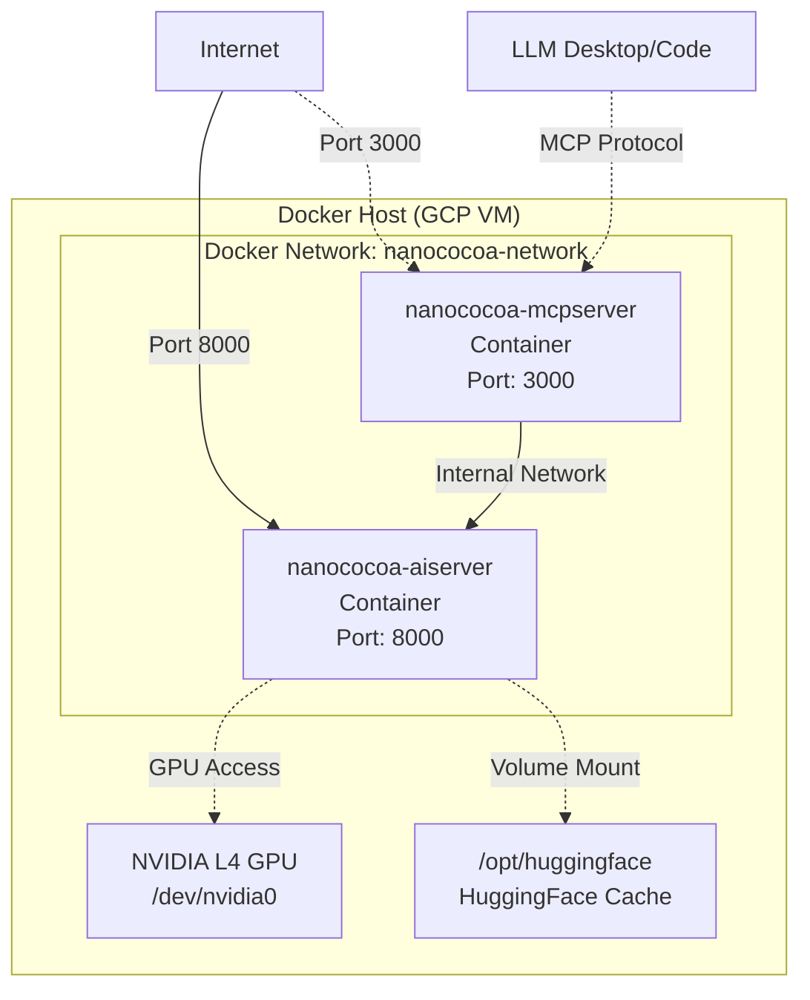

# nanoCocoa Docker Compose 배포 가이드

이 문서는 nanoCocoa AI 광고 생성기의 Docker Compose 기반 배포 가이드입니다.

## 목차

1. [개요](#1-개요)<br/>
2. [시스템 요구사항](#2-시스템-요구사항)<br/>
3. [배포 아키텍처](#3-배포-아키텍처)<br/>
4. [설치 및 실행](#4-설치-및-실행)<br/>
5. [서비스 관리](#5-서비스-관리)<br/>
6. [문제 해결](#6-문제-해결)<br/>
7. [모니터링](#7-모니터링)<br/>

---

## 1. 개요

### 1.1. Docker Compose 구성

프로젝트는 Docker Compose를 통해 두 개의 주요 서비스를 배포합니다:

1. **nanoCocoa_aiserver**: GPU 기반 AI 모델 서빙 서버
   - 포트: 8000
   - 이미지 버전: v2.0
   - 역할: 이미지 생성 AI 모델 추론 (FLUX.2, SDXL, BiRefNet)
   - GPU: NVIDIA L4 24GB VRAM
   - **중요**: FLUX.2 Klein 모델 지원을 위해 로컬 커스텀 diffusers 라이브러리 사용

2. **nanoCocoa_mcpserver**: MCP 프로토콜 브릿지 서버
   - 포트: 3000
   - 역할: AI 서버를 MCP 프로토콜로 감싸서 제공
   - 의존성: nanoCocoa_aiserver (health check 대기)

### 1.2. 배포 위치

```
codeit-ai-3team-ad-content/
└── src/
    ├── docker-compose.yml          # 메인 compose 파일
    ├── .env                         # 환경 변수 (선택)
    ├── nanoCocoa_aiserver/
    │   ├── Dockerfile
    │   ├── requirements-docker.txt
    │   ├── models/
    │   │   └── diffusers/          # 로컬 커스텀 diffusers (v0.37.0.dev0)
    │   ├── static/
    │   └── logs/
    └── nanoCocoa_mcpserver/
        ├── Dockerfile
        └── requirements-mcpserver.txt
```

**중요**: `nanoCocoa_aiserver/models/diffusers`는 FLUX.2 Klein 모델 지원을 위한 로컬 커스텀 diffusers 라이브러리입니다. PyPI 버전(v0.36.0)에는 FLUX.2 지원이 없으므로, Dockerfile에서 `PYTHONPATH`를 통해 로컬 버전을 우선 사용합니다.

---

## 2. 시스템 요구사항

### 2.1. 하드웨어

- **GPU**: NVIDIA L4 이상 (24GB VRAM 권장)
- **RAM**: 32GB 이상
- **디스크**:
  - OS: 20GB
  - 데이터/모델: 200GB 이상 (`/opt/huggingface`)

### 2.2. 소프트웨어

- **OS**: Ubuntu 22.04 LTS (권장)
- **Docker**: 20.10 이상
- **Docker Compose**: 2.0 이상
- **NVIDIA Driver**: 525 이상
- **NVIDIA Container Toolkit**: 설치 필요

### 2.3. NVIDIA Container Toolkit 설치

```bash
# NVIDIA Container Toolkit 설치
distribution=$(. /etc/os-release;echo $ID$VERSION_ID)
curl -s -L https://nvidia.github.io/nvidia-docker/gpgkey | sudo apt-key add -
curl -s -L https://nvidia.github.io/nvidia-docker/$distribution/nvidia-docker.list | sudo tee /etc/apt/sources.list.d/nvidia-docker.list

sudo apt-get update
sudo apt-get install -y nvidia-container-toolkit

# Docker 재시작
sudo systemctl restart docker

# GPU 접근 확인
docker run --rm --gpus all nvidia/cuda:12.9.1-base-ubuntu22.04 nvidia-smi
```

---

## 3. 배포 아키텍처

### 3.1. Docker 네트워크 구성



### 3.2. 볼륨 마운트

| 호스트 경로 | 컨테이너 경로 | 용도 | 서비스 |
|------------|--------------|------|--------|
| `/opt/huggingface` | `/root/.cache/huggingface` | HuggingFace 모델 캐시 | aiserver |
| `./nanoCocoa_aiserver/static/uploads` | `/app/static/uploads` | 업로드 파일 | aiserver, mcpserver |
| `./nanoCocoa_aiserver/static/results` | `/app/static/results` | 결과 파일 | aiserver, mcpserver |
| `./nanoCocoa_aiserver/logs` | `/app/logs` | 로그 파일 | aiserver |

### 3.3. 환경 변수

**nanoCocoa_aiserver**:
```yaml
PYTORCH_CUDA_ALLOC_CONF=expandable_segments:True
HF_HOME=/root/.cache/huggingface
TRANSFORMERS_CACHE=/root/.cache/huggingface/transformers
HF_HUB_CACHE=/root/.cache/huggingface/hub
DEVICE=cuda
AUTO_UNLOAD_DEFAULT=true
```

**nanoCocoa_mcpserver**:
```yaml
MCP_TRANSPORT=sse
MCP_PORT=3000
MCP_HOST=0.0.0.0
AISERVER_BASE_URL=http://nanococoa-aiserver:8000
LOG_LEVEL=INFO
```

---

## 4. 설치 및 실행

### 4.1. 사전 준비

```bash
# src 디렉토리로 이동
cd /home/spai0433/codeit-ai-3team-ad-content/src

# HuggingFace 캐시 디렉토리 생성 (호스트)
sudo mkdir -p /opt/huggingface
sudo chmod 777 /opt/huggingface

# 로그 디렉토리 생성
mkdir -p ./nanoCocoa_aiserver/logs
mkdir -p ./nanoCocoa_aiserver/static/{uploads,results}
```

### 4.2. 환경 변수 설정 (선택)

`.env` 파일을 생성하여 추가 설정:

```bash
# src/.env
HUGGINGFACE_TOKEN=your_token_here
```

### 4.3. 서비스 빌드 및 시작

```bash
# 모든 서비스 빌드 및 시작 (v2.0 이미지 생성)
sudo docker compose up -d --build

# 또는 특정 서비스만 빌드
sudo docker compose build nanococoa_aiserver
sudo docker compose build nanococoa_mcpserver

# 빌드 없이 시작
sudo docker compose up -d

# 이미지 버전 확인
sudo docker images | grep nanococoa
# 예상 출력: nanococoa_aiserver:v2.0
```

**빌드 검증**: FLUX.2 Klein 모델 지원을 위해 로컬 diffusers가 올바르게 설치되었는지 확인:

```bash
# diffusers 버전 및 Flux2KleinPipeline 확인
sudo docker run --rm nanococoa_aiserver:v2.0 python -c "from diffusers import Flux2KleinPipeline; import diffusers; print(f'diffusers version: {diffusers.__version__}'); print(f'Flux2KleinPipeline module: {Flux2KleinPipeline.__module__}')"

# 예상 출력:
# diffusers version: 0.37.0.dev0
# Flux2KleinPipeline module: diffusers.pipelines.flux2.pipeline_flux2_klein
```

### 4.4. 서비스 상태 확인

```bash
# 컨테이너 상태 확인
docker compose ps

# 예상 출력:
# NAME                    IMAGE                           STATUS
# nanococoa_aiserver      nanococoa_aiserver:v2.0         Up (healthy)
# nanococoa_mcpserver     nanococoa_mcpserver:latest      Up (healthy)

# 로그 확인
docker-compose logs -f

# 특정 서비스 로그만
docker-compose logs -f nanococoa-aiserver
docker-compose logs -f nanococoa-mcpserver
```

### 4.5. Health Check

```bash
# AI 서버 상태 확인
curl http://localhost:8000/health

# MCP 서버 상태 확인
curl http://localhost:3000/health

# 예상 응답 (AI 서버):
# {
#   "status": "healthy",
#   "server_time": 1234567890.123,
#   "system_metrics": {...}
# }

# 예상 응답 (MCP 서버):
# {
#   "status": "healthy",
#   "aiserver_status": "connected"
# }
```

---

## 5. 서비스 관리

### 5.1. 서비스 중지

```bash
# 모든 서비스 중지
sudo docker-compose stop

# 특정 서비스만 중지
sudo docker-compose stop nanococoa-mcpserver
```

### 5.2. 서비스 재시작

```bash
# 모든 서비스 재시작
sudo docker-compose restart

# 특정 서비스만 재시작
sudo docker-compose restart nanococoa-aiserver
```

### 5.3. 서비스 완전 제거

```bash
# 컨테이너 중지 및 제거
sudo docker-compose down

# 볼륨까지 제거 (주의: 데이터 손실)
sudo docker-compose down -v

# 이미지까지 제거
sudo docker-compose down --rmi all
```

### 5.4. 서비스 확장 (스케일링)

```bash
# MCP 서버를 3개 인스턴스로 확장
sudo docker-compose up -d --scale nanococoa-mcpserver=3

# 참고: AI 서버는 GPU 제약으로 단일 인스턴스 권장
```

### 5.5. 로그 관리

```bash
# 실시간 로그 확인
docker-compose logs -f

# 최근 100줄만 확인
docker-compose logs --tail=100

# 특정 시간 이후 로그
docker-compose logs --since 2026-01-10T10:00:00

# 로그 파일 위치
ls -lh ./nanoCocoa_aiserver/logs/
```

---

## 6. 문제 해결

### 6.1. GPU 인식 안 됨

**증상**: AI 서버가 GPU를 찾지 못함

**확인**:
```bash
# 호스트에서 GPU 확인
nvidia-smi

# Docker에서 GPU 접근 확인
docker run --rm --gpus all nvidia/cuda:12.9.1-base-ubuntu22.04 nvidia-smi

# AI 서버 컨테이너에서 GPU 확인
docker exec -it nanococoa-aiserver nvidia-smi
```

**해결**:
1. NVIDIA Container Toolkit 재설치
2. Docker 재시작: `sudo systemctl restart docker`
3. `docker-compose.yml`의 GPU 설정 확인

### 6.2. MCP 서버가 AI 서버에 연결 못함

**증상**: MCP 서버 로그에 연결 오류

**확인**:
```bash
# MCP 서버 로그 확인
docker-compose logs nanococoa-mcpserver | grep -i error

# AI 서버 health check 확인
curl http://localhost:8000/health

# 네트워크 확인
docker network inspect nanococoa-network
```

**해결**:
1. AI 서버가 먼저 healthy 상태인지 확인
2. `depends_on` 조건 확인 (docker-compose.yml)
3. 환경 변수 `AISERVER_BASE_URL` 확인

### 6.3. 포트 충돌

**증상**: "port is already allocated" 오류

**확인**:
```bash
# 포트 8000 사용 프로세스 확인
sudo lsof -i :8000

# 포트 3000 사용 프로세스 확인
sudo lsof -i :3000
```

**해결**:
1. 기존 프로세스 종료
2. `docker-compose.yml`에서 포트 변경:
   ```yaml
   ports:
     - "8001:8000"  # 호스트 포트만 변경
   ```

### 6.4. 디스크 공간 부족

**증상**: 모델 다운로드 실패, 이미지 생성 실패

**확인**:
```bash
# 디스크 사용량 확인
df -h

# Docker 디스크 사용량
docker system df

# HuggingFace 캐시 크기
du -sh /opt/huggingface
```

**해결**:
```bash
# Docker 정리 (사용하지 않는 이미지/컨테이너 제거)
docker system prune -a

# 오래된 로그 삭제
find ./nanoCocoa_aiserver/logs -type f -mtime +7 -delete
```

### 6.5. 메모리 부족 (OOM)

**증상**: 컨테이너가 자동으로 재시작됨

**확인**:
```bash
# 컨테이너 메모리 사용량
docker stats

# 시스템 메모리
free -h
```

**해결**:
```bash
# docker-compose.yml에 메모리 제한 추가
services:
  nanococoa-aiserver:
    deploy:
      resources:
        limits:
          memory: 28G
        reservations:
          memory: 16G
```

---

## 7. 모니터링

### 7.1. 컨테이너 리소스 모니터링

```bash
# 실시간 모니터링
docker stats

# 예상 출력:
# CONTAINER           CPU %   MEM USAGE / LIMIT     MEM %   NET I/O
# nanococoa-aiserver  45%     18.2GiB / 31.3GiB     58%     1.2MB / 450kB
# nanococoa-mcpserver 2%      256MiB / 31.3GiB      0.8%    450kB / 1.2MB
```

### 7.2. GPU 모니터링

```bash
# 호스트에서
watch -n 1 nvidia-smi

# 컨테이너에서
docker exec -it nanococoa-aiserver watch -n 1 nvidia-smi
```

### 7.3. 로그 모니터링

```bash
# 실시간 로그 (모든 서비스)
docker-compose logs -f

# 에러 로그만 필터링
docker-compose logs -f | grep -i error

# 로그 파일 모니터링 (호스트)
tail -f ./nanoCocoa_aiserver/logs/app.log
```

### 7.4. Health Check 모니터링

```bash
# Health check 스크립트 (매 30초)
watch -n 30 'curl -s http://localhost:8000/health | jq && curl -s http://localhost:3000/health | jq'
```

---

## 8. 운영 가이드

### 8.1. 백업

```bash
# 중요 데이터 백업
tar -czf backup_$(date +%Y%m%d).tar.gz \
  ./nanoCocoa_aiserver/static/uploads \
  ./nanoCocoa_aiserver/static/results \
  ./nanoCocoa_aiserver/logs

# HuggingFace 캐시 백업 (선택)
tar -czf huggingface_cache.tar.gz /opt/huggingface
```

### 8.2. 업데이트

```bash
# Git에서 최신 코드 받기
git pull origin alpha

# 이미지 재빌드
cd src
sudo docker-compose build --no-cache

# 서비스 재시작 (다운타임 최소화)
sudo docker-compose up -d
```

### 8.3. 자동 재시작 설정

`docker-compose.yml`에 이미 설정됨:
```yaml
restart: unless-stopped
```

시스템 재부팅 시 자동으로 서비스가 시작됩니다.

---

## 9. 보안 고려사항

### 9.1. 포트 노출 제한

프로덕션 환경에서는 포트를 내부 네트워크만 노출:

```yaml
# docker-compose.yml
services:
  nanococoa-aiserver:
    ports:
      - "127.0.0.1:8000:8000"  # localhost만 접근 가능
```

### 9.2. 환경 변수 보안

```bash
# .env 파일 권한 제한
chmod 600 src/.env

# Git에서 제외
echo ".env" >> .gitignore
```

### 9.3. 네트워크 격리

```yaml
# docker-compose.yml
networks:
  nanococoa-network:
    driver: bridge
    internal: true  # 외부 네트워크 차단
```

---

## 10. 참고 문서

- [완전한 설치 가이드](./완전한_설치_가이드.md)
- [아키텍처 설계](./아키텍처설계.md)
- [nanoCocoa MCP 서버 README](../../src/nanoCocoa_mcpserver/README.md)
- [Docker Compose 공식 문서](https://docs.docker.com/compose/)
- [NVIDIA Container Toolkit](https://github.com/NVIDIA/nvidia-container-toolkit)

---

**문서 변경 이력**

| 버전 | 날짜 | 작성자 | 변경 내용 |
|------|------|--------|-----------|
| v1.0 | 2026.01.10 | 김명환 | 초안 작성 |
