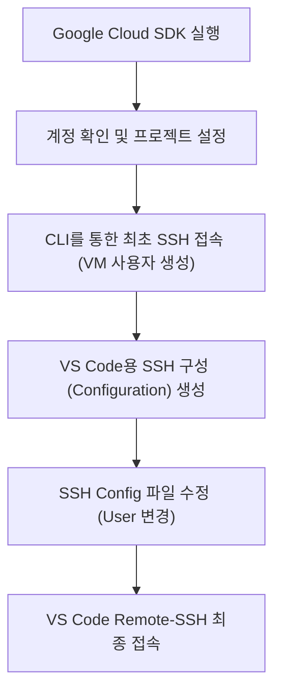

# codeit-ai-3team-ad-content GCP VM 접속 가이드

본 문서는 Windows 11 환경에서 Google Cloud SDK(gcloud CLI)와 VS Code를 사용하여 `sprint-ai-chunk2-03` 프로젝트의 VM 인스턴스(Instance)에 접속하는 절차를 기술합니다.

## 1. 개요 및 워크플로우

본 가이드는 다중 계정 환경에서 올바른 Google 계정과 프로젝트를 선택하고, 특정 사용자명(`spai0433`)으로 VM에 접속하도록 설정하는 것을 목표로 합니다.



## 2. 사전 준비 사항

VS Code 접속 전 로컬 환경(Local Environment) 설정이 필요합니다.

### 2.1. 소프트웨어 설치

* **VS Code**: 최신 버전 설치
* **Google Cloud CLI**: Windows용 설치 관리자를 통해 설치 및 `PATH` 환경 변수(Environment Variable) 등록 확인
* **Remote - SSH**: VS Code 확장 프로그램(Extension) 마켓플레이스에서 Microsoft 제공 버전 설치

## 3. 계정 및 프로젝트 설정 (PowerShell)

Windows PowerShell을 실행하여 진행합니다.

### 3.1. Google 계정 인증 (Authentication) 확인

현재 `gcloud` 도구가 사용 중인 계정을 확인합니다.

```powershell
gcloud auth list

```

* **확인 사항**: 접속하려는 계정(`spai0433@codeit-sprint.kr`) 옆에 `*` 표시가 있어야 합니다.
* **조치 사항**: 해당 계정이 없거나 선택되지 않은 경우 아래 명령어로 로그인합니다.
```powershell
gcloud auth login

```


### 3.2. 프로젝트 지정

작업할 대상 프로젝트(`sprint-ai-chunk2-03`)를 활성화합니다.

```powershell
gcloud config set project sprint-ai-chunk2-03

```

## 4. VM 사용자 생성 및 SSH 키 등록

Windows 사용자명과 다른 ID(`spai0433`)를 VM에서 사용하기 위해, CLI를 통해 강제로 사용자를 생성하고 접속을 시도합니다.

### 4.1. 최초 SSH 접속 시도

이 단계는 VM 내부(Internal)에 `spai0433` 사용자를 생성하고 공개 키(Public Key)를 등록하는 과정입니다.

```powershell
gcloud compute ssh spai0433@codeit-ai-part4-3team-vm --zone us-central1-c

```

1. SSH 키 생성 여부를 묻는 경우 `Y`를 입력합니다.
2. Passphrase(비밀번호) 입력 시 엔터를 눌러 건너뜁니다.
3. 터미널 프롬프트가 `spai0433@codeit-ai-part4-3team-vm:~$`으로 변경되면 성공입니다.
4. `exit` 명령어를 입력하여 로컬 PowerShell로 복귀합니다.

## 5. VS Code 연결 설정

VS Code가 접속 정보를 인식할 수 있도록 설정 파일을 갱신하고 수정합니다.

### 5.1. SSH 구성 파일 (Configuration File) 갱신

GCP의 VM 정보를 로컬 SSH 설정 파일에 자동으로 기록합니다.

```powershell
gcloud compute config-ssh --project sprint-ai-chunk2-03

```

### 5.2. VS Code 설정 파일 수정 (필수)

위 명령어가 Windows 사용자명(예: `sw1`)을 기본값으로 사용하기 때문에, 이를 `spai0433`으로 수동 변경해야 합니다.

1. VS Code 실행 후 좌측 하단 **원격 접속 아이콘 (><)** 클릭
2. **Open SSH Configuration File...** 선택
3. 경로 `C:\Users\[사용자명]\.ssh\config` 선택
4. 해당 호스트(`codeit-ai-part4-3team-vm...`)의 `User` 항목 수정

**수정 전:**

```ssh
Host codeit-ai-part4-3team-vm.us-central1-c.sprint-ai-chunk2-03
    HostName 34.44.205.198
    IdentityFile C:\Users\sw1\.ssh\google_compute_engine
    User sw1

```

**수정 후:**

```ssh
Host codeit-ai-part4-3team-vm.us-central1-c.sprint-ai-chunk2-03
    HostName 34.44.205.198
    IdentityFile C:\Users\sw1\.ssh\google_compute_engine
    User spai0433

```

* `User` 값을 반드시 **`spai0433`**으로 변경하고 저장(`Ctrl + S`)합니다.

## 6. 최종 접속 확인

### 6.1. 원격 접속 (Remote Connection)

1. VS Code 좌측 하단 **원격 접속 아이콘 (><)** 클릭
2. **Connect to Host...** 선택
3. 목록에서 `codeit-ai-part4-3team-vm...` 선택
4. 새 창이 열리면 운영체제(Operating System)로 **Linux** 선택

### 6.2. 접속 계정 검증

VS Code 내 터미널(Terminal)을 열어(`Ctrl + Backtick`), 프롬프트가 올바른지 확인합니다.

```bash
# 올바른 예시
spai0433@codeit-ai-part4-3team-vm:~$

```