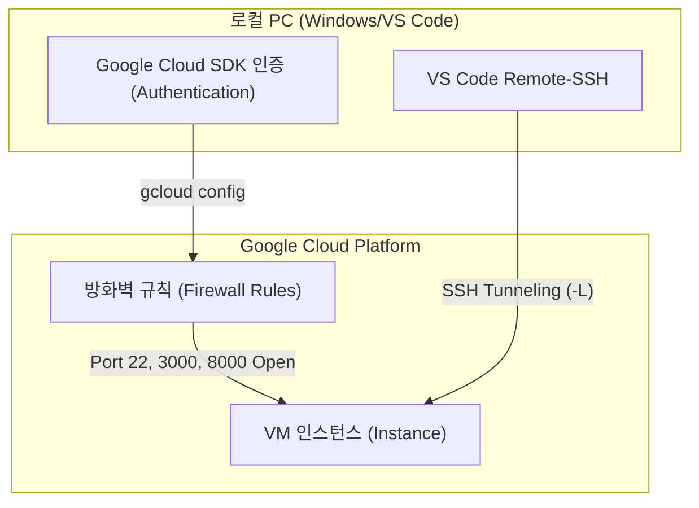

# codeit-ai-3team-ad-content GCP VM 네트워크 및 접속 통합 가이드

본 문서는 Windows 11 환경에서 **Google Cloud Platform(GCP)** VM 인스턴스에 접속하기 위한 모든 절차를 다룹니다.  
기본적인 SSH 접속뿐만 아니라, **AI 서빙 서버(Port 8000)**와 **MCP 서버(Port 3000)** 구동을 위한 네트워크 방화벽 설정 및 포트 포워딩(Tunneling) 기술을 상세히 기술합니다.

## 1. 개요 및 아키텍처

본 가이드는 다중 계정 환경에서 `spai0433` 사용자로 VM에 안전하게 접속하고, 로컬 환경(내 컴퓨터)에서 VM 내부의 웹 서비스에 직접 접근하는 환경 구성을 목표로 합니다.

### 1.1. 연결 워크플로우



### 1.2. 포트 구성 정보

| 포트 번호 | 용도 | 설명 | 프로토콜 |
| --- | --- | --- | --- |
| **22** | SSH | 원격 터미널 접속을 위한 필수 포트 | TCP |
| **3000** | MCP Server | Model Context Protocol 서버 통신용 | TCP |
| **8000** | AI Serving | FastAPI/Flask 등 AI 모델 서빙 API | TCP |

---

## 2. 사전 준비 사항

VS Code 접속 전 로컬 환경(Local Environment) 설정이 필요합니다.

* **VS Code**: 최신 버전 설치
* **Google Cloud CLI**: Windows용 설치 관리자를 통해 설치 및 `PATH` 환경 변수 등록 확인
* **Remote - SSH**: VS Code 확장 프로그램(Extension) 설치

---

## 3. 계정 및 프로젝트 설정 (PowerShell)

Windows PowerShell을 실행하여 인증 및 프로젝트 설정을 진행합니다.

### 3.1. Google 계정 인증

```powershell
# 현재 인증된 계정 목록 확인
gcloud auth list

```

* **확인**: 접속하려는 계정(`spai0433@codeit-sprint.kr`) 옆에 `*` 표시 확인.
* **로그인**: `gcloud auth login` 명령어로 로그인 수행.

### 3.2. 프로젝트 지정

```powershell
# 작업 대상 프로젝트 설정
gcloud config set project sprint-ai-chunk2-03

```

---

## 4. 네트워크 보안 및 방화벽(Firewall) 설정

외부에서 VM의 서비스에 접근하기 위해서는 GCP VPC 네트워크의 방화벽 규칙을 설정해야 합니다.

### 4.1. SSH 포트(22) 개방 확인 및 설정

GCP는 기본적으로 `default-allow-ssh` 규칙이 존재하지만, 만약 삭제되었거나 접속이 안 될 경우 아래 명령어로 복구합니다.

```powershell
# SSH 접속 허용 규칙 생성 (이미 존재할 경우 생략 가능)
gcloud compute firewall-rules create default-allow-ssh `
    --direction=INGRESS `
    --priority=65534 `
    --network=default `
    --action=ALLOW `
    --rules=tcp:22 `
    --source-ranges=0.0.0.0/0

```

### 4.2. 서비스 포트(3000, 8000) 개방

AI 서빙 서버(8000)와 MCP 서버(3000)를 외부에서 접근하거나 테스트하기 위해 포트를 개방합니다.

```powershell
# 3000번, 8000번 포트 동시 개방 규칙 생성
gcloud compute firewall-rules create allow-ai-services `
    --direction=INGRESS `
    --priority=1000 `
    --network=default `
    --action=ALLOW `
    --rules=tcp:3000,tcp:8000 `
    --source-ranges=0.0.0.0/0

```

* `--rules=tcp:3000,tcp:8000`: 쉼표로 구분하여 여러 포트를 한 번에 엽니다.
* `--source-ranges=0.0.0.0/0`: 모든 IP에서의 접근을 허용합니다. (운영 환경에서는 보안을 위해 특정 IP 대역으로 제한 권장)

### 4.3. 방화벽 설정 확인

설정된 규칙이 올바르게 적용되었는지 확인합니다.

```powershell
gcloud compute firewall-rules list --filter="name=(default-allow-ssh OR allow-ai-services)"

```

---

## 5. SSH 접속 및 포트 포워딩 (Port Forwarding)

포트 포워딩(터널링)은 로컬 PC의 특정 포트로 들어온 요청을 암호화된 SSH 터널을 통해 VM의 특정 포트로 전달하는 기술입니다.
**방화벽을 열지 않아도** 로컬호스트처럼 안전하게 서버에 접속할 수 있는 강력한 방법입니다.

### 5.1. CLI를 이용한 포트 포워딩 접속 (일회성)

터미널에서 직접 접속하며 터널을 뚫는 방법입니다.

**문법:** `-L [로컬포트]:localhost:[VM포트]`

```powershell
# 3000번(MCP)과 8000번(AI) 포트를 모두 내 컴퓨터로 포워딩하며 접속
gcloud compute ssh spai0433@codeit-ai-part4-3team-vm `
    --zone=us-central1-c `
    --ssh-flag="-L 3000:localhost:3000 -L 8000:localhost:8000"

```

* **결과**: 접속이 유지되는 동안, 내 컴퓨터 브라우저에서 `http://localhost:8000` 입력 시 VM의 AI 서버로 연결됩니다.

### 5.2. VS Code Config를 이용한 영구 포트 포워딩

매번 명령어를 입력하지 않고, VS Code 접속 시 자동으로 포트가 연결되도록 설정합니다.

#### 1단계: SSH 구성 정보 갱신

```powershell
gcloud compute config-ssh --project sprint-ai-chunk2-03

```

#### 2단계: Config 파일 수정 (핵심)

1. VS Code 좌측 하단 `><` 아이콘 클릭 -> **Open SSH Configuration File**
2. `C:\Users\[사용자명]\.ssh\config` 파일 선택
3. 자동 생성된 Host 항목을 아래와 같이 **수정 및 추가**합니다.

```ssh
Host codeit-ai-part4-3team-vm.us-central1-c.sprint-ai-chunk2-03
    HostName 34.44.205.198
    IdentityFile C:\Users\[윈도우사용자명]\.ssh\google_compute_engine
    User spai0433
    # 아래 부분이 포트 포워딩 설정입니다.
    LocalForward 3000 localhost:3000
    LocalForward 8000 localhost:8000

```

* **`User spai0433`**: VM 접속 계정을 `spai0433`으로 고정합니다.
* **`LocalForward [로컬] localhost:[원격]`**: VS Code가 SSH에 연결될 때 자동으로 해당 터널을 생성합니다.

---

## 6. VS Code 최종 접속 및 검증

### 6.1. 접속 수행

1. VS Code 좌측 하단 `><` 아이콘 클릭.
2. **Connect to Host...** 선택.
3. `codeit-ai-part4-3team-vm...` 호스트 선택.
4. 새 창에서 연결이 완료될 때까지 대기.

### 6.2. 접속 및 포트 확인

VS Code 터미널(`Ctrl + ~`)을 열고 아래 명령어로 확인합니다.

1. **사용자 확인**:
```bash
whoami
# 출력결과: spai0433

```


2. **서버 실행 여부 확인 (VM 내부)**:
```bash
# 8000번 포트가 리스닝 중인지 확인
sudo netstat -tulpn | grep 8000

```


3. **외부 통신 테스트 (로컬 PC)**:
* Chrome 브라우저를 켜고 `http://localhost:8000/docs` (FastAPI 기준) 접속 시 Swagger UI가 뜨면 성공입니다.
* 방화벽이 열려있다면 `http://34.44.205.198:8000/docs` 로도 접속 가능합니다.


---

## 7. 트러블슈팅 (FAQ)

**Q. "Connection refused" 오류가 뜹니다.**

* **원인 1**: VM 내부에서 해당 서비스(Web Server)가 실행 중이지 않습니다. `ps ax | grep python` 등으로 프로세스를 확인하세요.
* **원인 2**: 방화벽 규칙이 적용되지 않았습니다. `gcloud firewall-rules list`를 다시 확인하세요.

**Q. "Permission denied (publickey)" 오류가 뜹니다.**

* **해결**: 로컬의 `config` 파일에 `IdentityFile` 경로가 정확한지, `User`가 `spai0433`으로 되어 있는지 확인하세요. 필요하다면 `gcloud compute ssh` 명령어를 한번 실행하여 키를 갱신하세요.

**Q. 포트 포워딩을 했는데 localhost:8000 접속이 안 됩니다.**

* **해결**: VM 내부 서버가 `0.0.0.0`이 아닌 `127.0.0.1`로 바인딩되어 있어야 안전하지만, 외부 접속(방화벽 오픈)을 테스트할 땐 `0.0.0.0`으로 실행해야 합니다. 포트 포워딩만 쓴다면 `127.0.0.1`로 띄워도 됩니다.
