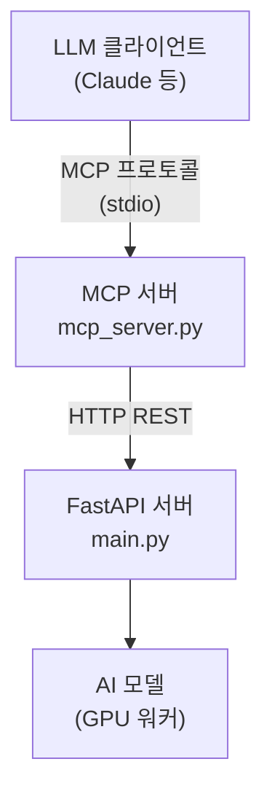

# nanoCocoa AI 광고 생성기 - MCP 서버

nanoCocoa AI 광고 생성 서버는 MCP (Model Context Protocol, 모델 컨텍스트 프로토콜) 서버를 통해 Claude Desktop과 같은 LLM 애플리케이션에 AI 기반 광고 이미지 생성 기능을 제공합니다.

## 1. 기능

MCP 서버는 다음과 같은 도구들을 제공합니다.

### 1.1. health_check

작업 시작 전 서버 가용성 및 시스템 메트릭을 확인합니다.

### 1.2. list_fonts

텍스트 생성에 사용 가능한 폰트 목록을 조회합니다.

### 1.3. generate_ad

새로운 광고 생성 작업을 시작합니다 (비차단 방식).
- 제품 이미지와 AI 생성 배경을 합성
- 3D 텍스트 효과 추가
- 상태 추적을 위한 job_id 반환

### 1.4. check_job_status

작업 진행 상황을 모니터링하고 결과를 조회합니다.
- 실시간 진행률 업데이트
- 단계별 상태 정보
- Base64 인코딩된 이미지 결과

### 1.5. stop_job

실행 중인 작업을 취소합니다.

### 1.6. list_jobs

모든 작업과 상태를 조회합니다.

### 1.7. delete_job

완료된 작업을 메모리에서 제거합니다.

### 1.8. generate_and_wait (편의 도구)

생성 시작 후 자동으로 완료까지 대기합니다 (차단 방식).
- generate_ad + 폴링을 결합
- 준비되면 최종 결과 반환
- 예상 소요 시간: 80-120초

### 1.9. 리소스

서버는 다음 문서 리소스를 제공합니다:
- `nanococoa://help/guide` - 완전한 API 사용 가이드
- `nanococoa://help/parameters` - 파라미터 레퍼런스
- `nanococoa://help/examples` - 코드 예시

## 2. 설치

### 2.1. 필수 요구사항

1. **FastAPI 서버**: MCP 서버는 FastAPI 백엔드에 연결
2. **Python 3.8+**
3. **MCP SDK**: Model Context Protocol SDK 설치

```bash
pip install mcp httpx
```

### 2.2. 설정

1. FastAPI 서버가 실행 중인지 확인:
```bash
cd src/nanoCocoa_aiserver
python main.py
```

2. FastAPI 서버는 `http://localhost:8000`에서 사용 가능해야 합니다.

## 3. 사용법

### 3.1. 방법 1: 자동 설정 (권장)

설정 스크립트를 사용하여 Claude Desktop을 자동으로 구성합니다:

```bash
cd src/nanoCocoa_aiserver
python setup_mcp.py --install
```

스크립트는 다음을 수행합니다:
- Claude Desktop 설정 파일 위치 확인
- MCP 서버 설정 추가
- 올바른 절대 경로 자동 사용

제거하려면:
```bash
python setup_mcp.py --uninstall
```

현재 설정 확인:
```bash
python setup_mcp.py --show
```

MCP 서버 테스트:
```bash
python setup_mcp.py --test
```

### 3.2. 방법 2: 수동 설정

수동 설정을 선호하는 경우, MCP 설정은 다음 위치에 저장됩니다:
- **프로젝트 설정**: `.mcp/config.json` (이 디렉토리)
- **Claude Desktop 설정**: 플랫폼별 위치

1. Claude Desktop 설정 파일 찾기:
   - **Windows**: `%APPDATA%\Claude\claude_desktop_config.json`
   - **macOS**: `~/Library/Application Support/Claude/claude_desktop_config.json`
   - **Linux**: `~/.config/Claude/claude_desktop_config.json`

2. `.mcp/config.json`에서 서버 설정을 Claude 설정으로 복사

3. `args` 경로를 시스템의 `mcp_server.py` 절대 경로로 업데이트

### 3.3. 방법 3: 직접 실행 (테스트)

테스트를 위해 MCP 서버를 직접 실행:

```bash
cd src/nanoCocoa_aiserver
python mcp_server.py
```

서버가 시작되어 stdio를 통해 통신합니다.

## 4. 예시 워크플로우

### 4.1. 기본 광고 생성

```
사용자: 커피 제품에 대한 광고를 생성해줘. 배경은 아늑한 카페로 하고 "Fresh Brew" 텍스트를 넣어줘

LLM이 수행할 작업:
1. health_check를 사용하여 서버 가용성 확인
2. list_fonts를 사용하여 사용 가능한 폰트 조회
3. generate_and_wait 사용:
   - input_image: <base64 커피 제품>
   - bg_prompt: "따뜻한 조명과 나무 테이블이 있는 아늑한 모던 카페 인테리어"
   - text_content: "Fresh Brew"
   - text_model_prompt: "커피 텍스처를 가진 다크 브라운 3D 텍스트"
4. 완료 시 최종 이미지 반환
```

### 4.2. 반복적 개선

```
사용자: 텍스트 스타일을 골드 메탈릭으로 변경해줘

LLM이 수행할 작업:
1. 이전 step1_result (배경) 사용
2. generate_ad 사용:
   - start_step: 2 (텍스트만)
   - step1_image: <이전 배경>
   - text_content: "Fresh Brew"
   - text_model_prompt: "광택이 있는 골드 메탈릭 텍스트"
3. check_job_status로 모니터링
```

## 5. API 엔드포인트 매핑

| MCP 도구 | REST 엔드포인트 | 설명 |
|----------|---------------|-------------|
| health_check | GET /health | 서버 상태 |
| list_fonts | GET /fonts | 사용 가능한 폰트 |
| generate_ad | POST /generate | 작업 시작 |
| check_job_status | GET /status/{job_id} | 작업 상태 |
| stop_job | POST /stop/{job_id} | 작업 취소 |
| list_jobs | GET /jobs | 모든 작업 |
| delete_job | DELETE /jobs/{job_id} | 작업 제거 |

## 6. LLM을 위한 모범 사례

1. **항상 health를 먼저 확인**: 작업 시작 전 `health_check` 사용
2. **간편함을 위해 generate_and_wait 사용**: 폴링을 자동으로 처리
3. **설명적인 프롬프트 제공**: 더 나은 프롬프트 = 더 나은 결과
   - 배경: "대리석 바닥과 따뜻한 조명이 있는 고급 호텔 로비"
   - 텍스트: "그림자와 반사가 있는 골드 메탈릭 3D 텍스트"
4. **바쁨 응답 처리**: 서버는 한 번에 하나의 작업만 처리
5. **완료된 작업 정리**: 결과 조회 후 `delete_job` 사용
6. **중간 결과 재사용**: 반복을 위해 step1_result와 step2_result 저장

## 7. 문제 해결

### 7.1. MCP 서버 연결 실패

- FastAPI 서버가 `http://localhost:8000`에서 실행 중인지 확인
- 설정에서 API_BASE_URL 확인
- 네트워크 연결 확인

### 7.2. 작업이 너무 오래 걸림

- 정상 생성 시간: 80-120초
- `check_job_status`를 사용하여 진행 상황 모니터링
- `health_check`로 GPU 가용성 확인

### 7.3. 서버가 항상 바쁨

- 서버는 한 번에 하나의 작업만 처리 (단일 작업 정책)
- `list_jobs`를 사용하여 활성 작업 확인
- 필요시 `stop_job`을 사용하여 취소

## 8. 아키텍처



## 9. 라이선스

nanoCocoa AI 광고 생성기 프로젝트의 일부입니다.

## 10. 지원

문제나 질문이 있는 경우:
- FastAPI 서버 로그 확인
- MCP 서버 로그 검토
- 생성을 위한 GPU 가용성 확인
