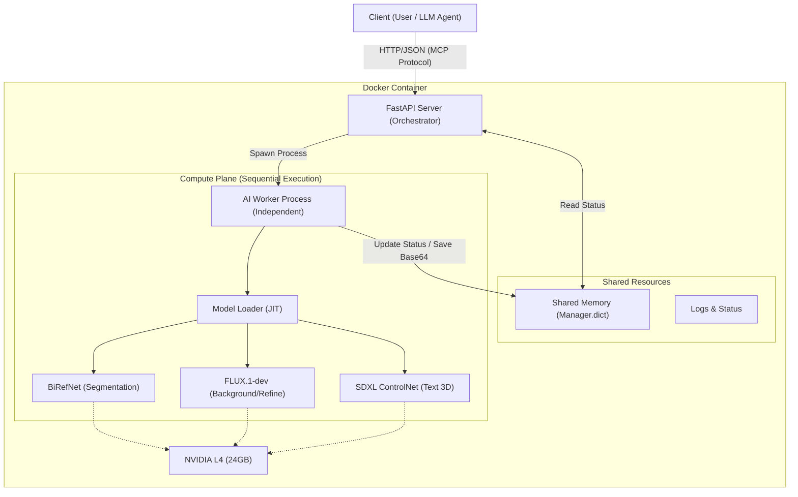
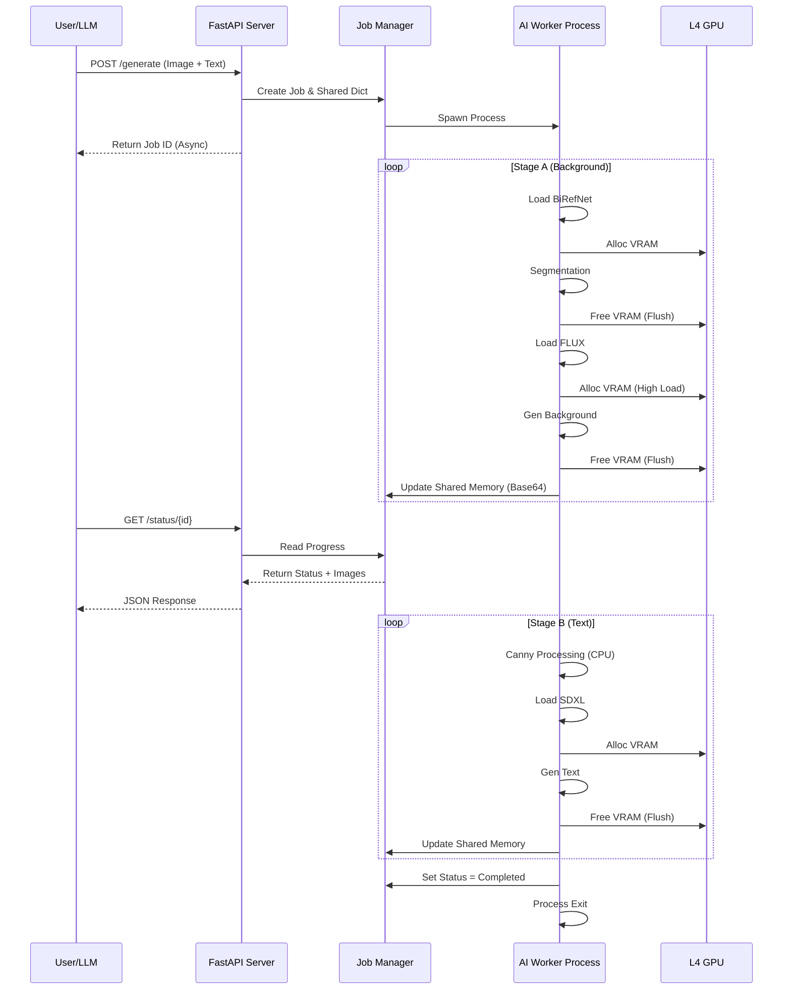

# AI 광고 생성 에이전트 서버 아키텍처 설계서

**1. 개요 (Introduction)**

본 문서는 NVIDIA L4 (24GB VRAM) 단일 GPU 환경에서 동작하는 생성형 AI 기반 광고 이미지 생성 서버의 아키텍처를 기술합니다. 본 시스템은 Docker 단일 컨테이너 내에서 독립적으로 구동되며, MCP (Model Context Protocol) 표준을 준수하여 LLM (Large Language Model)이 자연어 명령을 통해 제어할 수 있도록 설계되었습니다.

**1.1. 설계 목표 (Design Goals)**

1. **자원 최적화 (Resource Optimization):** 제한된 24GB VRAM 환경에서 거대 모델(FLUX, SDXL)을 운용하기 위해 JIT (Just-In-Time) 로딩 및 언로딩 전략을 채택합니다.
2. **비동기 처리 (Asynchronous Processing):** FastAPI 메인 스레드의 블로킹을 방지하기 위해 `multiprocessing (멀티프로세싱)`을 활용하여 추론 작업을 격리합니다.
3. **상태 보존 및 제어 (State Persistence & Control):** 외부 데이터베이스 없이 인메모리(In-Memory) 공유 객체를 통해 작업 단계(Stage)별 결과물을 저장하고, 실패 시 또는 사용자 요청 시 중간 지점부터 재시작(Resume)할 수 있는 기능을 제공합니다.
4. **MCP 호환성 (MCP Compatibility):** LLM 에이전트가 도구(Tool)로서 쉽게 호출할 수 있도록 명확한 API 스키마와 상태 코드를 정의합니다.

**1.2. 시스템 요구사항 (System Requirements)**

* **Hardware:** NVIDIA L4 GPU (24GB VRAM), 32GB System RAM, 4 vCPU 이상.
* **OS/Environment:** Ubuntu 22.04 LTS (Container base), CUDA 12.1.
* **Software Stack:** Python 3.10, FastAPI, PyTorch, Diffusers, Multiprocessing.

---

**2. 시스템 아키텍처 (System Architecture)**

시스템은 크게 요청을 처리하는 **Control Plane (제어 계층)**과 실제 AI 연산을 수행하는 **Compute Plane (연산 계층)**으로 분리됩니다. 이 두 계층은 `Shared Memory Manager (공유 메모리 관리자)`를 통해 데이터를 교환합니다.

**2.1. 상위 레벨 구조도 (High-Level Architecture)**



**2.2. 데이터 흐름 및 상태 관리 (Data Flow & State Management)**

시스템은 외부 DB(MySQL, Redis 등)를 사용하지 않으며, `multiprocessing.Manager`를 사용하여 프로세스 간 데이터를 공유합니다. 이미지 데이터는 Base64 문자열로 변환되어 메모리에 저장됩니다.

* **Lifecycle:**
1. **Request:** 클라이언트가 `/generate` 요청 전송.
2. **Job Creation:** FastAPI가 `Job ID` 생성 및 공유 메모리에 상태 초기화.
3. **Fork:** `Process` 생성 후 즉시 `Job ID` 반환 (Non-blocking).
4. **Processing:** 워커 프로세스가 단계별(Stage A -> B -> C) 연산 수행.
5. **Sync:** 각 단계 완료 시 결과 이미지를 Base64로 공유 메모리에 업데이트.
6. **Polling:** 클라이언트는 `/status/{job_id}`를 통해 진행 상황 및 중간 이미지 확인.


---

**3. 상세 컴포넌트 설계 (Detailed Component Design)**

**3.1. API Orchestrator (FastAPI)**

오케스트레이터는 클라이언트와의 인터페이스 역할을 하며, 워커 프로세스의 생명주기를 관리합니다.

* **Endpoint Design (MCP Friendly):**
* 각 엔드포인트는 명확한 `description`과 `summary`를 포함하여 LLM이 기능을 추론하기 쉽게 합니다.
* **Health Check:** 하드웨어(GPU) 가용성을 확인하는 로직 포함.


* **Process Management:**
* 파이썬의 GIL (Global Interpreter Lock)을 우회하기 위해 `threading` 대신 `multiprocessing` 모듈 사용.
* 좀비 프로세스 방지를 위해 `lifespan` 이벤트를 통해 서버 종료 시 자식 프로세스 일괄 정리 (`terminate`).


**3.2. AI Model Engine (Worker Process)**

실제 추론을 담당하는 핵심 모듈입니다. L4 메모리 한계를 극복하기 위해 다음과 같은 전략을 사용합니다.

**3.2.1. Dynamic Memory Management (동적 메모리 관리)**

모델은 필요할 때만 VRAM에 로드되고, 사용 직후 시스템 RAM 및 VRAM에서 완전히 제거됩니다.

* **VRAM Usage Equation:**
특정 시점 에서의 총 메모리 사용량 $M(t)$는 다음과 같이 정의됩니다.

여기서 $M_{model_active}(t)$는 현재 활성화된 모델(예: FLUX)의 가중치이며, 를 항상 만족해야 합니다. 이를 위해 단계 전환 함수  실행 시 다음과 같은 Flush 작업이 선행됩니다.


**3.2.2. Pipeline Stages (파이프라인 단계)**

* **Stage A (Base Construction):**
1. `BiRefNet` 로드 -> 제품 누끼(Segmentation) -> 언로드.
2. `FLUX` 로드 -> 배경 생성(T2I) -> 언로드.
3. 합성(Compositing) 및 그림자 생성 (CPU 연산).
4. `FLUX Img2Img` 로드 -> 리터칭(Refinement) -> 언로드.


* **Stage B (Text Asset Generation):**
1. 텍스트 레이아웃 및 Canny Map 생성 (CPU/PIL).
2. `SDXL ControlNet` 로드 -> 3D 텍스트 생성 -> 언로드.
3. `BiRefNet` 재로드 -> 텍스트 배경 제거 -> 언로드.


* **Stage C (Final Composition):**
1. 최종 레이어 합성 (CPU/PIL).


**3.3. Shared Memory Structure**

프로세스 간 데이터 공유를 위한 스키마 구조입니다.

| Key | Type | Description |
| --- | --- | --- |
| `job_id` | String (UUID) | 작업 고유 식별자 |
| `status` | String (Enum) | `pending`, `running`, `completed`, `failed`, `stopped` |
| `current_step` | String | 현재 실행 중인 내부 단계 (예: `loading_flux`, `inference_sdxl`) |
| `progress` | Integer | 0 ~ 100 퍼센트 진행률 |
| `images` | Dict | `{ "base": "b64...", "text": "b64...", "final": "b64..." }` |
| `system_metrics` | Dict | 실시간 CPU, RAM, VRAM 사용량 스냅샷 |

---

**4. 인터페이스 설계 (Interface Design)**

MCP(Model Context Protocol)를 지원하기 위해 JSON 기반의 명시적인 입출력을 정의합니다.

**4.1. Request Schema (JSON)**

```json
{
  "input_image": "base64_string...",
  "text_content": "Super Sale",
  "control_flags": {
    "run_stage_a": true,
    "run_stage_b": true,
    "run_stage_c": true
  },
  "overrides": {
    "base_image": null 
  }
}

```

* `overrides` 필드를 통해 사용자는 이전 단계에서 생성된 이미지를 수정해서 다시 주입할 수 있습니다 (Human-in-the-loop 지원).

**4.2. Response Schema (JSON)**

```json
{
  "job_id": "uuid-v4",
  "status": "running",
  "estimated_time": 120,
  "resource_usage": {
    "gpu_vram_used_mb": 14500,
    "gpu_utilization": 98
  }
}

```

---

**5. 안정성 및 예외 처리 (Reliability & Error Handling)**

**5.1. Resource Guard (자원 보호)**

* **Startup Check:** 서버 구동 시 `pynvml`을 통해 GPU VRAM이 최소 22GB 이상 확보되었는지 검사합니다. 부족할 경우 경고 로그를 출력하거나 구동을 중단합니다.
* **OOM Recovery:** 워커 프로세스 내에서 `torch.cuda.OutOfMemoryError` 발생 시, 즉시 `flush_gpu()`를 2회 재시도하고, 실패 시 해당 Job을 `failed` 처리하되 메인 서버는 유지합니다.

**5.2. Process Isolation (프로세스 격리)**

워커 프로세스는 메인 서버와 독립된 메모리 공간을 가집니다. 워커 프로세스가 세그멘테이션 오류(Segmentation Fault) 등으로 비정상 종료되더라도, FastAPI 서버는 `Process.is_alive()` 체크를 통해 이를 감지하고 클라이언트에게 에러 응답을 보낼 수 있습니다.

**5.3. Graceful Shutdown (우아한 종료)**

* `/stop/{job_id}` 요청 시 `multiprocessing.Event`를 set 하여 워커가 현재 단계 완료 후 안전하게 루프를 탈출하도록 유도합니다.
* 즉각적인 중단이 필요할 경우 `Process.terminate()`를 호출하고, 이후 반드시 `join()`을 수행하여 좀비 프로세스를 방지합니다.

---

**6. 시퀀스 다이어그램 (Sequence Diagram)**

