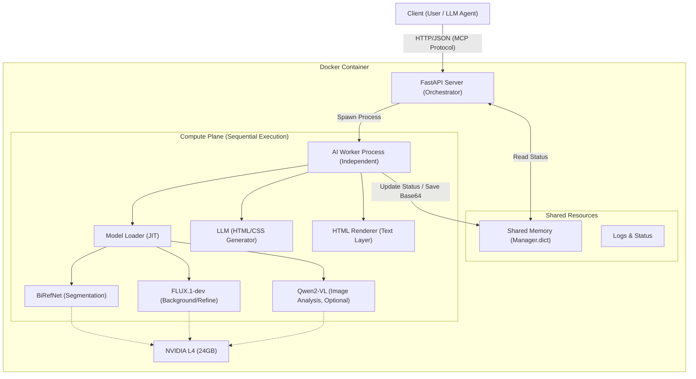
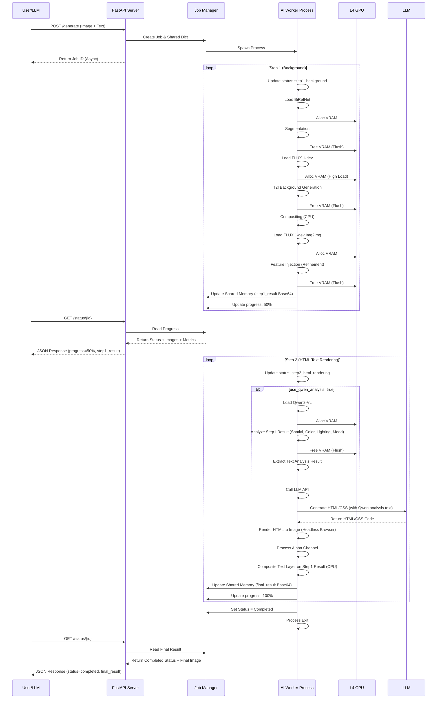

# AI 광고 생성 에이전트 서버 아키텍처 설계서

**1. 개요 (Introduction)**

본 문서는 NVIDIA L4 (24GB VRAM) 단일 GPU 환경에서 동작하는 생성형 AI 기반 광고 이미지 생성 서버의 아키텍처를 기술합니다. 본 시스템은 Docker 단일 컨테이너 내에서 독립적으로 구동되며, MCP (Model Context Protocol) 표준을 준수하여 LLM (Large Language Model)이 자연어 명령을 통해 제어할 수 있도록 설계되었습니다.

**1.1. 설계 목표 (Design Goals)**

1. **자원 최적화 (Resource Optimization):** 제한된 24GB VRAM 환경에서 거대 모델(FLUX, SDXL)을 운용하기 위해 JIT (Just-In-Time) 로딩 및 언로딩 전략을 채택합니다.
2. **비동기 처리 (Asynchronous Processing):** FastAPI 메인 스레드의 블로킹을 방지하기 위해 `multiprocessing (멀티프로세싱)`을 활용하여 추론 작업을 격리합니다.
3. **상태 보존 및 제어 (State Persistence & Control):** 외부 데이터베이스 없이 인메모리(In-Memory) 공유 객체를 통해 작업 단계(Stage)별 결과물을 저장하고, 실패 시 또는 사용자 요청 시 중간 지점부터 재시작(Resume)할 수 있는 기능을 제공합니다.
4. **MCP 호환성 (MCP Compatibility):** LLM 에이전트가 도구(Tool)로서 쉽게 호출할 수 있도록 명확한 API 스키마와 상태 코드를 정의합니다.

**1.2. 시스템 요구사항 (System Requirements)**

* **Hardware:** NVIDIA L4 GPU (24GB VRAM), 32GB System RAM, 4 vCPU 이상.
* **OS/Environment:** Ubuntu 22.04 LTS (Container base), CUDA 12.1.
* **Software Stack:** Python 3.10, FastAPI, PyTorch, Diffusers, Multiprocessing.

---

**2. 시스템 아키텍처 (System Architecture)**

시스템은 크게 요청을 처리하는 **Control Plane (제어 계층)**과 실제 AI 연산을 수행하는 **Compute Plane (연산 계층)**으로 분리됩니다. 이 두 계층은 `Shared Memory Manager (공유 메모리 관리자)`를 통해 데이터를 교환합니다.

**2.1. 상위 레벨 구조도 (High-Level Architecture)**



**2.2. 데이터 흐름 및 상태 관리 (Data Flow & State Management)**

시스템은 외부 DB(MySQL, Redis 등)를 사용하지 않으며, `multiprocessing.Manager`를 사용하여 프로세스 간 데이터를 공유합니다. 이미지 데이터는 Base64 문자열로 변환되어 메모리에 저장됩니다.

* **Lifecycle:**
1. **Request:** 클라이언트가 `/generate` 요청 전송.
2. **Job Creation:** FastAPI가 `Job ID` 생성 및 공유 메모리에 상태 초기화.
3. **Fork:** `Process` 생성 후 즉시 `Job ID` 반환 (Non-blocking).
4. **Processing:** 워커 프로세스가 단계별(Stage A -> B -> C) 연산 수행.
5. **Sync:** 각 단계 완료 시 결과 이미지를 Base64로 공유 메모리에 업데이트.
6. **Polling:** 클라이언트는 `/status/{job_id}`를 통해 진행 상황 및 중간 이미지 확인.


---

**3. 상세 컴포넌트 설계 (Detailed Component Design)**

**3.1. API Orchestrator (FastAPI)**

오케스트레이터는 클라이언트와의 인터페이스 역할을 하며, 워커 프로세스의 생명주기를 관리합니다.

* **Endpoint Design (MCP Friendly):**
* 각 엔드포인트는 명확한 `description`과 `summary`를 포함하여 LLM이 기능을 추론하기 쉽게 합니다.
* **Health Check:** 하드웨어(GPU) 가용성을 확인하는 로직 포함.


* **Process Management:**
* 파이썬의 GIL (Global Interpreter Lock)을 우회하기 위해 `threading` 대신 `multiprocessing` 모듈 사용.
* 좀비 프로세스 방지를 위해 `lifespan` 이벤트를 통해 서버 종료 시 자식 프로세스 일괄 정리 (`terminate`).


**3.2. AI Model Engine (Worker Process)**

실제 추론을 담당하는 핵심 모듈입니다. L4 메모리 한계를 극복하기 위해 다음과 같은 전략을 사용합니다.

**3.2.1. Dynamic Memory Management (동적 메모리 관리)**

모델은 필요할 때만 VRAM에 로드되고, 사용 직후 시스템 RAM 및 VRAM에서 완전히 제거됩니다.

* **VRAM Usage Equation:**
특정 시점 에서의 총 메모리 사용량 $M(t)$는 다음과 같이 정의됩니다.

여기서 $M_{model_active}(t)$는 현재 활성화된 모델(예: FLUX)의 가중치이며, 를 항상 만족해야 합니다. 이를 위해 단계 전환 함수  실행 시 다음과 같은 Flush 작업이 선행됩니다.


**3.2.2. Pipeline Stages (파이프라인 단계)**

실제 구현에서는 **2단계 Step 구조**로 설계되어 있습니다:

* **Step 1 (Background Generation - 배경 생성):**
1. `BiRefNet` 로드 → 제품 누끼(Segmentation) → 언로드
2. `FLUX.1-dev` 로드 → 배경 생성(Text-to-Image) → 언로드
3. 합성(Compositing) 및 그림자 생성 (CPU 연산)
4. `FLUX.1-dev Img2Img` 로드 → 리터칭(Refinement) → 언로드
   - **출력**: 배경과 합성된 상품 이미지 (step1_result)
   - **진행률**: 0% → 50%

* **Step 2 (LLM-based HTML Text Rendering - LLM 기반 HTML 텍스트 렌더링):**
1. *(선택적)* `Qwen2-VL` 로드 → Step 1 결과 이미지 분석 (공간, 색감, 조명, 분위기) → 언로드
2. LLM 호출 → Qwen 분석 결과를 텍스트로 전달 + 광고 문구에 적합한 HTML/CSS 코드 생성
3. HTML Renderer → HTML을 고품질 이미지로 렌더링 (Chrome Headless 또는 Selenium)
4. 투명 배경 처리 (Alpha Channel)
5. Step 1 결과 위에 텍스트 레이어 합성 (CPU/PIL)
   - **출력**: 최종 광고 이미지 (final_result)
   - **진행률**: 50% → 100%

**단계별 재시작(Resume) 지원:**
- `start_step` 파라미터를 통해 특정 단계부터 시작 가능
- Step 2부터 시작 시 `step1_image` 필수 제공
- 텍스트가 없을 경우 (`text_content == null`), Step 2 건너뛰고 Step 1 결과를 최종 이미지로 사용


**3.3. Shared Memory Structure**

프로세스 간 데이터 공유를 위한 스키마 구조입니다.

| Key | Type | Description |
| --- | --- | --- |
| `job_id` | String (UUID) | 작업 고유 식별자 |
| `status` | String (Enum) | `pending`, `running`, `completed`, `failed`, `stopped` |
| `current_step` | String | 현재 실행 중인 내부 단계 (예: `loading_flux`, `inference_sdxl`) |
| `progress` | Integer | 0 ~ 100 퍼센트 진행률 |
| `images` | Dict | `{ "base": "b64...", "text": "b64...", "final": "b64..." }` |
| `system_metrics` | Dict | 실시간 CPU, RAM, VRAM 사용량 스냅샷 |

---

**4. 인터페이스 설계 (Interface Design)**

MCP(Model Context Protocol)를 지원하기 위해 JSON 기반의 명시적인 입출력을 정의합니다.

**4.1. Request Schema (JSON)**

실제 구현된 요청 스키마 (`GenerateRequest`):

```json
{
  "start_step": 1,
  "product_image": "base64_string...",
  "text_content": "Super Sale",
  "bg_prompt": "Wooden table in a cozy cafe, sunlight, realistic",
  "bg_negative_prompt": "blurry, low quality, distorted",
  "bg_composition_prompt": "A photorealistic object lying naturally on a rustic wooden table...",
  "bg_composition_negative_prompt": "floating, disconnected, unrealistic shadows",
  "step1_image": null,
  "html_style_prompt": "Modern bold design with gold gradient, drop shadow, 3D effect",
  "use_qwen_analysis": true,
  "font_family": "Arial, sans-serif",
  "font_weight": "bold",
  "text_color": "linear-gradient(45deg, #FFD700, #FFA500)",
  "text_position": "top",
  "text_size": 72,
  "use_llm_html": true,
  "strength": 0.6,
  "guidance_scale": 3.5,
  "seed": null,
  "test_mode": false
}
```

**주요 파라미터 설명:**
- `start_step` (1~2): 실행 시작 단계 (Human-in-the-loop 지원)
- `step1_image`: Step 1 결과를 수정하여 재주입 가능
- `html_style_prompt`: LLM에게 전달할 HTML/CSS 스타일 지시사항
- `use_qwen_analysis`: Qwen2-VL로 이미지 상세 분석 사용 여부 (기본값: true)
  - true: 배경 이미지의 공간, 색감, 조명, 분위기를 분석하여 LLM에 텍스트로 전달
  - false: 이미지 분석 없이 바로 HTML 생성 (빠르지만 덜 정교함)
- `use_llm_html`: LLM 기반 HTML 생성 사용 여부 (기본값: true)
- `text_position`: 텍스트 위치 (`top`, `center`, `bottom`, `auto`)
- `test_mode`: 더미 모드 (AI 모델 없이 빠른 테스트)

**4.2. Response Schema (JSON)**

실제 구현된 응답 스키마 (`StatusResponse`):

```json
{
  "job_id": "550e8400-e29b-41d4-a716-446655440000",
  "status": "running",
  "progress_percent": 45,
  "current_step": "step2_html_rendering",
  "sub_step": "llm_html_generation",
  "message": "Generating HTML text layout...",
  "elapsed_sec": 67.3,
  "eta_seconds": 85,
  "step_eta_seconds": 42,
  "system_metrics": {
    "cpu_percent": 45.2,
    "ram_used_gb": 12.5,
    "ram_total_gb": 32.0,
    "ram_percent": 39.1,
    "gpu_info": [
      {
        "index": 0,
        "name": "NVIDIA L4",
        "vram_used_mb": 15234,
        "vram_total_mb": 24576,
        "vram_percent": 62.0,
        "utilization": 98
      }
    ]
  },
  "parameters": {
    "start_step": 1,
    "text_content": "Super Sale",
    "bg_prompt": "Wooden table..."
  },
  "step1_result": "base64_image_step1...",
  "step2_result": null,
  "final_result": null
}
```

**주요 필드 설명:**
- `status`: `pending`, `running`, `completed`, `failed`, `stopped`
- `progress_percent`: 0~100% 진행률 (가중치 기반 계산)
- `current_step`: 현재 메인 단계 (`step1_background`, `step2_html_rendering`)
- `sub_step`: 현재 서브 단계 및 추론 스텝 (예: `flux_bg_generation (10/28)`, `llm_html_generation`)
- `eta_seconds`: 전체 작업 예상 남은 시간 (통계 기반 동적 계산, 음수는 초과)
- `step_eta_seconds`: 현재 단계 예상 남은 시간
- `system_metrics`: 실시간 CPU/RAM/GPU 사용률
- `step1_result`, `final_result`: 단계별 결과 이미지 (Base64)

---

**5. 안정성 및 예외 처리 (Reliability & Error Handling)**

**5.1. Resource Guard (자원 보호)**

* **Startup Check:** 서버 구동 시 `pynvml`을 통해 GPU VRAM이 최소 22GB 이상 확보되었는지 검사합니다. 부족할 경우 경고 로그를 출력하거나 구동을 중단합니다.
* **OOM Recovery:** 워커 프로세스 내에서 `torch.cuda.OutOfMemoryError` 발생 시, 즉시 `flush_gpu()`를 2회 재시도하고, 실패 시 해당 Job을 `failed` 처리하되 메인 서버는 유지합니다.

**5.2. Process Isolation (프로세스 격리)**

워커 프로세스는 메인 서버와 독립된 메모리 공간을 가집니다. 워커 프로세스가 세그멘테이션 오류(Segmentation Fault) 등으로 비정상 종료되더라도, FastAPI 서버는 `Process.is_alive()` 체크를 통해 이를 감지하고 클라이언트에게 에러 응답을 보낼 수 있습니다.

**5.3. Graceful Shutdown (우아한 종료)**

* `/stop/{job_id}` 요청 시 `multiprocessing.Event`를 set 하여 워커가 현재 단계 완료 후 안전하게 루프를 탈출하도록 유도합니다.
* 즉각적인 중단이 필요할 경우 `Process.terminate()`를 호출하고, 이후 반드시 `join()`을 수행하여 좀비 프로세스를 방지합니다.

---

**6. 시퀀스 다이어그램 (Sequence Diagram)**



---

**7. 실제 구현된 API 엔드포인트 (Implemented API Endpoints)**

### 7.1. 생성 관련 엔드포인트

**POST /generate**
- **설명**: AI 광고 생성 작업 시작 (Non-blocking)
- **요청**: `GenerateRequest` (JSON)
- **응답**: `{job_id: str, status: str}`
- **상태 코드**:
  - `200 OK`: 작업 시작 성공
  - `503 Service Unavailable`: 다른 작업 진행 중 (단일 작업만 지원)
    - `Retry-After` 헤더 포함 (예상 대기 시간)

**GET /status/{job_id}**
- **설명**: 작업 상태 및 결과 조회
- **응답**: `StatusResponse` (JSON)
  - 진행률, 현재 단계, 서브 단계
  - 경과 시간 및 예상 남은 시간 (ETA)
  - 실시간 시스템 메트릭 (CPU/RAM/GPU)
  - 단계별 결과 이미지 (Base64)

**POST /stop/{job_id}**
- **설명**: 작업 강제 중단
- **응답**: `{job_id: str, status: "stopped"}`

### 7.2. 리소스 확인 엔드포인트

**GET /health**
- **설명**: 서버 상태 및 GPU 가용성 확인
- **응답**: `{status: str, gpu_available: bool}`

**GET /fonts**
- **설명**: 사용 가능한 폰트 목록 조회
- **응답**: `[{name: str, path: str}]`

**GET /resources**
- **설명**: 실시간 시스템 리소스 확인
- **응답**: `SystemMetrics` (CPU/RAM/GPU 사용률)

### 7.3. 개발 및 디버깅 엔드포인트

**GET /dashboard** (개발 모드)
- **설명**: HTML 대시보드 (작업 목록, 시스템 메트릭)
- **응답**: HTML 페이지

---

**8. 실제 구현 특징 (Implementation Highlights)**

### 8.1. 동적 ETA 계산

워커 프로세스는 통계 기반의 **동적 ETA(Estimated Time to Arrival)**를 계산합니다:

1. **단계별 통계 수집**: `StepStatsManager`가 각 단계의 실제 소요 시간을 추적
2. **가중치 기반 진행률**: 각 서브 스텝의 비중을 고려한 정확한 진행률 계산
   - Step 1: 배경 생성 50% + 합성 50%
   - Step 2: 텍스트 생성 100%
   - Step 3: 합성 100%
3. **실시간 차감**: API 응답 시 마지막 업데이트 이후 경과 시간을 차감하여 부드러운 카운트다운 구현
4. **음수 ETA**: 예상 시간 초과 시 음수로 표시하여 지연 정보 제공

**코드 참조**: [worker.py:103-124](d:/project/codeit-ai-3team-ad-content/src/nanoCocoa_aiserver/core/worker.py#L103-L124)

### 8.2. LLM 기반 HTML 텍스트 렌더링 (LLM-based HTML Text Rendering)

Step 2에서는 LLM을 활용한 동적 HTML/CSS 생성으로 고품질 텍스트 레이어를 생성합니다:

- **Qwen2-VL 이미지 분석 (선택적)**:
  - `use_qwen_analysis=true`인 경우, Qwen2-VL Vision-Language 모델로 이미지 상세 분석
  - 분석 항목:
    - `spatial`: 객체의 공간적 배치 및 위치 정보
    - `color_material`: 색감 및 재질 분석 (주조색, 보조색, 재질 질감)
    - `lighting_mood`: 조명, 분위기, 시간대 분석
    - `overall`: 전체적인 장면 설명
  - Qwen 분석 결과는 **텍스트 형태**로 LLM에 전달 (이미지 직접 전송 X)
  - 분석 완료 후 즉시 모델 언로드 (VRAM 확보)

- **LLM HTML 생성**:
  - Qwen 분석 텍스트 + 사용자의 광고 문구와 스타일 프롬프트를 LLM에 전달
  - LLM이 배경 이미지와 조화로운 HTML/CSS 코드 생성 (그라데이션, 그림자, 3D 효과 등)
  - 예시 프롬프트: "이미지 분석: 따뜻한 우드 톤, 중앙에 여백 많음, 자연광 → Gold gradient text with drop shadow"

- **HTML 렌더링**:
  - Chrome Headless 또는 Selenium을 사용하여 HTML을 고해상도 이미지로 렌더링
  - 투명 배경 (Alpha Channel) 자동 처리
  - 다양한 폰트 및 스타일 지원

- **텍스트 위치 설정** (`text_position`):
  - `auto`: 배경 여백 자동 감지하여 최적 위치 선정
  - `top`, `center`, `bottom`: 수동 지정

- **장점**:
  - SDXL ControlNet 대비 VRAM 사용량 제로 (CPU 전용 렌더링)
  - 텍스트 품질 및 가독성 향상
  - 다양한 스타일 및 효과 지원 (CSS 활용)
  - 빠른 렌더링 속도

**코드 참조**: [processors.py](d:/project/codeit-ai-3team-ad-content/src/nanoCocoa_aiserver/core/processors.py)

### 8.3. Qwen2-VL 이미지 분석 (Image Analysis with Qwen2-VL)

Qwen2-VL은 Vision-Language 모델로, 배경 이미지를 상세히 분석하여 텍스트 정보로 LLM에 전달합니다.

**주요 특징**:
- **멀티모달 입력**: 이미지 + 텍스트 질문을 동시에 처리
- **상세 분석**: 공간, 색감, 조명, 분위기 등 다각도 분석
- **텍스트 출력**: 분석 결과를 한국어/영어 텍스트로 반환 (이미지 토큰 절약)
- **JIT 방식**: 분석 후 즉시 언로드하여 VRAM 확보

**분석 프로세스**:
1. Step 1 결과 이미지를 Qwen2-VL에 입력
2. 4가지 관점으로 이미지 분석:
   - `spatial`: "중앙에 여백이 많고, 왼쪽에 제품 배치..."
   - `color_material`: "따뜻한 우드 톤, 자연스러운 조명..."
   - `lighting_mood`: "부드러운 자연광, 따뜻한 분위기..."
   - `overall`: "카페 테이블 위의 제품 사진..."
3. 분석 텍스트를 LLM 프롬프트에 포함
4. LLM이 이미지와 조화로운 HTML/CSS 생성

**코드 구조** (`qwen_analyzer.py`):
```python
class Qwen3Analyzer:
    def analyze_image_details(
        self, 
        image: Image.Image, 
        auto_unload: bool = False
    ) -> Dict[str, str]:
        \"\"\"
        이미지를 4가지 관점으로 상세 분석
        
        Returns:
            {
                'spatial': '공간 배치 설명',
                'color_material': '색감 및 재질 설명',
                'lighting_mood': '조명 및 분위기 설명',
                'overall': '전체 장면 설명'
            }
        \"\"\"
        # Qwen2-VL 로드
        self._load_model()
        
        # 4가지 질문으로 분석
        spatial_info = self._query_model(image, "공간 배치 질문")
        color_info = self._query_model(image, "색감 재질 질문")
        lighting_info = self._query_model(image, "조명 분위기 질문")
        overall_info = self._query_model(image, "전체 장면 질문")
        
        # 모델 언로드
        if auto_unload:
            self._unload_model()
        
        return {
            'spatial': spatial_info,
            'color_material': color_info,
            'lighting_mood': lighting_info,
            'overall': overall_info
        }
```

**LLM 프롬프트 예시** (`llm_text.py`):
```python
user_prompt = f\"\"\"다음 이미지 분석 정보를 바탕으로 광고 문구가 포함된 완전한 HTML을 생성해주세요:

[이미지 분석 정보]
- 전체 장면: {analysis['overall']}
- 색감/재질: {analysis['color_material']}
- 조명/분위기: {analysis['lighting_mood']}
- 공간 배치: {analysis['spatial']}

[광고 정보]
- 광고 문구: "{ad_text}"
- 스타일 힌트: {style_hint}

위 분석을 참고하여 배경과 조화로운 HTML/CSS를 생성하세요.
\"\"\"
```

**메모리 효율성**:
- Qwen2-VL: ~14GB VRAM (bfloat16)
- 분석 완료 후 즉시 언로드
- LLM API는 외부 서비스 사용 (VRAM 불필요)
- 최종 HTML 렌더링은 CPU 전용 (Headless Browser)

**코드 참조**: 
- [qwen_analyzer.py](d:/project/codeit-ai-3team-ad-content/src/nanoCocoa_aiserver/models/qwen_analyzer.py)
- [llm_text.py](d:/project/codeit-ai-3team-ad-content/src/nanoCocoa_aiserver/models/llm_text.py)

---

**9. 멀티프로세싱 아키텍처 (Multiprocessing Architecture)**

- **프로세스 격리**: FastAPI 메인 스레드와 AI 추론 작업 완전 분리
- **공유 메모리**: `multiprocessing.Manager.dict()`를 통한 프로세스 간 상태 공유
- **Stop Event**: `multiprocessing.Event`를 통한 안전한 작업 중단
- **좀비 프로세스 방지**: `join()` 및 `terminate()` 적절한 사용

**코드 참조**: [generation.py](d:/project/codeit-ai-3team-ad-content/src/nanoCocoa_aiserver/api/routers/generation.py)

### 9.2. GPU 메모리 관리

```python
def flush_gpu():
    """GPU VRAM 및 시스템 RAM 캐시를 완전히 정리"""
    if torch.cuda.is_available():
        torch.cuda.empty_cache()
        torch.cuda.synchronize()
    gc.collect()
```

- **JIT 로딩**: 모델을 필요할 때만 GPU에 로드
- **즉시 언로딩**: 사용 후 즉시 `del model` 및 `flush_gpu()` 호출
- **단일 작업 정책**: 동시에 하나의 작업만 처리하여 메모리 경합 방지

**코드 참조**: [utils/images.py](d:/project/codeit-ai-3team-ad-content/src/nanoCocoa_aiserver/utils/images.py)

---

**10. 디렉토리 구조 (Directory Structure)**

```
src/nanoCocoa_aiserver/
├── api/
│   ├── app.py                    # FastAPI 애플리케이션 진입점
│   ├── middleware.py             # CORS 및 미들웨어 설정
│   └── routers/
│       ├── generation.py         # 생성 관련 엔드포인트
│       ├── resources.py          # 리소스 확인 엔드포인트
│       └── dev_dashboard.py      # 개발 대시보드
├── core/
│   ├── engine.py                 # AI 모델 엔진 (모델 로딩 및 추론)
│   ├── processors.py             # 단계별 처리 로직 (Step 1/2/3)
│   └── worker.py                 # 워커 프로세스 메인 함수
├── models/
│   ├── base.py                   # 기본 모델 래퍼
│   ├── segmentation.py           # BiRefNet 모델
│   ├── flux_generator.py         # FLUX 모델
│   ├── qwen_analyzer.py          # Qwen2-VL 이미지 분석 모델
│   ├── llm_text.py               # LLM 기반 HTML 텍스트 생성
│   └── CompositionEngine.py      # 합성 엔진
├── schemas/
│   ├── request.py                # 요청 스키마 (GenerateRequest)
│   ├── response.py               # 응답 스키마 (StatusResponse)
│   └── metrics.py                # 시스템 메트릭 스키마
├── services/
│   ├── monitor.py                # 시스템 모니터링
│   ├── stats.py                  # 통계 관리 (StepStatsManager)
│   └── fonts.py                  # 폰트 관리
├── utils/
│   ├── images.py                 # 이미지 유틸리티 (Base64, GPU Flush)
│   └── MaskGenerator.py          # 마스크 생성
├── fonts/                        # 한글 폰트 라이브러리
├── static/                       # 정적 파일 (CSS, JS)
├── templates/                    # HTML 템플릿
├── config.py                     # 설정 및 상수
└── main.py                       # 서버 실행 엔트리포인트
```