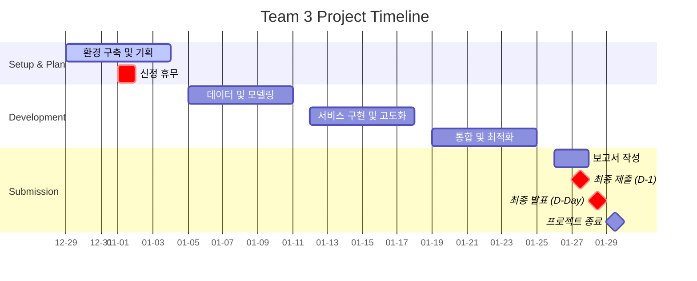

# [AI] 고급 프로젝트 수행 계획 및 환경 검토 보고서

**팀 명**: sprint-ai-chunk2-03 (3팀)
**프로젝트 기간**: 2025.12.29(월) ~ 2026.01.29(목)
**작성일**: 2025.12.28
**문서 버전**: v1.2 (5인 체제 R&R 업데이트)

---

## 1. 프로젝트 개요 (Project Overview)

### 1.1. 배경 및 목적
* **주제**: 생성형 AI(Generative AI) 기술을 활용한 소상공인 광고 콘텐츠 제작 지원 서비스
* **목표**: 디자인 역량이 부족한 소상공인이 제품 이미지, 배너, 광고 문구 등을 손쉽게 생성하여 온라인 마케팅 진입 장벽을 낮출 수 있도록 지원
* **핵심 가치**: 비용 절감, 콘텐츠 제작 시간 단축, 마케팅 효율 증대
* **특화 타겟**: 전통시장 소상공인 (1차 특화: 건어물 상품 프롬프트 엔진)
* **기술 방향**: 이미지 기반 광고 제작 (영상 제외), 확장 가능한 설계 구조

### 1.2. 서비스 범위 (Scope)
* **타겟 유저**: 오프라인 중심의 개인/법인 사업자 (소상공인)
* **필수 기능**: 생성형 AI를 활용한 이미지 또는 텍스트 생성 기능 최소 1종 구현
* **제공 형태**: FastAPI 기반의 웹 어플리케이션

---

## 2. 개발 환경 및 인프라 구축 (Infrastructure)

제공된 GCP VM 자원을 5명의 팀원이 효율적으로 공유할 수 있도록 아래와 같이 환경을 구성합니다.

### 2.1. 하드웨어 스펙 (GCP)
* **Region**: us-central1 (Iowa) - 비용 최적화
* **Instance**: `g2-standard` (4 vCPU, 16GB RAM)
* **GPU**: NVIDIA L4 (24GB VRAM) x 1
* **OS**: Ubuntu (Deep Learning Image 권장)
* **Storage**: OS 20GB + 데이터 200GB (개인별 100GB씩 바인드 마운트)
* **External IP**: 34.44.205.198
* **VM 제한**: 팀당 1개 (비용 관리)

### 2.2. 협업 환경 구성도
1. **JupyterHub (다중 사용자 환경)**
   - **용도**: 팀원 5인의 독립된 코딩 및 분석 환경 제공
   - **접속 주소**: `http://[VM_External_IP]:8000`
   - **계정**: 팀원 5명 전원 계정 생성 (예: `spai04xx` 시리즈)
   - **환경**: Miniconda (`jhub-env`) 기반 개별 커널 등록 가능

2. **VSFTPD (파일 서버)**
   - **용도**: 대용량 모델 가중치, 데이터셋 공유 (Windows Z: 드라이브 마운트)
   - **포트**: 21 (Control), 30000-30009 (Passive Data)
   - **설정**: `pasv_address`를 VM 외부 IP로 설정 필수

3. **Colab SSH 터널링 (고성능 연산)**
   - **용도**: 무거운 학습 수행 시 Colab UI 활용
   - **연결**: `gcloud compute ssh ... --ssh-flag="-L 8888:localhost:8888"`
   - **접속**: `http://localhost:8888/?token=[토큰값]`

### 2.3. 기술 스택 (Tech Stack)
* **Language**: Python 3.11+
* **Framework**: PyTorch, Diffusers
* **Serving**: FastAPI (선택), FastAPI (UI)
* **Models**: HuggingFace (Stable Diffusion 계열), OpenAI API (GPT-5-mini, Embedding)
* **VCS**: Github (소스코드 형상 관리)

---

## 3. 팀 구성 및 역할 분담 (R&R) - 5인 체제

5명의 팀원이 전문성을 발휘하고 업무 병목을 방지하기 위해 다음과 같이 역할을 분담합니다.

### 3.1. 역할 정의 (확정)

| 담당자 | 역할 | 주요 업무 | 비고 |
| :--- | :--- | :--- | :--- |
| **박지윤** | PM & 기획 (Project Manager) | 일정(Jira/Notion) 관리, 서비스 기획, 데이터 요구사항 정의, 최종 QA | 전체 조율 및 문서화 |
| **김민혁** | 모델 연구 (이미지 특성 추출) | 이미지 특성 추출 모델 개발, 데이터셋 전처리 | 이미지 분석 담당 |
| **이솔형** | 모델 연구 (이미지 생성) | 이미지 생성 및 조합 모델 개발, 프롬프트 엔지니어링 | 이미지 생성 담당 |
| **김명환** | 아키텍처 & 파이프라인 | 시스템 아키텍처 설계, API 설계, 데이터 포맷 정의, 모델 서버 구성, 모델 관리 서버 설계 | 시스템 설계 |
| **이건희** | 백엔드 & 프론트엔드 | 백엔드 개발(LLM 연동), 프론트엔드 개발(FastAPI), Google Cloud VM 서버 구성 | 서비스 구현 담당 |

**세부 업무 분담**:
- **김명환**: 아키텍처 설계 및 파이프라인 구성 (API, 데이터 포맷 json/db/png, 모델 서버 L4)
- **이건희**: 백엔드 (LLM 연동) + 프론트엔드 (FastAPI UI) + VM 인프라 구성
- **김민혁**: 이미지 특성 추출 모델 (Feature Extraction)
- **이솔형**: 이미지 생성 및 조합 모델 (Image Generation & Composition)
- **박지윤**: PM (프로젝트 관리, 일정 조율, 문서화)

### 3.2. 협업 규칙
* **협업 일지**: 매일 작업 전/후 개인별 작성 (노션 등 활용, 평가 필수 항목)
* **코드 리뷰**: 주요 기능 Merge 시 팀원 1인 이상 리뷰 진행
* **보안**: API Key, SSH Key 등 민감 정보 Github 업로드 절대 금지 (`.env` 활용)

---

## 4. 프로젝트 추진 일정 (Timeline)

**전체 기간**: 2025.12.29(월) ~ 2026.01.29(목) (총 32일)

### 4.1. 주차별 상세 계획

**1주차: 기획 및 환경 세팅 (12.29 ~ 01.04)**
* `12.29(월)`: 프로젝트 킥오프, 주제 확정, R&R 분배
* `12.30(화)`: GCP 환경 구축 (JupyterHub, FTP), Github Repo 생성
* `12.31(수)`: 데이터 요구사항 정의 및 수집 시작
* `01.01(목)`: **[휴일] 신정 (New Year's Day)**
* `01.02(금)`: UI 와이어프레임 설계, 베이스라인 모델 선정

**2주차: 데이터 확보 및 모델링 (01.05 ~ 01.11)**
* `01.05(월)`: 데이터 전처리 및 증강 (Data Augmentation)
* `01.07(수)`: 모델 파이프라인 프로토타입 구현 (이미지 생성 테스트)
* `01.09(금)`: 모델 성능 1차 평가 및 개선 방향 도출

**3주차: 서비스 개발 및 고도화 (01.12 ~ 01.18)**
* `01.12(월)`: FastAPI 프론트엔드 개발 착수
* `01.14(수)`: 모델 Fine-tuning (LoRA 등 적용) 및 결과물 퀄리티 향상
* `01.16(금)`: 백엔드 로직과 모델 연동 테스트

**4주차: 최적화 및 통합 (01.19 ~ 01.25)**
* `01.19(월)`: 추론 속도 최적화, 에러 핸들링 추가
* `01.21(수)`: 서비스 통합 테스트, UI/UX 디테일 수정
* `01.23(금)`: 최종 시연 시나리오 점검

**5주차: 마무리 및 발표 (01.26 ~ 01.29)**
* `01.26(월)`: 최종 버그 수정, 발표 자료 및 보고서 작성
* `01.27(화)`: **[D-1] Github 및 보고서 제출 (19:00 마감)**, 발표 리허설
* `01.28(수)`: **[D-Day] 최종 프로젝트 발표 (팀별 25분)**
* `01.29(목)`: 멘토링 피드백 반영, 최종 협업 일지 제출 (23:50 마감), 프로젝트 종료

### 4.2. 간트 차트 (Gantt Chart)

---

## 5. 결과물 제출 목록 (Deliverables)

| 항목 | 제출 마감 | 제출 방법 | 비고 |
| --- | --- | --- | --- |
| **Github Repository** | 2026.01.27 (화) 19:00 | LMS 제출 | 코드 및 실행 가이드 포함 |
| **결과 보고서 (PDF)** | 2026.01.27 (화) 19:00 | LMS & Github | README에 다운로드 링크 포함 |
| **발표 자료 (PPT)** | 2026.01.28 (수) 발표 전 | 발표용 | 시연 영상 포함 권장 |
| **개인 협업 일지** | 2026.01.29 (목) 23:50 | LMS 제출 | 개인별 작성 링크 또는 PDF |

---

## 6. 주의사항 및 리스크 관리

1. **비용 관리**: GCP VM은 반드시 **팀당 1개**만 유지 (추가 생성 시 비용 발생 주의).
2. **저작권 준수**: 타 팀 결과물 도용 금지, 학습 데이터 라이선스 확인.
3. **일정 관리**: 1월 1일 휴일을 고려하여 초반 환경 설정 및 기획을 12월 말 내에 빠르게 확정하는 것이 중요함.
