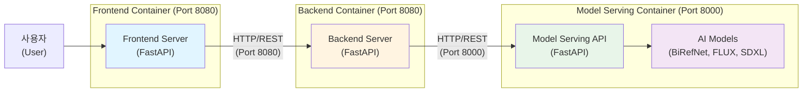
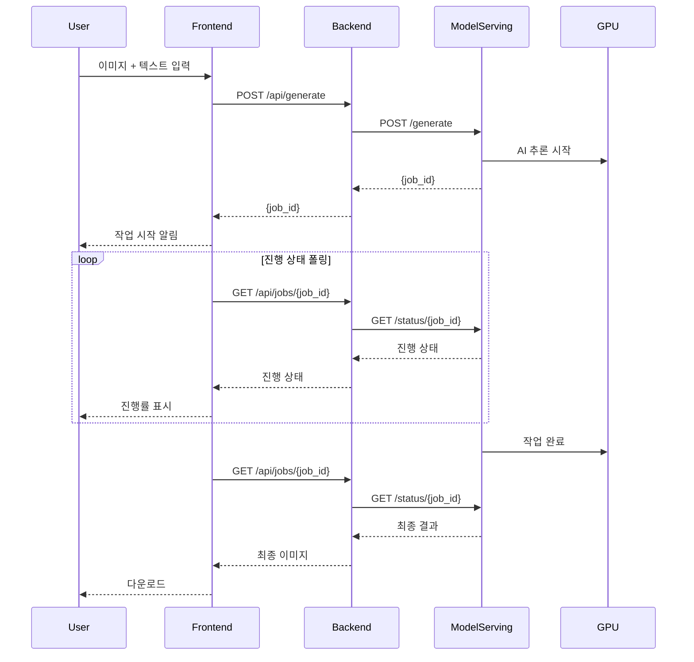

# 광고 콘텐츠 생성 시스템 아키텍처 설계서

**프로젝트명**: 소상공인 광고 콘텐츠 제작 지원 서비스
**작성일**: 2026-01-02
**작성자**: 김명환
**문서 버전**: v1.0

---

## 1. 시스템 개요 (System Overview)

본 문서는 생성형 AI 기술을 활용한 소상공인 광고 콘텐츠 제작 지원 서비스의 전체 시스템 아키텍처를 기술합니다.

### 1.1. 설계 목표

1. **마이크로서비스 아키텍처**: 프론트엔드, 백엔드, AI 모델 서빙을 독립적인 서비스로 분리하여 개발 및 배포
2. **컨테이너 기반 배포**: Docker를 활용한 일관된 배포 환경 구축
3. **확장 가능한 구조**: 향후 기능 추가 및 성능 확장이 용이한 설계
4. **API 기반 통신**: RESTful API를 통한 서비스 간 느슨한 결합

### 1.2. 기술 스택

- **프론트엔드**: FastAPI (웹 UI 제공)
- **백엔드**: FastAPI (비즈니스 로직 처리)
- **모델 서빙**: FastAPI (AI 모델 추론)
- **AI 모델**: BiRefNet, FLUX.1-dev, SDXL ControlNet
- **컨테이너**: Docker
- **GPU**: NVIDIA L4 (24GB VRAM)

---

## 2. 전체 시스템 아키텍처 (System Architecture)

### 2.1. 상위 레벨 구조도



### 2.2. 계층별 역할

| 계층 | 포트 | 역할 | 기술 스택 |
|------|------|------|-----------|
| **Frontend** | 8080 | 사용자 인터페이스 제공, 요청 전달 | FastAPI |
| **Backend** | 8080 (내부) | 비즈니스 로직 처리, LLM 연동 | FastAPI |
| **Model Serving** | 8000 | AI 모델 추론 및 이미지 생성 | FastAPI + PyTorch + Diffusers |

---

## 3. 모델 서빙 계층 (Model Serving Layer)

모델 서빙 계층은 기존에 구현된 `nanoCocoa_aiserver` 시스템을 활용합니다.

### 3.1. 모델 서빙 아키텍처

상세한 모델 서빙 아키텍처는 [nanoCocoa_AI_Server_아키텍처설계.md](doc/nanoCocoa_AI_Server_아키텍처설계.md)를 참조하세요.

**주요 특징**:
- **3단계 파이프라인**: 배경 생성 (Step 1) → 텍스트 자산 생성 (Step 2) → 최종 합성 (Step 3)
- **동적 메모리 관리**: JIT 로딩/언로딩을 통한 GPU 메모리 최적화
- **비동기 처리**: Multiprocessing 기반 워커 프로세스
- **상태 관리**: In-Memory 공유 객체를 통한 작업 상태 추적

### 3.2. 모델 서빙 API 엔드포인트

| 엔드포인트 | 메서드 | 설명 | 응답 |
|------------|--------|------|------|
| `/generate` | POST | AI 광고 생성 작업 시작 | `{job_id, status}` |
| `/status/{job_id}` | GET | 작업 상태 및 결과 조회 | `StatusResponse` (진행률, 이미지) |
| `/stop/{job_id}` | POST | 작업 강제 중단 | `{job_id, status}` |
| `/health` | GET | 서버 상태 확인 | `{status, gpu_available}` |
| `/fonts` | GET | 사용 가능한 폰트 목록 | `[{name, path}]` |
| `/resources` | GET | 시스템 리소스 확인 | `SystemMetrics` |

**참고 코드**: [generation.py](../src/nanoCocoa_aiserver/api/routers/generation.py), [app.py](../src/nanoCocoa_aiserver/api/app.py)

### 3.3. 요청/응답 데이터 포맷

**생성 요청 예시**:

```json
{
  "start_step": 1,
  "input_image": "base64_encoded_image...",
  "text_content": "Super Sale",
  "bg_prompt": "Wooden table in a cozy cafe, sunlight, realistic",
  "text_model_prompt": "3D render of Gold foil balloon text",
  "font_name": "NanumSquare/NanumSquareB.ttf",
  "composition_mode": "overlay",
  "text_position": "top"
}
```

**상태 응답 예시**:

```json
{
  "job_id": "550e8400-e29b-41d4-a716-446655440000",
  "status": "running",
  "progress_percent": 45,
  "current_step": "step2_text_asset",
  "message": "Generating 3D text...",
  "step1_result": "base64_image...",
  "final_result": null
}
```

---

## 4. 백엔드 계층 (Backend Layer)

### 4.1. 백엔드 역할

1. **비즈니스 로직 처리**: 사용자 요청 검증, 데이터 변환
2. **LLM 연동**: GPT-4o 등을 활용한 프롬프트 생성 및 최적화
3. **작업 관리**: 모델 서빙 API 호출 및 결과 수집

### 4.2. 백엔드 API 설계

| 엔드포인트 | 메서드 | 설명 | 비고 |
|------------|--------|------|------|
| `/api/generate` | POST | 광고 생성 요청 | 모델 서빙 `/generate` 호출 |
| `/api/jobs/{job_id}` | GET | 작업 상태 조회 | 모델 서빙 `/status/{job_id}` 호출 |
| `/api/optimize-prompt` | POST | LLM 기반 프롬프트 최적화 | GPT-4o 연동 |

### 4.3. 백엔드-모델 서빙 통신

백엔드는 모델 서빙 REST API (Port 8000)를 호출합니다:

```python
import requests

MODEL_SERVING_URL = "http://model-serving:8000"

def request_generation(request_data):
    response = requests.post(f"{MODEL_SERVING_URL}/generate", json=request_data)
    return response.json()

def check_status(job_id):
    response = requests.get(f"{MODEL_SERVING_URL}/status/{job_id}")
    return response.json()
```

---

## 5. 프론트엔드 계층 (Frontend Layer)

### 5.1. 프론트엔드 역할

1. **UI 제공**: 이미지 업로드, 텍스트 입력, 설정 조정
2. **실시간 상태 표시**: 작업 진행률, 중간 결과 미리보기
3. **결과 다운로드**: 생성된 이미지 다운로드

### 5.2. 프론트엔드-백엔드 통신

프론트엔드는 백엔드 API (Port 8080)를 호출합니다:

```python
import httpx

BACKEND_URL = "http://backend:8080"

async def submit_generation(image, text, bg_prompt):
    async with httpx.AsyncClient() as client:
        response = await client.post(
            f"{BACKEND_URL}/api/generate",
            json={"input_image": image, "text_content": text, "bg_prompt": bg_prompt}
        )
    return response.json()
```

---

## 6. 배포 아키텍처 (Deployment Architecture)

### 6.1. Docker 컨테이너 구성

각 계층은 독립적인 Docker 컨테이너로 배포됩니다:

```yaml
version: '3.8'

services:
  frontend:
    build: ./frontend
    ports:
      - "8080:8080"
    depends_on:
      - backend

  backend:
    build: ./backend
    ports:
      - "8081:8080"
    depends_on:
      - model-serving

  model-serving:
    build: ./src/nanoCocoa_aiserver
    ports:
      - "8000:8000"
    deploy:
      resources:
        reservations:
          devices:
            - driver: nvidia
              count: 1
              capabilities: [gpu]
```

---

## 7. 데이터 플로우 (Data Flow)



---

## 8. 참고 문서

- [nanoCocoa_AI_Server_아키텍처설계.md](doc/nanoCocoa_AI_Server_아키텍처설계.md) - 모델 서빙 상세 설계
- [고급_프로젝트_수행_계획_및_환경_검토_보고서.md](doc/고급_프로젝트_수행_계획_및_환경_검토_보고서.md)
- [generation.py](../src/nanoCocoa_aiserver/api/routers/generation.py) - API 구현 참고

---

**작성일**: 2026-01-02
**최종 수정**: 2026-01-02
