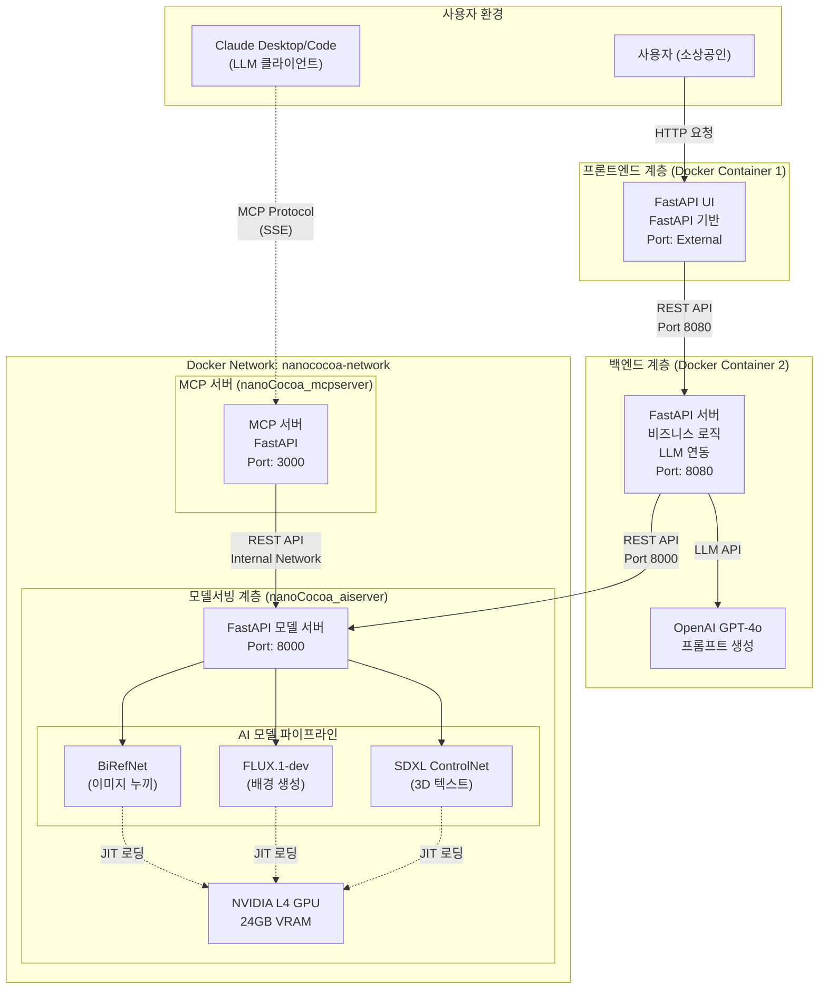
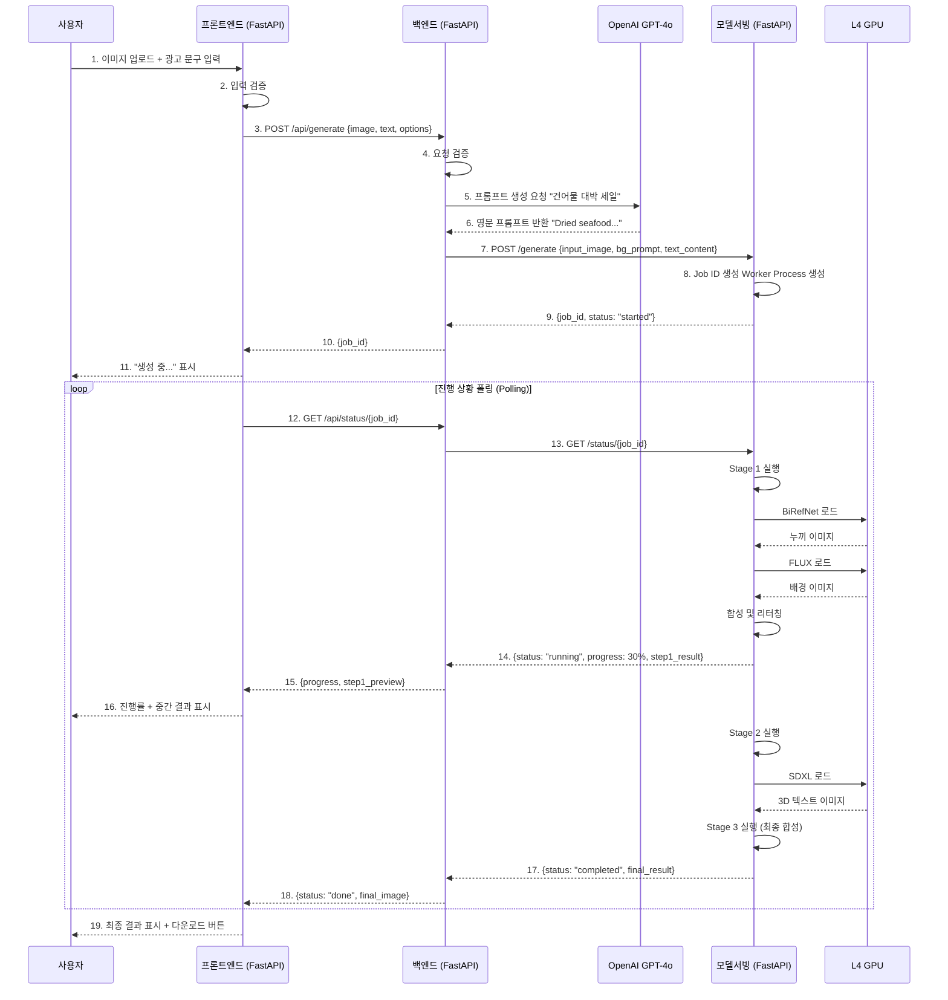
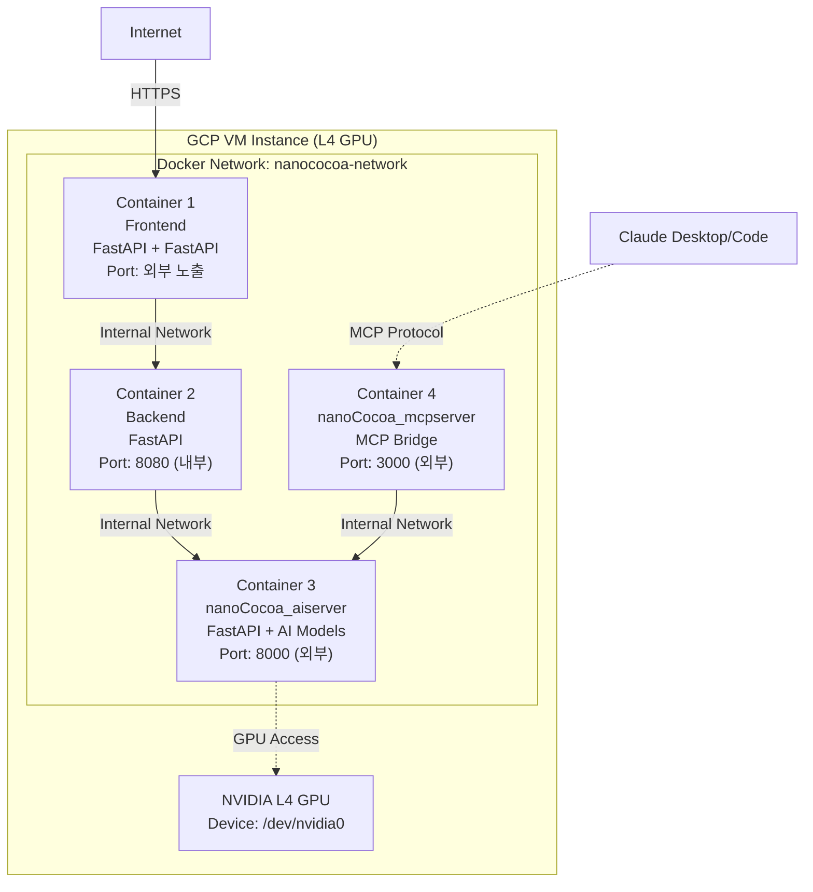

# AI 광고 콘텐츠 생성 시스템 아키텍처 설계서

**작성일**: 2026.01.01<br/>
**작성자**: 김명환<br/>
**버전**: v1.0<br/>
**프로젝트**: 생성형 AI 기반 소상공인 광고 콘텐츠 제작 지원 서비스<br/>

---

## 1. 개요 (Overview)

### 1.1. 문서 목적

본 문서는 생성형 AI 기반 광고 콘텐츠 생성 시스템의 전체 아키텍처를 정의합니다. 사용자-프론트엔드-백엔드-모델서빙의 4계층 구조와 각 컴포넌트 간 통신 방식, 데이터 흐름, 배포 전략을 기술합니다.

### 1.2. 시스템 목표

- **사용자 친화성**: FastAPI 기반의 직관적인 UI로 디자인 역량이 부족한 소상공인도 쉽게 사용
- **고성능 AI 추론**: NVIDIA L4 GPU를 활용한 고품질 이미지 생성
- **확장 가능성**: Docker 기반 컨테이너화로 각 계층의 독립적인 확장 및 배포
- **안정성**: 비동기 처리 및 에러 핸들링을 통한 서비스 안정성 확보

### 1.3. 기술 스택

| 계층 | 기술 스택 | 비고 |
|-----|----------|------|
| **프론트엔드** | FastAPI, Python 3.11+ | 사용자 인터페이스 |
| **백엔드** | FastAPI, Python 3.11+ | 비즈니스 로직, LLM 연동 |
| **모델서빙** | FastAPI, PyTorch, Diffusers | AI 모델 추론 서버 |
| **AI 모델** | FLUX.1-dev, SDXL, BiRefNet | 이미지 생성 및 처리 |
| **배포** | Docker, Docker Compose | 컨테이너 기반 배포 |
| **인프라** | GCP VM (L4 GPU) | NVIDIA L4 24GB VRAM |

---

## 2. 시스템 아키텍처 (System Architecture)

### 2.1. 전체 구조도 (High-Level Architecture)



### 2.2. 계층별 역할 (Layer Responsibilities)

#### 2.2.1. 프론트엔드 계층

**역할**: 사용자 인터페이스 제공 및 입력 데이터 수집

- FastAPI 기반 웹 UI
- 이미지 업로드 (상품 이미지)
- 광고 문구 입력 (텍스트)
- 생성 옵션 설정 (배경 스타일, 텍스트 스타일 등)
- 생성 결과 표시 및 다운로드

**통신 방식**: HTTP/REST API (→ 백엔드 8080 포트)

#### 2.2.2. 백엔드 계층

**역할**: 비즈니스 로직 처리 및 외부 서비스 연동

- 사용자 요청 검증 및 전처리
- LLM(GPT-4o) 연동을 통한 프롬프트 생성
  - 사용자 입력을 분석하여 AI 모델에 적합한 영문 프롬프트 자동 생성
  - 예: "건어물 대박 세일" → "Dried seafood products on a rustic wooden table, traditional Korean market atmosphere, vibrant colors, photorealistic"
- 모델 서버 호출 및 응답 관리
- 작업 상태 추적 및 폴링 처리
- 에러 핸들링 및 사용자 피드백

**통신 방식**:
- 프론트엔드 ← HTTP/REST API (8080 포트 수신)
- 모델서빙 → HTTP/REST API (8000 포트 호출)
- OpenAI API → HTTPS

#### 2.2.3. 모델서빙 계층 (nanoCocoa_aiserver)

**역할**: AI 모델 추론 및 이미지 생성

- FastAPI 기반 REST API 서버
- GPU 리소스 관리 (JIT 로딩/언로딩)
- 비동기 추론 작업 처리 (멀티프로세싱)
- 3단계 파이프라인 실행
  - **Stage 1 (배경 생성)**: BiRefNet 누끼 → FLUX 배경 생성 → 합성 및 리터칭
  - **Stage 2 (텍스트 생성)**: SDXL ControlNet 3D 텍스트 생성 → BiRefNet 배경 제거
  - **Stage 3 (최종 합성)**: 배경 + 텍스트 레이어 합성

**Docker 배포**:
- 컨테이너명: `nanococoa-aiserver`
- 포트: 8000 (외부 노출)
- GPU 접근: NVIDIA Driver, 모든 GPU 사용 가능
- 볼륨:
  - `/opt/huggingface` → HuggingFace 모델 캐시
  - `./nanoCocoa_aiserver/static/uploads` → 업로드 파일
  - `./nanoCocoa_aiserver/static/results` → 결과 파일
  - `./nanoCocoa_aiserver/logs` → 로그

**통신 방식**:
- 백엔드 ← HTTP/REST API (8000 포트 수신)
- MCP 서버 ← HTTP/REST API (내부 네트워크, nanococoa-network)

**상세 아키텍처**: [nanoCocoa_AI_Server_아키텍처설계.md](./nanoCocoa_AI_Server_아키텍처설계.md) 참조

#### 2.2.4. MCP 서버 계층 (nanoCocoa_mcpserver)

**역할**: MCP 프로토콜 브릿지 서버

- nanoCocoa_aiserver REST API를 MCP 프로토콜로 변환
- Claude Desktop/Code와 연동하여 자연어로 광고 이미지 생성 가능
- 8개의 MCP 도구 제공 (generate_ad_image, check_generation_status 등)
- SSE (Server-Sent Events) 전송 방식

**Docker 배포**:
- 컨테이너명: `nanococoa-mcpserver`
- 포트: 3000 (외부 노출)
- 의존성: nanoCocoa-aiserver (health check 대기)
- 환경변수:
  - `MCP_TRANSPORT=sse`
  - `MCP_PORT=3000`
  - `AISERVER_BASE_URL=http://nanococoa-aiserver:8000` (내부 네트워크)

**통신 방식**:
- Claude Desktop/Code ← MCP Protocol (SSE, 3000 포트)
- nanoCocoa_aiserver → HTTP/REST API (내부 네트워크)

---

## 3. 데이터 흐름 (Data Flow)

### 3.1. 전체 시퀀스 다이어그램



### 3.2. API 엔드포인트 명세

#### 3.2.1. 백엔드 API (Port 8080)

| 메서드 | 경로 | 설명 | 요청 | 응답 |
|--------|------|------|------|------|
| POST | `/api/generate` | 광고 생성 시작 | `{image, text, style}` | `{job_id}` |
| GET | `/api/status/{job_id}` | 작업 상태 조회 | - | `{status, progress, result}` |
| POST | `/api/stop/{job_id}` | 작업 중단 | - | `{status: "stopped"}` |

**요청 예시 (백엔드)**:
```json
{
  "product_image": "base64_encoded_image...",
  "ad_text": "건어물 대박 세일",
  "background_style": "전통시장 분위기",
  "text_style": "골드 풍선 텍스트"
}
```

**응답 예시 (백엔드)**:
```json
{
  "job_id": "uuid-v4",
  "status": "processing"
}
```

#### 3.2.2. 모델서빙 API (Port 8000)

| 메서드 | 경로 | 설명 | 요청 | 응답 |
|--------|------|------|------|------|
| POST | `/generate` | AI 생성 작업 시작 | `{input_image, bg_prompt, text_content, ...}` | `{job_id, status}` |
| GET | `/status/{job_id}` | 작업 상태 및 결과 조회 | - | `{status, progress, images, metrics}` |
| POST | `/stop/{job_id}` | 작업 강제 중단 | - | `{job_id, status}` |
| GET | `/health` | 서버 상태 확인 | - | `{status, gpu_available}` |
| GET | `/fonts` | 사용 가능한 폰트 목록 | - | `[{name, path}]` |

**요청 예시 (모델서빙)**:
```json
{
  "start_step": 1,
  "input_image": "base64_string...",
  "text_content": "Super Sale",
  "bg_prompt": "Wooden table in a cozy cafe, sunlight, realistic",
  "text_model_prompt": "Gold balloon text, 3d render",
  "strength": 0.6,
  "guidance_scale": 3.5,
  "test_mode": false
}
```

**응답 예시 (모델서빙)**:
```json
{
  "job_id": "550e8400-e29b-41d4-a716-446655440000",
  "status": "running",
  "progress_percent": 45,
  "current_step": "step2_text_asset",
  "sub_step": "sdxl_text_generation",
  "message": "Generating 3D text...",
  "elapsed_sec": 67.3,
  "eta_seconds": 85,
  "step_eta_seconds": 42,
  "system_metrics": {
    "cpu_percent": 45.2,
    "ram_used_gb": 12.5,
    "ram_total_gb": 32.0,
    "ram_percent": 39.1,
    "gpu_info": [
      {
        "index": 0,
        "name": "NVIDIA L4",
        "vram_used_mb": 15234,
        "vram_total_mb": 24576,
        "vram_percent": 62.0,
        "utilization": 98
      }
    ]
  },
  "parameters": {
    "start_step": 1,
    "text_content": "Super Sale",
    "bg_prompt": "Wooden table in a cozy cafe..."
  },
  "step1_result": "base64_image_step1...",
  "step2_result": null,
  "final_result": null
}
```

---

## 4. 배포 아키텍처 (Deployment Architecture)

### 4.1. Docker 컨테이너 구성



### 4.2. Docker Compose 구성

실제 배포 중인 구성 (`src/docker-compose.yml`):

```yaml
version: '3.8'

services:
  nanococoa-aiserver:
    build:
      context: ./nanoCocoa_aiserver
      dockerfile: Dockerfile
    image: nanococoa-aiserver:latest
    container_name: nanococoa-aiserver

    # GPU 설정
    deploy:
      resources:
        reservations:
          devices:
            - driver: nvidia
              count: all
              capabilities: [gpu]

    # 포트 매핑
    ports:
      - "8000:8000"

    # 볼륨 마운트
    volumes:
      # HuggingFace 캐시 (외부 스토리지)
      - /opt/huggingface:/root/.cache/huggingface
      # 업로드/결과 파일 (영구 저장)
      - ./nanoCocoa_aiserver/static/uploads:/app/static/uploads
      - ./nanoCocoa_aiserver/static/results:/app/static/results
      # 로그 (영구 저장)
      - ./nanoCocoa_aiserver/logs:/app/logs

    # 환경 변수
    env_file:
      - .env
    environment:
      - PYTORCH_CUDA_ALLOC_CONF=expandable_segments:True
      - HF_HOME=/root/.cache/huggingface
      - DEVICE=cuda
      - AUTO_UNLOAD_DEFAULT=true

    # 재시작 정책
    restart: unless-stopped

    # 헬스체크
    healthcheck:
      test: ["CMD", "curl", "-f", "http://localhost:8000/health"]
      interval: 30s
      timeout: 10s
      retries: 3
      start_period: 60s

    networks:
      - nanococoa-network

  nanococoa-mcpserver:
    build:
      context: ./nanoCocoa_mcpserver
      dockerfile: Dockerfile
    image: nanococoa-mcpserver:latest
    container_name: nanococoa-mcpserver

    # 포트 매핑
    ports:
      - "3000:3000"

    # 볼륨 마운트 (이미지 파일 공유)
    volumes:
      - ./nanoCocoa_aiserver/static/uploads:/app/static/uploads
      - ./nanoCocoa_aiserver/static/results:/app/static/results

    # 환경 변수
    environment:
      - MCP_TRANSPORT=sse
      - MCP_PORT=3000
      - MCP_HOST=0.0.0.0
      - AISERVER_BASE_URL=http://nanococoa-aiserver:8000
      - LOG_LEVEL=INFO

    # 의존성 (AI 서버가 healthy 상태일 때만 시작)
    depends_on:
      nanococoa-aiserver:
        condition: service_healthy

    # 재시작 정책
    restart: unless-stopped

    # 헬스체크
    healthcheck:
      test: ["CMD", "curl", "-f", "http://localhost:3000/health"]
      interval: 30s
      timeout: 10s
      retries: 3
      start_period: 10s

    networks:
      - nanococoa-network

networks:
  nanococoa-network:
    name: nanococoa-network
    driver: bridge
```

**주요 특징**:
- GPU 리소스를 AI 서버에만 할당
- MCP 서버는 AI 서버의 health check이 성공한 후에 시작 (`depends_on` 조건)
- 내부 네트워크 (`nanococoa-network`)를 통해 서비스 간 통신
- 볼륨 마운트로 데이터 영구 저장 및 공유

### 4.3. 포트 구성 (Port Configuration)

| 컨테이너 | 내부 포트 | 외부 포트 | 접근 범위 | 용도 |
|----------|----------|----------|-----------|------|
| **프론트엔드** | 8501 | 80 (HTTPS) | Public | 사용자 인터페이스 |
| **백엔드** | 8080 | 8080 | Internal Only | 비즈니스 로직 API |
| **nanoCocoa_aiserver** | 8000 | 8000 | Public | AI 모델 추론 API |
| **nanoCocoa_mcpserver** | 3000 | 3000 | Public | MCP 프로토콜 브릿지 |

**참고**:
- AI 서버(8000)와 MCP 서버(3000)는 외부 접근 가능하도록 포트 노출
- MCP 서버는 내부 네트워크를 통해 `http://nanococoa-aiserver:8000`으로 AI 서버 접근

---

## 5. 프론트엔드 설계 (Frontend Design)

### 5.1. 기술 스택

- **프레임워크**: FastAPI
- **언어**: Python 3.11+
- **서버**: FastAPI (FastAPI 임베딩)
- **통신**: HTTP REST API (백엔드 8080 포트)

### 5.2. 주요 기능

1. **이미지 업로드**
   - 드래그 앤 드롭 또는 파일 선택
   - 지원 형식: JPG, PNG
   - 이미지 미리보기

2. **광고 문구 입력**
   - 텍스트 입력 필드
   - 최대 길이 제한 (예: 20자)

3. **스타일 선택**
   - 배경 스타일 (전통시장, 고급스러운, 미니멀 등)
   - 텍스트 스타일 (골드 풍선, 네온, 3D 메탈 등)

4. **생성 진행 상황 표시**
   - 진행률 바 (Progress Bar)
   - 현재 단계 표시 (누끼 처리 중, 배경 생성 중, 텍스트 생성 중)
   - 중간 결과 미리보기

5. **결과 다운로드**
   - 최종 이미지 표시
   - 다운로드 버튼 (PNG 형식)

### 5.3. UI 플로우

```
[이미지 업로드] → [광고 문구 입력] → [스타일 선택] → [생성 버튼 클릭]
                                                              ↓
                                    [진행 상황 표시 + 중간 결과 미리보기]
                                                              ↓
                                          [최종 결과 표시 + 다운로드]
```

### 5.4. 백엔드 연동

```python
import streamlit as st
import requests
import time

BACKEND_URL = "http://backend:8080"

# 1. 생성 요청
def generate_ad(image, text, style):
    response = requests.post(
        f"{BACKEND_URL}/api/generate",
        json={
            "product_image": image,
            "ad_text": text,
            "background_style": style["background"],
            "text_style": style["text"]
        }
    )
    return response.json()["job_id"]

# 2. 상태 폴링
def poll_status(job_id):
    while True:
        response = requests.get(f"{BACKEND_URL}/api/status/{job_id}")
        data = response.json()

        if data["status"] == "completed":
            return data["result"]
        elif data["status"] == "failed":
            raise Exception(data["error"])

        # 진행 상황 표시
        st.progress(data["progress"] / 100)
        st.text(data["message"])

        time.sleep(2)  # 2초마다 폴링
```

---

## 6. 백엔드 설계 (Backend Design)

### 6.1. 기술 스택

- **프레임워크**: FastAPI
- **언어**: Python 3.11+
- **외부 API**: OpenAI GPT-4o
- **통신**: HTTP REST API

### 6.2. 주요 기능

1. **프롬프트 생성 (LLM 연동)**
   - 사용자 입력 (한글 텍스트 + 스타일 선택)을 분석
   - GPT-4o를 통해 AI 모델에 적합한 영문 프롬프트 생성

   **예시**:
   ```
   입력: "건어물 대박 세일", 스타일: "전통시장 분위기"

   LLM 프롬프트:
   "Generate a professional English prompt for an AI image generation model.
   Input: Korean text '건어물 대박 세일', style: traditional market atmosphere.
   Output: Detailed prompt for background generation and text style."

   LLM 응답:
   {
     "background_prompt": "Traditional Korean market stall with dried seafood products, wooden display, warm lighting, authentic atmosphere, photorealistic, 8k",
     "text_prompt": "3D render of bold Korean text '대박 세일', red and gold colors, festive style, hanging banner effect"
   }
   ```

2. **모델 서버 호출**
   - 생성된 프롬프트와 사용자 이미지를 모델 서버로 전송
   - Job ID 반환

3. **상태 관리**
   - 모델 서버의 `/status/{job_id}` 폴링
   - 진행 상황을 프론트엔드에 전달

4. **에러 핸들링**
   - 모델 서버 장애 시 재시도 로직
   - 사용자에게 명확한 에러 메시지 반환

### 6.3. API 구현 예시

```python
from FastAPI import FastAPI, HTTPException
from openai import OpenAI
import httpx

app = FastAPI()
client = OpenAI()

MODEL_SERVER_URL = "http://model-serving:8000"

@app.post("/api/generate")
async def generate_ad(request: GenerateRequest):
    # 1. LLM을 통한 프롬프트 생성
    prompts = await generate_prompts_with_llm(
        request.ad_text,
        request.background_style,
        request.text_style
    )

    # 2. 모델 서버 호출
    async with httpx.AsyncClient() as client:
        response = await client.post(
            f"{MODEL_SERVER_URL}/generate",
            json={
                "input_image": request.product_image,
                "text_content": request.ad_text,
                "bg_prompt": prompts["background"],
                "text_model_prompt": prompts["text"],
                "start_step": 1
            },
            timeout=10.0
        )

    return response.json()

async def generate_prompts_with_llm(text, bg_style, text_style):
    completion = client.chat.completions.create(
        model="gpt-5-mini",
        messages=[
            {
                "role": "system",
                "content": "You are an expert prompt engineer for AI image generation."
            },
            {
                "role": "user",
                "content": f"""Generate detailed English prompts for:
                - Text: {text}
                - Background style: {bg_style}
                - Text style: {text_style}

                Return JSON with 'background' and 'text' keys."""
            }
        ]
    )

    # JSON 파싱
    result = completion.choices[0].message.content
    return eval(result)  # 실제로는 json.loads() 사용
```

---

## 7. 모델서빙 설계 (Model Serving Design)

### 7.1. 상세 설계 문서

모델서빙 계층의 상세한 아키텍처는 별도 문서를 참조하세요:

**📄 [nanoCocoa_AI_Server_아키텍처설계.md](./nanoCocoa_AI_Server_아키텍처설계.md)**

### 7.2. 주요 특징 요약

- **JIT (Just-In-Time) 모델 로딩**: 메모리 최적화를 위해 필요할 때만 모델을 GPU에 로드
- **비동기 처리**: `multiprocessing`을 활용한 Non-blocking 추론
- **3단계 파이프라인**: 배경 생성 → 텍스트 생성 → 최종 합성
- **실시간 모니터링**: CPU/RAM/GPU 사용률 실시간 제공
- **단계별 재시작**: 실패 시 특정 단계부터 재실행 가능

### 7.3. 핵심 API

```python
# 모델 서버 핵심 로직 (간략화)
@router.post("/generate")
async def generate_ad(req: GenerateRequest):
    job_id = str(uuid.uuid4())

    # Worker Process 생성 (비동기 처리)
    p = multiprocessing.Process(
        target=worker_process,
        args=(job_id, req.model_dump(), shared_jobs[job_id])
    )
    p.start()

    return {"job_id": job_id, "status": "started"}

def worker_process(job_id, input_data, shared_state):
    # Step 1: 배경 생성
    step1_result = generate_background(
        input_data["input_image"],
        input_data["bg_prompt"]
    )
    shared_state["step1_result"] = step1_result

    # Step 2: 텍스트 생성
    step2_result = generate_text(
        input_data["text_content"],
        input_data["text_model_prompt"]
    )
    shared_state["step2_result"] = step2_result

    # Step 3: 최종 합성
    final_result = compose_layers(step1_result, step2_result)
    shared_state["final_result"] = final_result
    shared_state["status"] = "completed"
```

---

## 8. 보안 및 안정성 (Security & Reliability)

### 8.1. 보안 고려사항

1. **API 키 관리**
   - 환경 변수로 관리 (`.env` 파일)
   - Docker secrets 활용
   - GitHub에 업로드 금지

2. **네트워크 격리**
   - 모델서빙과 백엔드는 내부 네트워크에서만 접근
   - 프론트엔드만 외부 노출

3. **입력 검증**
   - 이미지 크기 제한 (예: 10MB)
   - 텍스트 길이 제한
   - 파일 형식 검증

### 8.2. 안정성 확보

1. **에러 핸들링**
   - GPU OOM 발생 시 자동 메모리 정리 및 재시도
   - 모델 로딩 실패 시 상세 에러 메시지 반환

2. **리소스 관리**
   - 단일 작업만 처리 (동시성 제어)
   - 작업 큐 구현 (향후 확장)

3. **모니터링**
   - 실시간 GPU/CPU/RAM 사용률 추적
   - 작업 시간 로깅

---

## 9. 향후 확장 계획 (Future Enhancements)

### 9.1. 단기 계획 (1~2주)

- [ ] 작업 큐 시스템 구현 (다중 사용자 지원)
- [ ] Redis 기반 상태 관리 (인메모리 → 영구 저장)
- [ ] 사용자 인증 및 세션 관리

### 9.2. 중기 계획 (1~2개월)

- [ ] 데이터베이스 연동 (작업 이력 저장)
- [ ] 사용자 갤러리 기능
- [ ] A/B 테스트 지원 (여러 버전 생성 및 비교)

---

## 10. 참고 문서 (References)

- [고급_프로젝트_수행_계획_및_환경_검토_보고서.md](./고급_프로젝트_수행_계획_및_환경_검토_보고서.md)
- [nanoCocoa_AI_Server_아키텍처설계.md](./nanoCocoa_AI_Server_아키텍처설계.md)

---

**문서 변경 이력**

| 버전 | 날짜 | 작성자 | 변경 내용 |
|------|------|--------|-----------|
| v1.0 | 2026.01.01 | 김명환 | 초안 작성 |
