# AI 광고 콘텐츠 생성 시스템 아키텍처 설계서

**작성일**: 2026.01.01<br/>
**작성자**: 김명환<br/>
**버전**: v1.0<br/>
**프로젝트**: 생성형 AI 기반 소상공인 광고 콘텐츠 제작 지원 서비스<br/>

---

## 1. 개요 (Overview)

### 1.1. 문서 목적

본 문서는 생성형 AI 기반 광고 콘텐츠 생성 시스템의 전체 아키텍처를 정의합니다. 사용자-프론트엔드-백엔드-모델서빙의 4계층 구조와 각 컴포넌트 간 통신 방식, 데이터 흐름, 배포 전략을 기술합니다.

### 1.2. 시스템 목표

- **사용자 친화성**: FastAPI 기반의 직관적인 UI로 디자인 역량이 부족한 소상공인도 쉽게 사용
- **고성능 AI 추론**: NVIDIA L4 GPU를 활용한 고품질 이미지 생성
- **확장 가능성**: Docker 기반 컨테이너화로 각 계층의 독립적인 확장 및 배포
- **안정성**: 비동기 처리 및 에러 핸들링을 통한 서비스 안정성 확보

### 1.3. 기술 스택

| 계층 | 기술 스택 | 비고 |
|-----|----------|------|
| **프론트엔드** | FastAPI, Python 3.11+ | 사용자 인터페이스 |
| **백엔드** | FastAPI, Python 3.11+ | 비즈니스 로직, LLM 연동 |
| **모델서빙** | FastAPI, PyTorch, Diffusers | AI 모델 추론 서버 |
| **AI 모델** | FLUX.1-dev, BiRefNet, Qwen2-VL, LLM (HTML) | 이미지 생성, 처리, 분석, 텍스트 렌더링 |
| **광고페이지 생성** | LangGraph, OpenAI, Playwright | 멀티에이전트 협업, HTML 생성 |
| **배포** | Docker, Docker Compose | 컨테이너 기반 배포 |
| **인프라** | GCP VM (L4 GPU) | NVIDIA L4 24GB VRAM |

---

## 2. 시스템 아키텍처 (System Architecture)

### 2.1. 전체 구조도 (High-Level Architecture)

```mermaid
graph TB
    subgraph "사용자 환경"
        User["사용자 (소상공인)"]
        LLMClient["LLM / GPT
(MCP 클라이언트)"]
    end

    subgraph "Docker Network: nanococoa-network"
        subgraph "백엔드 계층 (backend)"
            Backend["FastAPI 서버
비즈니스 로직
Port: 8080"]
            HPGen["Homepage Generator
LangGraph + Multi-Agent
Port: 8081"]
            DB[("PostgreSQL
고객 데이터")]
        end

        subgraph "MCP 서버 (nanoCocoa_mcpserver)"
            MCPServer["MCP 서버
MCP Protocol Bridge
Port: 3000"]
        end

        subgraph "모델서빙 계층 (nanoCocoa_aiserver)"
            ModelServer["FastAPI 모델 서버
Port: 8000"]

            subgraph "AI 모델 파이프라인"
                BiRefNet["BiRefNet
(이미지 누끼)"]
                FLUX["FLUX.1-dev
(배경 생성)"]
                Qwen["Qwen2-VL
(이미지 분석)"]
            end

            LLMText["OpenAI API
(HTML/CSS 생성)"]
            GPU["NVIDIA L4 GPU
24GB VRAM"]
        end
    end

    User -->|HTTP/웹| Backend
    Backend --> DB
    Backend --> HPGen
    HPGen -->|HTTP| MCPServer
    Backend -->|"REST API
Port 8000"| ModelServer
    
    LLMClient -.->|"MCP Protocol
(SSE)"| MCPServer
    MCPServer -->|"REST API
Internal Network"| ModelServer
    
    ModelServer --> BiRefNet
    ModelServer --> FLUX
    ModelServer --> Qwen
    ModelServer --> LLMText
    
    BiRefNet -.->|JIT 로딩| GPU
    FLUX -.->|JIT 로딩| GPU
    Qwen -.->|JIT 로딩| GPU
```



### 2.2. 계층별 역할 (Layer Responsibilities)

#### 2.2.1. 프론트엔드 계층

**역할**: 사용자 인터페이스 제공 및 입력 데이터 수집

- FastAPI 기반 웹 UI
- 이미지 업로드 (상품 이미지)
- 광고 문구 입력 (텍스트)
- 생성 옵션 설정 (배경 스타일, 텍스트 스타일 등)
- 생성 결과 표시 및 다운로드

**통신 방식**: HTTP/REST API (→ 백엔드 8080 포트)

#### 2.2.2. 백엔드 계층

**역할**: 비즈니스 로직 처리 및 외부 서비스 연동

- 사용자 요청 검증 및 전처리
- LLM(GPT-5-mini) 연동을 통한 프롬프트 생성
  - 사용자 입력을 분석하여 AI 모델에 적합한 영문 프롬프트 자동 생성
  - 예: "건어물 대박 세일" → "Dried seafood products on a rustic wooden table, traditional Korean market atmosphere, vibrant colors, photorealistic"
- 모델 서버 호출 및 응답 관리
- 작업 상태 추적 및 폴링 처리
- 에러 핸들링 및 사용자 피드백

**통신 방식**:
- 프론트엔드 ← HTTP/REST API (8080 포트 수신)
- 모델서빙 → HTTP/REST API (8000 포트 호출)
- OpenAI API → HTTPS

#### 2.2.3. 모델서빙 계층 (nanoCocoa_aiserver)

**역할**: AI 모델 추론 및 이미지 생성

- FastAPI 기반 REST API 서버
- GPU 리소스 관리 (JIT 로딩/언로딩)
- 비동기 추론 작업 처리 (멀티프로세싱)
- 2단계 파이프라인 실행
  - **Stage 1 (배경 생성)**: BiRefNet 누끼 → FLUX.1-dev 배경 생성 → 합성 및 리터칭
  - **Stage 2 (텍스트 렌더링)**: Qwen2-VL 이미지 분석 (선택) → LLM HTML/CSS 생성 → HTML 렌더링 → 텍스트 레이어 합성

**Docker 배포**:
- 컨테이너명: `nanococoa-aiserver`
- 포트: 8000 (외부 노출)
- GPU 접근: NVIDIA Driver, 모든 GPU 사용 가능
- 볼륨:
  - `/opt/huggingface` → HuggingFace 모델 캐시
  - `./nanoCocoa_aiserver/static/uploads` → 업로드 파일
  - `./nanoCocoa_aiserver/static/results` → 결과 파일
  - `./nanoCocoa_aiserver/logs` → 로그

**통신 방식**:
- 백엔드 ← HTTP/REST API (8000 포트 수신)
- MCP 서버 ← HTTP/REST API (내부 네트워크, nanococoa-network)

**상세 아키텍처**: [nanoCocoa_AI_Server_아키텍처설계.md](./nanoCocoa_AI_Server_아키텍처설계.md) 참조

#### 2.2.4. MCP 서버 계층 (nanoCocoa_mcpserver)

**역할**: MCP 프로토콜 브릿지 서버

- nanoCocoa_aiserver REST API를 MCP 프로토콜로 변환
- LLM Desktop/Code와 연동하여 자연어로 광고 이미지 생성 가능
- 8개의 MCP 도구 제공 (generate_ad_image, check_generation_status 등)
- SSE (Server-Sent Events) 전송 방식

**Docker 배포**:
- 컨테이너명: `nanococoa-mcpserver`
- 포트: 3000 (외부 노출)
- 의존성: nanoCocoa-aiserver (health check 대기)
- 환경변수:
  - `MCP_TRANSPORT=sse`
  - `MCP_PORT=3000`
  - `AISERVER_BASE_URL=http://nanococoa-aiserver:8000` (내부 네트워크)

**통신 방식**:
- LLM Desktop/Code ← MCP Protocol (SSE, 3000 포트)
- nanoCocoa_aiserver → HTTP/REST API (내부 네트워크)

---

## 3. 데이터 흐름 (Data Flow)

### 3.1. 전체 시퀀스 다이어그램

```mermaid
sequenceDiagram
    participant User as 사용자
    participant FE as 프론트엔드 (FastAPI)
    participant BE as 백엔드 (FastAPI)
    participant LLM as OpenAI GPT-5-mini
    participant MS as 모델서빙 (FastAPI)
    participant GPU as L4 GPU

    User->>FE: 1. 이미지 업로드 + 광고 문구 입력
    FE->>FE: 2. 입력 검증
    FE->>BE: 3. POST /api/generate {image, text, options}

    BE->>BE: 4. 요청 검증
    BE->>LLM: 5. 프롬프트 생성 요청 "건어물 대박 세일"
    LLM-->>BE: 6. 영문 프롬프트 반환 "Dried seafood..."

    BE->>MS: 7. POST /generate {product_image, bg_prompt, text_content}
    MS->>MS: 8. Job ID 생성 Worker Process 생성
    MS-->>BE: 9. {job_id, status: "started"}
    BE-->>FE: 10. {job_id}
    FE-->>User: 11. "생성 중..." 표시

    loop 진행 상황 폴링 (Polling)
        FE->>BE: 12. GET /api/status/{job_id}
        BE->>MS: 13. GET /status/{job_id}

        MS->>MS: Stage 1 실행
        MS->>GPU: BiRefNet 로드
        GPU-->>MS: 누끼 이미지
        MS->>GPU: FLUX.1-dev 로드
        GPU-->>MS: 배경 이미지
        MS->>MS: 합성 및 리터칭

        MS-->>BE: 14. {status: "running", progress: 50%, step1_result}
        BE-->>FE: 15. {progress, step1_preview}
        FE-->>User: 16. 진행률 + 중간 결과 표시

        MS->>MS: Stage 2 실행
        
        alt use_qwen_analysis=true
            MS->>GPU: Qwen2-VL 로드
            GPU-->>MS: 이미지 분석 텍스트
            MS->>GPU: Qwen2-VL 언로드
        end
        
        MS->>LLM: HTML/CSS 생성 요청 (Qwen 분석 포함)
        LLM-->>MS: HTML/CSS 코드
        MS->>MS: HTML 렌더링 (Headless Browser)
        MS->>MS: 텍스트 레이어 합성

        MS-->>BE: 17. {status: "completed", final_result}
        BE-->>FE: 18. {status: "done", final_image}
    end

    FE-->>User: 19. 최종 결과 표시 + 다운로드 버튼
```



### 3.2. API 엔드포인트 명세

#### 3.2.1. 백엔드 API (Port 8080)

| 메서드 | 경로 | 설명 | 요청 | 응답 |
|--------|------|------|------|------|
| POST | `/api/generate` | 광고 생성 시작 | `{image, text, style}` | `{job_id}` |
| GET | `/api/status/{job_id}` | 작업 상태 조회 | - | `{status, progress, result}` |
| POST | `/api/stop/{job_id}` | 작업 중단 | - | `{status: "stopped"}` |

**요청 예시 (백엔드)**:
```json
{
  "product_image": "base64_encoded_image...",
  "ad_text": "건어물 대박 세일",
  "background_style": "전통시장 분위기",
  "text_style": "골드 풍선 텍스트"
}
```

**응답 예시 (백엔드)**:
```json
{
  "job_id": "uuid-v4",
  "status": "processing"
}
```

#### 3.2.2. 모델서빙 API (Port 8000)

| 메서드 | 경로 | 설명 | 요청 | 응답 |
|--------|------|------|------|------|
| POST | `/generate` | AI 생성 작업 시작 | `{product_image, bg_prompt, text_content, ...}` | `{job_id, status}` |
| GET | `/status/{job_id}` | 작업 상태 및 결과 조회 | - | `{status, progress, images, metrics}` |
| POST | `/stop/{job_id}` | 작업 강제 중단 | - | `{job_id, status}` |
| GET | `/health` | 서버 상태 확인 | - | `{status, gpu_available}` |
| GET | `/fonts` | 사용 가능한 폰트 목록 | - | `[{name, path}]` |

**요청 예시 (모델서빙)**:
```json
{
  "start_step": 1,
  "product_image": "base64_string...",
  "text_content": "Super Sale",
  "bg_prompt": "Wooden table in a cozy cafe, sunlight, realistic",
  "html_style_prompt": "Gold gradient with shadow, modern bold",
  "use_qwen_analysis": true,
  "use_llm_html": true,
  "text_position": "top",
  "strength": 0.6,
  "guidance_scale": 3.5,
  "test_mode": false
}
```

**응답 예시 (모델서빙)**:
```json
{
  "job_id": "550e8400-e29b-41d4-a716-446655440000",
  "status": "running",
  "progress_percent": 45,
  "current_step": "step2_html_rendering",
  "sub_step": "llm_html_generation",
  "message": "Generating HTML text layout...",
  "elapsed_sec": 67.3,
  "eta_seconds": 85,
  "step_eta_seconds": 42,
  "system_metrics": {
    "cpu_percent": 45.2,
    "ram_used_gb": 12.5,
    "ram_total_gb": 32.0,
    "ram_percent": 39.1,
    "gpu_info": [
      {
        "index": 0,
        "name": "NVIDIA L4",
        "vram_used_mb": 15234,
        "vram_total_mb": 24576,
        "vram_percent": 62.0,
        "utilization": 98
      }
    ]
  },
  "parameters": {
    "start_step": 1,
    "text_content": "Super Sale",
    "bg_prompt": "Wooden table in a cozy cafe..."
  },
  "step1_result": "base64_image_step1...",
  "final_result": null
}
```

---

## 4. 배포 아키텍처 (Deployment Architecture)

### 4.1. Docker 컨테이너 구성

```mermaid
graph TB
    subgraph "GCP VM Instance (L4 GPU)"
        subgraph "Docker Network: nanococoa-network"
            Container1["Container 1
Frontend
FastAPI + FastAPI
Port: 외부 노출"]
            Container2["Container 2
Backend
FastAPI
Port: 8080 (내부)"]
            Container3["Container 3
nanoCocoa_aiserver
FastAPI + AI Models
Port: 8000 (외부)"]
            Container4["Container 4
nanoCocoa_mcpserver
MCP Bridge
Port: 3000 (외부)"]
        end

        GPU_Device["NVIDIA L4 GPU
Device: /dev/nvidia0"]
    end

    Internet["Internet"] -->|HTTPS| Container1
    LLM["LLM Desktop/Code"] -.->|MCP Protocol| Container4
    Container1 -->|Internal Network| Container2
    Container2 -->|Internal Network| Container3
    Container4 -->|Internal Network| Container3
    Container3 -.->|GPU Access| GPU_Device
```



### 4.2. Docker Compose 구성

실제 배포 중인 구성 (`src/docker-compose.yml`):

```yaml
version: '3.8'

services:
  nanococoa-aiserver:
    build:
      context: ./nanoCocoa_aiserver
      dockerfile: Dockerfile
    image: nanococoa-aiserver:latest
    container_name: nanococoa-aiserver

    # GPU 설정
    deploy:
      resources:
        reservations:
          devices:
            - driver: nvidia
              count: all
              capabilities: [gpu]

    # 포트 매핑
    ports:
      - "8000:8000"

    # 볼륨 마운트
    volumes:
      # HuggingFace 캐시 (외부 스토리지)
      - /opt/huggingface:/root/.cache/huggingface
      # 업로드/결과 파일 (영구 저장)
      - ./nanoCocoa_aiserver/static/uploads:/app/static/uploads
      - ./nanoCocoa_aiserver/static/results:/app/static/results
      # 로그 (영구 저장)
      - ./nanoCocoa_aiserver/logs:/app/logs

    # 환경 변수
    env_file:
      - .env
    environment:
      - PYTORCH_CUDA_ALLOC_CONF=expandable_segments:True
      - HF_HOME=/root/.cache/huggingface
      - DEVICE=cuda
      - AUTO_UNLOAD_DEFAULT=true

    # 재시작 정책
    restart: unless-stopped

    # 헬스체크
    healthcheck:
      test: ["CMD", "curl", "-f", "http://localhost:8000/health"]
      interval: 30s
      timeout: 10s
      retries: 3
      start_period: 60s

    networks:
      - nanococoa-network

  nanococoa-mcpserver:
    build:
      context: ./nanoCocoa_mcpserver
      dockerfile: Dockerfile
    image: nanococoa-mcpserver:latest
    container_name: nanococoa-mcpserver

    # 포트 매핑
    ports:
      - "3000:3000"

    # 볼륨 마운트 (이미지 파일 공유)
    volumes:
      - ./nanoCocoa_aiserver/static/uploads:/app/static/uploads
      - ./nanoCocoa_aiserver/static/results:/app/static/results

    # 환경 변수
    environment:
      - MCP_TRANSPORT=sse
      - MCP_PORT=3000
      - MCP_HOST=0.0.0.0
      - AISERVER_BASE_URL=http://nanococoa-aiserver:8000
      - LOG_LEVEL=INFO

    # 의존성 (AI 서버가 healthy 상태일 때만 시작)
    depends_on:
      nanococoa-aiserver:
        condition: service_healthy

    # 재시작 정책
    restart: unless-stopped

    # 헬스체크
    healthcheck:
      test: ["CMD", "curl", "-f", "http://localhost:3000/health"]
      interval: 30s
      timeout: 10s
      retries: 3
      start_period: 10s

    networks:
      - nanococoa-network

networks:
  nanococoa-network:
    name: nanococoa-network
    driver: bridge
```

**주요 특징**:
- GPU 리소스를 AI 서버에만 할당
- MCP 서버는 AI 서버의 health check이 성공한 후에 시작 (`depends_on` 조건)
- 내부 네트워크 (`nanococoa-network`)를 통해 서비스 간 통신
- 볼륨 마운트로 데이터 영구 저장 및 공유

### 4.3. 포트 구성 (Port Configuration)

| 컨테이너 | 내부 포트 | 외부 포트 | 접근 범위 | 용도 |
|----------|----------|----------|-----------|------|
| **프론트엔드** | 8501 | 80 (HTTPS) | Public | 사용자 인터페이스 |
| **백엔드** | 8080 | 8080 | Internal Only | 비즈니스 로직 API |
| **nanoCocoa_aiserver** | 8000 | 8000 | Public | AI 모델 추론 API |
| **nanoCocoa_mcpserver** | 3000 | 3000 | Public | MCP 프로토콜 브릿지 |

**참고**:
- AI 서버(8000)와 MCP 서버(3000)는 외부 접근 가능하도록 포트 노출
- MCP 서버는 내부 네트워크를 통해 `http://nanococoa-aiserver:8000`으로 AI 서버 접근

---

## 5. 프론트엔드 설계 (Frontend Design)

### 5.1. 기술 스택

- **프레임워크**: FastAPI
- **언어**: Python 3.11+
- **서버**: FastAPI (FastAPI 임베딩)
- **통신**: HTTP REST API (백엔드 8080 포트)

### 5.2. 주요 기능

1. **이미지 업로드**
   - 드래그 앤 드롭 또는 파일 선택
   - 지원 형식: JPG, PNG
   - 이미지 미리보기

2. **광고 문구 입력**
   - 텍스트 입력 필드
   - 최대 길이 제한 (예: 20자)

3. **스타일 선택**
   - 배경 스타일 (전통시장, 고급스러운, 미니멀 등)
   - 텍스트 스타일 (골드 풍선, 네온, 3D 메탈 등)

4. **생성 진행 상황 표시**
   - 진행률 바 (Progress Bar)
   - 현재 단계 표시 (누끼 처리 중, 배경 생성 중, 텍스트 생성 중)
   - 중간 결과 미리보기

5. **결과 다운로드**
   - 최종 이미지 표시
   - 다운로드 버튼 (PNG 형식)

### 5.3. UI 플로우

```
[이미지 업로드] → [광고 문구 입력] → [스타일 선택] → [생성 버튼 클릭]
                                                              ↓
                                    [진행 상황 표시 + 중간 결과 미리보기]
                                                              ↓
                                          [최종 결과 표시 + 다운로드]
```

### 5.4. 백엔드 연동

```python
import streamlit as st
import requests
import time

BACKEND_URL = "http://backend:8080"

# 1. 생성 요청
def generate_ad(image, text, style):
    response = requests.post(
        f"{BACKEND_URL}/api/generate",
        json={
            "product_image": image,
            "ad_text": text,
            "background_style": style["background"],
            "text_style": style["text"]
        }
    )
    return response.json()["job_id"]

# 2. 상태 폴링
def poll_status(job_id):
    while True:
        response = requests.get(f"{BACKEND_URL}/api/status/{job_id}")
        data = response.json()

        if data["status"] == "completed":
            return data["result"]
        elif data["status"] == "failed":
            raise Exception(data["error"])

        # 진행 상황 표시
        st.progress(data["progress"] / 100)
        st.text(data["message"])

        time.sleep(2)  # 2초마다 폴링
```

---

## 6. 백엔드 설계 (Backend Design)

### 6.1. 기술 스택

- **프레임워크**: FastAPI
- **언어**: Python 3.11+
- **외부 API**: OpenAI GPT-5-mini
- **통신**: HTTP REST API

### 6.2. 주요 기능

1. **프롬프트 생성 (LLM 연동)**
   - 사용자 입력 (한글 텍스트 + 스타일 선택)을 분석
   - GPT-4o를 통해 AI 모델에 적합한 영문 프롬프트 생성

   **예시**:
   ```
   입력: "건어물 대박 세일", 스타일: "전통시장 분위기"

   LLM 프롬프트:
   "Generate a professional English prompt for an AI image generation model.
   Input: Korean text '건어물 대박 세일', style: traditional market atmosphere.
   Output: Detailed prompt for background generation and text style."

   LLM 응답:
   {
     "background_prompt": "Traditional Korean market stall with dried seafood products, wooden display, warm lighting, authentic atmosphere, photorealistic, 8k",
     "text_prompt": "3D render of bold Korean text '대박 세일', red and gold colors, festive style, hanging banner effect"
   }
   ```

2. **모델 서버 호출**
   - 생성된 프롬프트와 사용자 이미지를 모델 서버로 전송
   - Job ID 반환

3. **상태 관리**
   - 모델 서버의 `/status/{job_id}` 폴링
   - 진행 상황을 프론트엔드에 전달

4. **에러 핸들링**
   - 모델 서버 장애 시 재시도 로직
   - 사용자에게 명확한 에러 메시지 반환

### 6.3. API 구현 예시

```python
from FastAPI import FastAPI, HTTPException
from openai import OpenAI
import httpx

app = FastAPI()
client = OpenAI()

MODEL_SERVER_URL = "http://model-serving:8000"

@app.post("/api/generate")
async def generate_ad(request: GenerateRequest):
    # 1. LLM을 통한 프롬프트 생성
    prompts = await generate_prompts_with_llm(
        request.ad_text,
        request.background_style,
        request.text_style
    )

    # 2. 모델 서버 호출
    async with httpx.AsyncClient() as client:
        response = await client.post(
            f"{MODEL_SERVER_URL}/generate",
            json={
                "product_image": request.product_image,
                "text_content": request.ad_text,
                "bg_prompt": prompts["background"],
                "text_model_prompt": prompts["text"],
                "start_step": 1
            },
            timeout=10.0
        )

    return response.json()

async def generate_prompts_with_llm(text, bg_style, text_style):
    completion = client.chat.completions.create(
        model="gpt-5-mini",
        messages=[
            {
                "role": "system",
                "content": "You are an expert prompt engineer for AI image generation."
            },
            {
                "role": "user",
                "content": f"""Generate detailed English prompts for:
                - Text: {text}
                - Background style: {bg_style}
                - Text style: {text_style}

                Return JSON with 'background' and 'text' keys."""
            }
        ]
    )

    # JSON 파싱
    result = completion.choices[0].message.content
    return eval(result)  # 실제로는 json.loads() 사용
```

---

## 7. 모델서빙 설계 (Model Serving Design)

### 7.1. 상세 설계 문서

모델서빙 계층의 상세한 아키텍처는 별도 문서를 참조하세요:

**📄 [nanoCocoa_AI_Server_아키텍처설계.md](./nanoCocoa_AI_Server_아키텍처설계.md)**

### 7.2. 주요 특징 요약

- **JIT (Just-In-Time) 모델 로딩**: 메모리 최적화를 위해 필요할 때만 모델을 GPU에 로드
- **비동기 처리**: `multiprocessing`을 활용한 Non-blocking 추론
- **3단계 파이프라인**: 배경 생성 → 텍스트 생성 → 최종 합성
- **실시간 모니터링**: CPU/RAM/GPU 사용률 실시간 제공
- **단계별 재시작**: 실패 시 특정 단계부터 재실행 가능

### 7.3. 핵심 API

```python
# 모델 서버 핵심 로직 (간략화)
@router.post("/generate")
async def generate_ad(req: GenerateRequest):
    job_id = str(uuid.uuid4())

    # Worker Process 생성 (비동기 처리)
    p = multiprocessing.Process(
        target=worker_process,
        args=(job_id, req.model_dump(), shared_jobs[job_id])
    )
    p.start()

    return {"job_id": job_id, "status": "started"}

def worker_process(job_id, input_data, shared_state):
    # Step 1: 배경 생성
    step1_result = generate_background(
        input_data["product_image"],
        input_data["bg_prompt"]
    )
    shared_state["step1_result"] = step1_result

    # Step 2: LLM 기반 HTML 텍스트 렌더링 (Qwen 분석 활용)
    qwen_analysis = None
    if input_data.get("use_qwen_analysis"):
        # Qwen2-VL로 이미지 분석 (객체 위치, 색상, 여백 분석)
        qwen_analysis = analyze_image_with_qwen(step1_result)
    
    # LLM에 Qwen 분석 결과 전달하여 최적 배치 결정
    html_css_code = generate_html_with_llm(
        input_data["text_content"],
        input_data["html_style_prompt"],
        qwen_analysis  # 이미지 분석 정보 전달
    )
    text_layer = render_html_to_image(html_css_code)

    # 최종 합성
    final_result = composite_text_on_background(step1_result, text_layer)
    shared_state["final_result"] = final_result
    shared_state["status"] = "completed"
```

### 7.4. Qwen 이미지 분석 기반 자동배치 (Auto Layout with Qwen Analysis)

#### 7.4.1. 개요 (Overview)

**목적**: Step2+Step3의 LLM Text 옵션에서 Qwen2-VL의 이미지 분석 결과를 활용하여 텍스트의 최적 위치와 스타일을 자동으로 결정합니다.

**프로세스**:
```
Step 1 결과 이미지 → Qwen2-VL 분석 → LLM 프롬프트 생성 → HTML/CSS 생성 → 텍스트 렌더링
```

**Qwen 분석 항목**:
- 객체 위치 및 크기 (product placement, bounding box)
- 색상 분포 및 명암 (color palette, brightness zones)
- 여백 영역 분석 (empty spaces, optimal text zones)
- 시각적 집중 영역 (visual focus areas)

#### 7.4.2. Qwen 분석 출력 예시

```json
{
  "objects": [
    {
      "type": "product",
      "location": "bottom-center",
      "bbox": [120, 450, 680, 980],
      "占용률": 0.35
    }
  ],
  "color_analysis": {
    "dominant_colors": ["#8B4513", "#F5DEB3", "#FFFFFF"],
    "brightness_map": {
      "top": 0.75,
      "middle": 0.50,
      "bottom": 0.45
    }
  },
  "empty_spaces": [
    {
      "region": "top-center",
      "bbox": [150, 50, 650, 350],
      "suitability": 0.90,
      "reason": "bright background, high contrast area"
    },
    {
      "region": "middle-left",
      "bbox": [50, 300, 200, 600],
      "suitability": 0.65,
      "reason": "moderate space but near product edge"
    }
  ],
  "recommendations": {
    "text_position": "top-center",
    "text_color": "#FF0000",
    "background_needed": true,
    "background_opacity": 0.7,
    "font_size_range": [48, 72]
  }
}
```

#### 7.4.3. LLM 프롬프트 생성 (Qwen 분석 통합)

**Qwen 분석 결과를 LLM 프롬프트에 반영**:

```python
def generate_llm_prompt_with_qwen(text_content, style_prompt, qwen_analysis):
    """Qwen 분석 결과를 LLM 프롬프트에 통합"""
    
    # Qwen 권장사항 추출
    recommended_position = qwen_analysis["recommendations"]["text_position"]
    recommended_color = qwen_analysis["recommendations"]["text_color"]
    empty_space = qwen_analysis["empty_spaces"][0]  # 최적 공간
    
    prompt = f"""Create HTML/CSS code for advertising text overlay.

**Text Content**: "{text_content}"
**Style Request**: {style_prompt}

**Image Analysis Results (Qwen2-VL)**:
- Product Location: {qwen_analysis["objects"][0]["location"]}
- Optimal Text Zone: {recommended_position}
- Recommended Position: {empty_space["bbox"]}
- Reason: {empty_space["reason"]}
- Background Brightness: {qwen_analysis["color_analysis"]["brightness_map"]}

**Layout Requirements**:
1. Position text in the "{recommended_position}" area
2. Avoid overlapping with product ({qwen_analysis["objects"][0]["bbox"]})
3. Use color "{recommended_color}" for high contrast
4. Add semi-transparent background (opacity: {qwen_analysis["recommendations"]["background_opacity"]})
5. Font size: {qwen_analysis["recommendations"]["font_size_range"][0]}-{qwen_analysis["recommendations"]["font_size_range"][1]}px

**Output**: HTML with inline CSS (800x1200px canvas)
"""
    return prompt
```

#### 7.4.4. 자동배치 알고리즘 (Auto Layout Algorithm)

**단계별 처리**:

1. **이미지 분석 (Qwen2-VL)**
   - JIT 로딩: GPU에 Qwen 모델 로드
   - 프롬프트: "Analyze this image. Identify product location, color distribution, empty spaces suitable for text overlay."
   - 출력: JSON 형식의 분석 결과
   - JIT 언로딩: GPU 메모리 해제

2. **여백 스코어링 (Empty Space Scoring)**
   - 각 영역의 적합성 점수 계산 (0~1)
   - 고려 요소:
     - 여백 크기 (면적)
     - 밝기 대비 (텍스트 가독성)
     - 객체와의 거리 (간섭 방지)
     - 시각적 균형 (레이아웃 조화)

3. **LLM 프롬프트 강화 (Prompt Enhancement)**
   - Qwen 분석 결과를 구조화된 텍스트로 변환
   - 제약사항 명시 (위치, 색상, 크기)
   - LLM에 전달하여 HTML/CSS 생성

4. **폴백 메커니즘 (Fallback Mechanism)**
   - Qwen 분석 실패 시: 기본 위치 사용 (`text_position` 파라미터)
   - LLM 생성 실패 시: 템플릿 기반 HTML 사용

#### 7.4.5. 권장 사항 (Best Practices)

**성능 최적화**:
- Qwen2-VL 로딩 시간: 약 15-20초 (L4 GPU)
- 분석 시간: 약 5-10초
- 총 추가 시간: 약 20-30초
- **권장**: `use_qwen_analysis=true`는 고품질이 필요한 경우에만 사용

**정확도 향상**:
- Step1 결과 이미지 해상도: 최소 800x1200px 권장
- Qwen 프롬프트 튜닝: 업종별 특화 프롬프트 사용
- 검증 로직: Qwen 출력 JSON 유효성 검사 필수

**사용 시나리오**:
- ✅ **추천**: 복잡한 배경, 불규칙한 객체 배치
- ✅ **추천**: 자동화된 대량 생성 (일관된 품질)
- ❌ **비추천**: 단순 배경, 수동 조정이 더 빠른 경우
- ❌ **비추천**: 실시간 미리보기 (지연 시간 고려)

#### 7.4.6. 검토 사항 (Review Points)

**기술적 검토**:
1. **GPU 메모리 관리**
   - Qwen2-VL 모델 크기: 약 8GB VRAM
   - FLUX.1 언로드 후 Qwen 로드 필요
   - 총 파이프라인 시간 증가: +30초

2. **분석 신뢰성**
   - Qwen 출력 일관성: 테스트 필요
   - 잘못된 분석 시 폴백 전략 필수
   - JSON 파싱 에러 처리 강화

3. **LLM 프롬프트 품질**
   - Qwen 분석 결과를 LLM이 올바르게 해석하는지 검증
   - 프롬프트 엔지니어링 반복 개선 필요
   - A/B 테스트: Qwen 사용 vs 미사용 비교

**사용자 경험 검토**:
1. **처리 시간**
   - 기존: 60-90초 (Step2 LLM 옵션)
   - Qwen 추가 시: 90-120초
   - 사용자 대기 시간 수용 가능성 평가

2. **품질 개선 효과**
   - 텍스트 배치 정확도 향상 정도 측정
   - 수동 조정 필요성 감소 정도 확인
   - 사용자 만족도 조사 필요

3. **옵션 제공 방식**
   - 기본값: `use_qwen_analysis=false` (빠른 생성)
   - 고급 옵션: `use_qwen_analysis=true` (고품질 자동배치)
   - UI에서 체크박스로 제공 권장

**비용 효율성 검토**:
- GPU 가동 시간 증가: 약 50% 증가
- LLM API 호출 증가: Qwen 프롬프트 + 결과 전달 (토큰 증가)
- 비용 대비 효과 분석 필요

#### 7.4.7. 향후 개선 방향 (Future Improvements)

**단기 (1-2주)**:
- [ ] Qwen 분석 결과 캐싱 (동일 이미지 재사용)
- [ ] 분석 결과 시각화 (디버깅용 히트맵)
- [ ] 업종별 Qwen 프롬프트 템플릿

**중기 (1-2개월)**:
- [ ] Qwen 파인튜닝 (광고 이미지 특화)
- [ ] 다중 텍스트 배치 지원 (헤드라인 + 서브텍스트)
- [ ] 실시간 배치 조정 API (사용자 피드백 반영)

**장기 (3개월 이상)**:
- [ ] 경량화 모델 적용 (Qwen2-VL 7B → 4B)
- [ ] 엣지 디바이스 배포 (클라이언트 사이드 분석)
- [ ] 멀티모달 LLM 통합 (GPT-4V 등)

---

## 8. 보안 및 안정성 (Security & Reliability)

### 8.1. 보안 고려사항

1. **API 키 관리**
   - 환경 변수로 관리 (`.env` 파일)
   - Docker secrets 활용
   - GitHub에 업로드 금지

2. **네트워크 격리**
   - 모델서빙과 백엔드는 내부 네트워크에서만 접근
   - 프론트엔드만 외부 노출

3. **입력 검증**
   - 이미지 크기 제한 (예: 10MB)
   - 텍스트 길이 제한
   - 파일 형식 검증

### 8.2. 안정성 확보

1. **에러 핸들링**
   - GPU OOM 발생 시 자동 메모리 정리 및 재시도
   - 모델 로딩 실패 시 상세 에러 메시지 반환

2. **리소스 관리**
   - 단일 작업만 처리 (동시성 제어)
   - 작업 큐 구현 (향후 확장)

3. **모니터링**
   - 실시간 GPU/CPU/RAM 사용률 추적
   - 작업 시간 로깅

---

## 9. 광고 페이지 생성 시스템 (Homepage Generator System)

### 9.1. 개요

광고 페이지 생성 시스템은 고객 정보를 기반으로 완전한 광고 홈페이지를 자동 생성하는 LangGraph 기반 멀티에이전트 시스템입니다.

**주요 특징**:
- LangGraph 워크플로우 기반 단계별 생성
- OpenAI 멀티에이전트 협업 (브레인스토밍, 전략, 디자인)
- MCP 클라이언트를 통한 AI 이미지 생성 통합
- Tailwind CSS 기반 반응형 디자인
- Multi-Page Application (MPA) 구조

### 9.2. 시스템 구조

```mermaid
graph TB
    subgraph "Backend (FastAPI)"
        UserInput["고객 데이터 입력
(store_name, budget, goal)"]
        DB["PostgreSQL
고객 정보 저장"]
    end

    subgraph "Homepage Generator (LangGraph)"
        direction TB
        
        subgraph "Multi-Agent Brainstorm"
            Manager["매니저 에이전트"]
            Marketer["마케터 에이전트"]
            Designer["디자이너 에이전트"]
            Manager --> Marketer
            Marketer --> Designer
            Designer --> Manager
        end
        
        subgraph "LangGraph Workflow"
            A["Node A: Concept Designer
매장 컨셉 정의"]
            B["Node B: Marketing Strategy
마케팅 전략 수립"]
            C["Node C: Homepage Designer
홈페이지 구조 설계"]
            D["Node D: Content Designer
콘텐츠 상세 설계"]
            E["Node E: Generate Images
AI 이미지 생성 (MCP)"]
            F["Node F: Header/Footer
공통 컴포넌트 생성"]
            G["Node G: HTML Code
페이지별 HTML 생성"]
            H["Node H: Package Output
최종 패키징"]
        end
    end

    subgraph "MCP Adapter"
        MCPClient["MCP Client
HTTP 통신"]
    end

    subgraph "AI Server (nanoCocoa)"
        ImageGen["이미지 생성 API
FLUX + Qwen + LLM"]
    end

    UserInput --> DB
    DB --> Manager
    Manager --> A
    A --> B --> C --> D --> E
    E --> F --> G --> H
    
    E -.->|call_tool
generate_ad_image| MCPClient
    MCPClient -->|HTTP POST| ImageGen
    ImageGen -.->|Base64 Image| MCPClient
    MCPClient -.->|Result| E

    H --> Output["생성된 홈페이지
HTML/CSS + Images"]
```



### 9.3. 데이터 흐름 (Data Flow)

#### 9.3.1. 전체 프로세스

```mermaid
sequenceDiagram
    participant User as 사용자
    participant Backend as Backend (FastAPI)
    participant DB as PostgreSQL
    participant HPGen as Homepage Generator
    participant Agents as Multi-Agent System
    participant LGraph as LangGraph Workflow
    participant MCP as MCP Client
    participant AIServer as nanoCocoa AI Server

    User->>Backend: 1. 고객 정보 입력 (store_name, budget, goal)
    Backend->>DB: 2. 고객 데이터 저장
    DB-->>Backend: 3. customer_id 반환
    
    Backend->>HPGen: 4. POST /generate {customer_data}
    HPGen->>DB: 5. 고객 데이터 조회
    DB-->>HPGen: 6. StoreConfig 반환
    
    HPGen->>Agents: 7. 브레인스토밍 시작
    Agents->>Agents: 8. Manager ↔ Marketer ↔ Designer 협업
    Agents-->>HPGen: 9. 브레인스토밍 결과
    
    HPGen->>LGraph: 10. Workflow 실행
    
    LGraph->>LGraph: Node A: 매장 컨셉 정의
    LGraph->>LGraph: Node B: 마케팅 전략 수립
    LGraph->>LGraph: Node C: 홈페이지 구조 설계
    LGraph->>LGraph: Node D: 콘텐츠 상세 설계
    
    LGraph->>MCP: Node E: 이미지 생성 요청
    MCP->>AIServer: generate_ad_image(product_image, prompts)
    AIServer-->>MCP: Base64 이미지
    MCP-->>LGraph: 생성된 이미지
    
    LGraph->>LGraph: Node F: Header/Footer 생성 (Tailwind)
    LGraph->>LGraph: Node G: 페이지별 Main HTML 생성
    LGraph->>LGraph: Node H: 최종 패키징
    
    LGraph-->>HPGen: 최종 State (HTML + CSS + Images)
    HPGen->>HPGen: 파일 시스템에 저장
    HPGen-->>Backend: output_path 반환
    Backend-->>User: 생성 완료 (홈페이지 링크)
```



#### 9.3.2. LangGraph Workflow 상세

**Node 구성**:

1. **Concept Designer**: 매장 컨셉 및 브랜드 아이덴티티 정의
   - 입력: StoreConfig (store_name, store_type, advertising_goal)
   - 출력: StoreConcept (concept, brand_identity, values)

2. **Marketing Strategy**: 마케팅 전략 및 타겟 고객 분석
   - 입력: StoreConcept
   - 출력: MarketingStrategy (target_audience, messaging, channels)

3. **Homepage Designer**: 홈페이지 전체 구조 설계
   - 입력: StoreConcept, MarketingStrategy
   - 출력: HomePageDesign (pages, navigation, layout)

4. **Content Designer**: 페이지별 콘텐츠 상세 설계
   - 입력: HomePageDesign
   - 출력: ContentDesign (sections, copy, cta)

5. **Generate Images**: MCP를 통한 AI 이미지 생성
   - 입력: ContentDesign (이미지 프롬프트)
   - 출력: generated_images (Base64)
   - MCP Client를 통해 nanoCocoa AI Server 호출

6. **Header/Footer**: 공통 컴포넌트 생성
   - 입력: HomePageDesign, generated_images
   - 출력: header_html, footer_html (Tailwind CSS)

7. **HTML Code**: 페이지별 Main 콘텐츠 생성
   - 입력: ContentDesign, generated_images
   - 출력: html_codes (MPA: index.html, about.html, contact.html)

8. **Package Output**: 최종 파일 구조 생성
   - 입력: header_html, footer_html, html_codes, generated_images
   - 출력: 완전한 홈페이지 (HTML + CSS + Images)

### 9.4. 멀티에이전트 협업 (Multi-Agent Collaboration)

**브레인스토밍 단계**에서는 3개의 OpenAI 에이전트가 협업합니다:

**에이전트 구성**:
- **Manager Agent**: 회의 진행 및 의사결정 조율
- **Marketer Agent**: 마케팅 전략 및 고객 분석
- **Designer Agent**: 디자인 방향 및 UX 제안

**협업 프로세스**:
1. Manager가 고객 정보를 공유하고 회의 시작
2. Marketer가 타겟 고객 및 마케팅 전략 제안
3. Designer가 디자인 컨셉 및 레이아웃 제안
4. Manager가 의견을 종합하여 최종 방향 결정
5. 브레인스토밍 결과를 LangGraph State에 저장

### 9.5. MCP 통합 (MCP Integration)

**mcpadapter 라이브러리**를 통해 AI 이미지 생성 서버와 통합:

**코드 예시**:
```python
from mcpadapter import MCPClient

async with MCPClient("http://nanococoa-mcpserver:3000") as client:
    result = await client.call_tool(
        "generate_ad_image",
        {
            "product_image_path": product_image_path,
            "background_prompt": bg_prompt,
            "text_content": text_content,
            "text_prompt": text_style_prompt,
            "use_qwen_analysis": True,
        }
    )
    
    # 결과에서 final_result (Base64) 추출
    final_image_base64 = result.get("final_result")
```

**특징**:
- 비동기 HTTP 통신 (httpx)
- 지수 백오프 재시도 (max_retries=3)
- 타임아웃 관리 (기본 900초)
- 에러 핸들링

### 9.6. 생성된 홈페이지 구조

```
generated_sites/{store_name}_{timestamp}/
├── index.html              # 메인 페이지
├── about.html              # 소개 페이지
├── services.html           # 서비스 페이지
├── contact.html            # 연락 페이지
├── css/
│   └── style.css          # (옵션, Tailwind CDN 사용 시 불필요)
└── images/
    ├── hero.png           # 히어로 이미지 (Base64 → PNG 저장)
    ├── product_1.png      # 제품 이미지
    └── cta.png            # CTA 이미지
```

**기술 스택**:
- **HTML5**: 시맨틱 마크업
- **Tailwind CSS**: CDN 방식 (빌드 불필요)
- **반응형 디자인**: 모바일/태블릿/데스크톱 지원
- **접근성**: ARIA 레이블, 키보드 네비게이션

### 9.7. API 엔드포인트

#### 9.7.1. Homepage Generator API (Port 8080)

| 메서드 | 경로 | 설명 | 요청 | 응답 |
|--------|------|------|------|------|
| GET | `/` | 헬스체크 | - | `{status, service, version}` |
| POST | `/generate` | 홈페이지 생성 | `CustomerData` | `{output_path, status}` |

**요청 예시**:
```json
{
  "store_name": "김밥천국 강남점",
  "store_type": "음식점 (분식)",
  "budget": 500,
  "period": 30,
  "advertising_goal": "신규 고객 유치",
  "target_customer": "20-30대 직장인",
  "advertising_media": "네이버 블로그, 인스타그램",
  "store_strength": "24시간 영업, 빠른 조리",
  "location": "서울 강남구 테헤란로",
  "phone_number": "02-1234-5678"
}
```

**응답 예시**:
```json
{
  "status": "success",
  "output_path": "/generated_sites/김밥천국_강남점_20260123_143052",
  "pages": ["index.html", "about.html", "services.html", "contact.html"],
  "generated_images": 3
}
```

### 9.8. 배포 구성 (Deployment)

**Docker Compose 구성**:
```yaml
services:
  backend:
    build: ./backend
    ports:
      - "8080:8080"
    depends_on:
      - postgres
      - homepage-generator

  homepage-generator:
    build: ./homepage_generator
    ports:
      - "8081:8081"
    environment:
      - OPENAI_API_KEY=${OPENAI_API_KEY}
      - MCP_SERVER_URL=http://nanococoa-mcpserver:3000
    depends_on:
      - nanococoa-mcpserver

  postgres:
    image: postgres:15
    ports:
      - "5432:5432"
    volumes:
      - ./backend/postgres_data:/var/lib/postgresql/data
```

### 9.9. 성능 최적화

**비동기 처리**:
- FastAPI 비동기 엔드포인트
- httpx AsyncClient (MCP 통신)
- LangGraph 병렬 노드 실행

**캐싱 전략**:
- 브레인스토밍 결과 캐싱 (동일 고객 정보)
- 생성된 이미지 재사용 (유사 프롬프트)

**에러 복구**:
- MCP 연결 실패 시 재시도 (지수 백오프)
- LangGraph State 저장 (중단 지점 복구)
- 부분 생성 결과 저장 (단계별 체크포인트)

---

## 10. 향후 확장 계획 (Future Enhancements)

### 10.1. 단기 계획 (1~2주)

- [ ] 작업 큐 시스템 구현 (다중 사용자 지원)
- [ ] Redis 기반 상태 관리 (인메모리 → 영구 저장)
- [ ] 사용자 인증 및 세션 관리
- [ ] 홈페이지 템플릿 다양화 (업종별 템플릿)

### 10.2. 중기 계획 (1~2개월)

- [ ] 데이터베이스 연동 (작업 이력 저장)
- [ ] 사용자 갤러리 기능
- [ ] A/B 테스트 지원 (여러 버전 생성 및 비교)
- [ ] 실시간 미리보기 기능
- [ ] SEO 최적화 자동 적용

---

## 11. 참고 문서 (References)

- [고급_프로젝트_수행_계획_및_환경_검토_보고서.md](./고급_프로젝트_수행_계획_및_환경_검토_보고서.md)
- [nanoCocoa_AI_Server_아키텍처설계.md](./nanoCocoa_AI_Server_아키텍처설계.md)

---

**문서 변경 이력**

| 버전 | 날짜 | 작성자 | 변경 내용 |
|------|------|--------|-----------|
| v1.0 | 2026.01.01 | 김명환 | 초안 작성 |
| v1.1 | 2026.01.23 | 김명환 | Qwen 이미지 분석, 광고 페이지 생성 시스템 추가 |
| v1.2 | 2026.01.23 | 김명환 | step2+step3 Qwen 자동배치 권장사항 및 검토사항 추가 |
