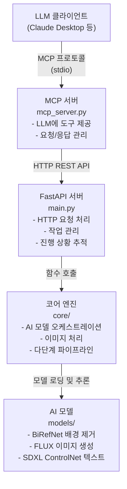

# nanoCocoa AI 광고 생성기 - 완전한 설치 가이드

이 가이드는 AI 기반 광고 생성을 위한 REST API 서버와 MCP 서버 설정을 도와줍니다.

## 1. 목차

1.1. [아키텍처 개요](#11-아키텍처-개요)
1.2. [필수 요구사항](#12-필수-요구사항)
1.3. [설치](#13-설치)
1.4. [FastAPI 서버 실행](#14-FastAPI-서버-실행)
1.5. [MCP 서버 설정](#15-mcp-서버-설정)
1.6. [테스트](#16-테스트)
1.7. [LLM 클라이언트 통합](#17-llm-클라이언트-통합)
1.8. [문제 해결](#18-문제-해결)

## 1.1. 아키텍처 개요



## 1.2. 필수 요구사항

### 1.2.1. 하드웨어 요구사항

- **GPU**: 최소 12GB VRAM의 Nvidia GPU (L4 이상 권장)
- **RAM**: 16GB 이상 시스템 RAM
- **스토리지**: 모델용 20GB 이상 여유 공간

### 1.2.2. 소프트웨어 요구사항

- **Python**: 3.8 이상
- **CUDA**: GPU와 호환되는 버전
- **운영 체제**: Windows, Linux, 또는 macOS

## 1.3. 설치

### 1.3.1. 프로젝트 클론/이동

```bash
cd /home/spai0433/codeit-ai-3team-ad-content/src/nanoCocoa_aiserver
```

### 1.3.2. FastAPI 서버 의존성 설치

```bash
# 주요 의존성 설치 (requirements.txt가 있는 경우)
pip install FastAPI uvicorn torch torchvision diffusers transformers accelerate

# 추가 의존성 설치
pip install pillow numpy opencv-python pynvml psutil
```

### 1.3.3. MCP 서버 의존성 설치

```bash
pip install -r requirements_mcp.txt
```

다음이 설치됩니다:
- `mcp` - Model Context Protocol SDK
- `httpx` - API 호출을 위한 HTTP 클라이언트

### 1.3.4. AI 모델 다운로드

첫 실행 시 필요한 모델을 자동으로 다운로드합니다:
- BiRefNet (배경 제거)
- FLUX.1-dev (이미지 생성)
- SDXL + ControlNet (3D 텍스트 생성)

**10-20분** 소요되며 **15-20GB** 스토리지가 필요합니다.

## 1.4. FastAPI 서버 실행

### 1.4.1. 서버 시작

```bash
# 개발 모드 (자동 리로드)
python main.py

# 프로덕션 모드
uvicorn api.app:app --host 0.0.0.0 --port 8000
```

### 1.4.2. 서버 실행 확인

브라우저에서 다음 주소로 이동:
- **API 문서**: http://localhost:8000/docs
- **Health Check**: http://localhost:8000/health

다음과 같은 응답이 표시되어야 합니다:
```json
{
  "status": "healthy",
  "server_time": 1234567890.123,
  "total_jobs": 0,
  "active_jobs": 0,
  "system_metrics": { ... }
}
```

### 1.4.3. 사용 가능한 REST 엔드포인트

| 엔드포인트 | 메서드 | 설명 |
|----------|--------|-------------|
| `/health` | GET | 서버 상태 및 메트릭 |
| `/fonts` | GET | 사용 가능한 폰트 목록 |
| `/generate` | POST | 광고 생성 시작 |
| `/status/{job_id}` | GET | 작업 상태 확인 |
| `/stop/{job_id}` | POST | 실행 중인 작업 중지 |
| `/jobs` | GET | 모든 작업 목록 |
| `/jobs/{job_id}` | DELETE | 작업 삭제 |
| `/help` | GET | API 사용 가이드 |
| `/help/parameters` | GET | 파라미터 레퍼런스 |
| `/help/examples` | GET | 사용 예시 |

## 1.5. MCP 서버 설정

### 1.5.1. 방법 A: 자동 설정 (권장)

자동 구성을 위해 포함된 설정 스크립트 사용:

```bash
cd src/nanoCocoa_aiserver
python setup_mcp.py --install
```

**수행 내용:**
- 자동으로 Claude Desktop 설정 파일 찾기
- 올바른 경로로 MCP 서버 설정 추가
- 수동 편집 불필요

**기타 명령어:**
```bash
python setup_mcp.py --uninstall   # MCP 서버 제거
python setup_mcp.py --show        # 현재 설정 확인
python setup_mcp.py --test        # MCP 서버 테스트
```

설치 후 **Claude Desktop 재시작**이 필요합니다.

### 1.5.2. 방법 B: 수동 설정

스크립트가 작동하지 않거나 수동 설정을 선호하는 경우:

1. **Claude Desktop 설정 위치**
   - Windows: `%APPDATA%\Claude\claude_desktop_config.json`
   - macOS: `~/Library/Application Support/Claude/claude_desktop_config.json`
   - Linux: `~/.config/Claude/claude_desktop_config.json`

2. **`.mcp/config.json`에서 설정 복사**
   - 프로젝트에 사전 구성된 MCP 설정 파일 포함
   - `args` 경로를 절대 경로로 업데이트

3. **Claude Desktop 재시작**

### 1.5.3. 방법 C: 직접 실행 (테스트)

```bash
cd src/nanoCocoa_aiserver
python mcp_server.py
```

서버가 stdio를 통해 통신합니다. 명령을 파이프하거나 MCP 클라이언트 도구를 사용할 수 있습니다.

## 1.6. 테스트

### 1.6.1. 테스트 1: FastAPI 서버

```bash
# health 엔드포인트 테스트
curl http://localhost:8000/health

# fonts 엔드포인트 테스트
curl http://localhost:8000/fonts

# help 엔드포인트 테스트
curl http://localhost:8000/help
```

### 1.6.2. 테스트 2: MCP 서버

**옵션 1: 설정 스크립트 사용 (권장)**

```bash
cd src/nanoCocoa_aiserver
python setup_mcp.py --test
```

다음을 수행합니다:
- 의존성 확인 (mcp, httpx)
- MCP 서버 파일 존재 확인
- FastAPI 서버 연결 테스트
- MCP 인터페이스 더미 테스트 실행

**옵션 2: 테스트 직접 실행**

```bash
# 더미 테스트 (MCP 서버 불필요)
cd tests
pytest mcp/test_mcp_dummy.py -v

# 수동 대화형 테스트
cd src/nanoCocoa_aiserver
python test_mcp_server.py
```

테스트 항목:
- 도구 목록 조회
- 리소스 목록 조회
- 리소스 읽기
- 모든 도구 인터페이스 (health_check, list_fonts, generate_ad 등)
- 워크플로우 시뮬레이션

### 1.6.3. 테스트 3: Claude Desktop을 사용한 종단 간 테스트

1. FastAPI 서버가 실행 중인지 확인
2. Claude Desktop 열기
3. 입력: "nanoCocoa에서 사용 가능한 폰트 목록을 보여줘"
4. Claude가 `list_fonts` 도구를 사용하고 결과를 반환해야 함

## 1.7. LLM 클라이언트 통합

### 1.7.1. Claude Desktop

구성 완료 후 Claude는 다음 도구들을 사용할 수 있습니다:

**예시 대화:**

```
사용자: 커피 제품에 대한 광고를 만들어줘. 배경은 아늑한 카페로

Claude: 광고 이미지를 만들어드리겠습니다. 먼저 제품 이미지가 필요합니다.
커피 제품 이미지를 제공해주시겠어요?

사용자: [이미지 업로드]

Claude: [generate_and_wait 도구 사용]
다음과 같이 광고를 생성합니다:
- 배경: 아늑한 모던 카페 인테리어
- 텍스트: "Fresh Brew"
- 스타일: 따뜻한 브라운 3D 텍스트

[90초 후]
광고가 준비되었습니다! [결과 표시]
```

### 1.7.2. API 클라이언트 (Python)

```python
import requests
import base64
import time

# 이미지 읽기
with open("product.png", "rb") as f:
    img_b64 = base64.b64encode(f.read()).decode()

# 생성 시작
response = requests.post("http://localhost:8000/generate", json={
    "input_image": img_b64,
    "bg_prompt": "따뜻한 조명이 있는 고급 호텔 로비",
    "text_content": "Grand Opening",
    "text_model_prompt": "골드 메탈릭 3D 텍스트"
})

job_id = response.json()["job_id"]

# 결과를 위한 폴링
while True:
    status = requests.get(f"http://localhost:8000/status/{job_id}").json()

    if status["status"] == "completed":
        # 결과 저장
        with open("result.png", "wb") as f:
            f.write(base64.b64decode(status["final_result"]))
        break

    print(f"진행률: {status['progress_percent']}%")
    time.sleep(3)
```

## 1.8. 문제 해결

### 1.8.1. 문제 1: FastAPI 서버가 시작되지 않음

**증상**: 포트가 이미 사용 중, import 에러

**해결방법**:
```bash
# 포트 8000이 사용 중인지 확인
netstat -ano | findstr :8000  # Windows
lsof -i :8000                 # Linux/macOS

# 프로세스 종료 또는 다른 포트 사용
uvicorn api.app:app --port 8001
```

### 1.8.2. 문제 2: MCP 서버가 연결되지 않음

**증상**: Claude Desktop에서 도구가 보이지 않음

**해결방법**:
1. FastAPI 서버가 `http://localhost:8000`에서 실행 중인지 확인
2. `claude_desktop_config.json`에서 절대 경로 확인
3. Claude Desktop 로그 확인:
   - Windows: `%APPDATA%\Claude\logs`
   - macOS: `~/Library/Logs/Claude`
4. Claude Desktop 재시작

### 1.8.3. 문제 3: GPU 메모리 부족

**증상**: CUDA out of memory 에러

**해결방법**:
1. 다른 GPU 애플리케이션 종료
2. 요청에서 이미지 해상도 감소
3. 현재 작업 완료 대기 (단일 작업 정책)
4. GPU 메모리 확인: `nvidia-smi`

### 1.8.4. 문제 4: 작업이 너무 오래 걸림

**증상**: 작업이 예상 시간을 초과

**해결방법**:
1. GPU 사용률 확인: `nvidia-smi`
2. GPU 사용 여부 확인 (CPU 대체 아님)
3. `/health` 엔드포인트로 시스템 부하 확인
4. 품질 파라미터 감소 (적은 steps, 낮은 strength)

### 1.8.5. 문제 5: Import 에러

**증상**: 모듈을 찾을 수 없음 에러

**해결방법**:
```bash
# 의존성 재설치
pip install --upgrade -r requirements_mcp.txt

# MCP 설치 확인
python -c "import mcp; print(mcp.__version__)"

# httpx 설치 확인
python -c "import httpx; print(httpx.__version__)"
```

## 1.9. 설정

### 1.9.1. 환경 변수

`.env` 파일 생성 (선택사항):

```bash
# API 설정
API_HOST=0.0.0.0
API_PORT=8000
API_BASE_URL=http://localhost:8000

# 모델 설정
DEVICE=cuda
ENABLE_DEV_DASHBOARD=true

# 로깅
LOG_LEVEL=INFO
```

### 1.9.2. 모델 경로

모델은 다음 위치에 캐시됩니다:
- Windows: `C:\Users\<user>\.cache\huggingface`
- Linux/macOS: `~/.cache/huggingface`

사용자 정의 모델 경로 사용:
```bash
export HF_HOME=/path/to/models
```

## 1.10. 성능 튜닝

### 1.10.1. 예상 시간 (Nvidia L4)

- **Step 1** (배경): ~80초
- **Step 2** (텍스트): ~35초
- **Step 3** (합성): ~5초
- **전체**: ~120초

### 1.10.2. 최적화 팁

1. **결과 재사용**: 반복을 위해 `step1_result`와 `step2_result` 저장
2. **단계 조정**: `start_step`을 사용하여 완료된 단계 건너뛰기
3. **품질 감소**: `composition_steps` 낮추기 (기본 28 → 20)
4. **배치 처리**: 배경 한 번 생성, 여러 텍스트 적용

## 1.11. 다음 단계

1. **FastAPI 서버 실행 중**: http://localhost:8000
2. **MCP 서버 구성 완료**: Claude Desktop 설정에 포함
3. **테스트 완료**: 모든 도구 작동
4. **광고 생성 시작**: Claude 또는 직접 API 사용

## 1.12. 추가 리소스

- **API 문서**: http://localhost:8000/docs
- **사용 가이드**: http://localhost:8000/help
- **파라미터 레퍼런스**: http://localhost:8000/help/parameters
- **예시**: http://localhost:8000/help/examples
- **MCP 가이드**: [MCP서버_사용가이드.md](MCP서버_사용가이드.md)

## 1.13. 지원

문제나 질문이 있는 경우:
- 에러에 대한 서버 로그 확인
- 시스템 상태 확인을 위해 `/health` 엔드포인트 검토
- `test_mcp_server.py`로 테스트
- `nvidia-smi`로 GPU 가용성 확인
