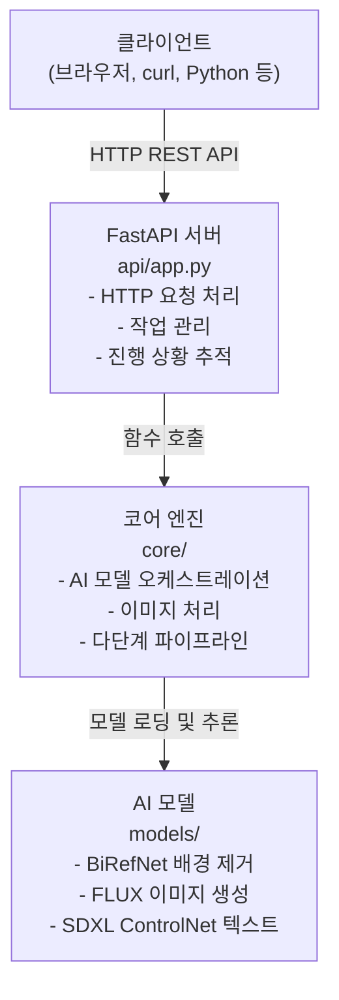

# nanoCocoa AI 광고 생성기 - 완전한 설치 가이드

이 가이드는 AI 기반 광고 생성을 위한 REST API 서버 설정을 도와줍니다.

## 1. 목차

1.1. [아키텍처 개요](#11-아키텍처-개요)
1.2. [필수 요구사항](#12-필수-요구사항)
1.3. [설치](#13-설치)
1.4. [FastAPI 서버 실행](#14-FastAPI-서버-실행)
1.5. [테스트](#15-테스트)
1.6. [API 사용 예시](#16-api-사용-예시)
1.7. [문제 해결](#17-문제-해결)

## 1.1. 아키텍처 개요



## 1.2. 필수 요구사항

### 1.2.1. 하드웨어 요구사항

- **GPU**: 최소 12GB VRAM의 Nvidia GPU (L4 이상 권장)
- **RAM**: 16GB 이상 시스템 RAM
- **스토리지**: 모델용 20GB 이상 여유 공간

### 1.2.2. 소프트웨어 요구사항

- **Python**: 3.8 이상
- **CUDA**: GPU와 호환되는 버전
- **운영 체제**: Windows, Linux, 또는 macOS

## 1.3. 설치

### 1.3.1. 프로젝트 클론/이동

```bash
cd /home/spai0433/codeit-ai-3team-ad-content/src/nanoCocoa_aiserver
```

### 1.3.2. 의존성 설치

```bash
# requirements.txt 사용
pip install -r requirements.txt

# 또는 개별 설치
pip install FastAPI uvicorn torch torchvision diffusers transformers accelerate
pip install pillow numpy opencv-python pynvml psutil httpx
```

### 1.3.3. AI 모델 다운로드

첫 실행 시 필요한 모델을 자동으로 다운로드합니다:
- BiRefNet (배경 제거)
- FLUX.1-dev (이미지 생성)
- SDXL + ControlNet (3D 텍스트 생성)

**10-20분** 소요되며 **15-20GB** 스토리지가 필요합니다.

## 1.4. FastAPI 서버 실행

### 1.4.1. Docker Compose로 실행 (권장)

프로젝트는 Docker Compose를 통해 AI 서버와 MCP 서버를 함께 배포합니다.

```bash
# src 디렉토리로 이동
cd /home/spai0433/codeit-ai-3team-ad-content/src

# 서비스 시작 (빌드 포함)
sudo docker-compose up -d --build

# 서비스 상태 확인
docker-compose ps

# 로그 확인
docker-compose logs -f

# 특정 서비스 로그만 확인
docker-compose logs -f nanococoa-aiserver
docker-compose logs -f nanococoa-mcpserver
```

**배포되는 서비스**:
- **nanoCocoa-aiserver**: AI 모델 서빙 서버 (포트 8000)
  - GPU 기반 이미지 생성 (FLUX, SDXL, BiRefNet)
  - REST API 제공
  - Health check: `http://localhost:8000/health`

- **nanoCocoa-mcpserver**: MCP 프로토콜 브릿지 서버 (포트 3000)
  - AI 서버를 MCP 프로토콜로 감싸서 제공
  - Claude Desktop/Code와 연동 가능
  - Health check: `http://localhost:3000/health`

**서비스 중지**:
```bash
cd /home/spai0433/codeit-ai-3team-ad-content/src
sudo docker-compose down
```

### 1.4.2. 직접 실행 (개발 모드)

Docker 없이 직접 실행하는 방법:

```bash
# nanoCocoa_aiserver 디렉토리로 이동
cd /home/spai0433/codeit-ai-3team-ad-content/src/nanoCocoa_aiserver

# 개발 모드 (자동 리로드)
python main.py

# 프로덕션 모드
uvicorn main:app --host 0.0.0.0 --port 8000
```

### 1.4.3. 서버 실행 확인

브라우저 또는 curl로 다음 주소를 확인:

**AI 서버 (nanoCocoa_aiserver)**:
- **API 문서**: http://localhost:8000/docs
- **Health Check**: http://localhost:8000/health

```bash
curl http://localhost:8000/health
```

예상 응답:
```json
{
  "status": "healthy",
  "server_time": 1234567890.123,
  "total_jobs": 0,
  "active_jobs": 0,
  "system_metrics": {
    "cpu_percent": 12.5,
    "ram_used_gb": 8.2,
    "gpu_info": [...]
  }
}
```

**MCP 서버 (nanoCocoa_mcpserver)**:
- **Health Check**: http://localhost:3000/health

```bash
curl http://localhost:3000/health
```

예상 응답:
```json
{
  "status": "healthy",
  "aiserver_status": "connected",
  "aiserver_url": "http://nanococoa-aiserver:8000"
}
```

### 1.4.3. 사용 가능한 REST 엔드포인트

| 엔드포인트 | 메서드 | 설명 |
|----------|--------|-------------|
| `/health` | GET | 서버 상태 및 메트릭 |
| `/fonts` | GET | 사용 가능한 폰트 목록 |
| `/generate` | POST | 광고 생성 시작 |
| `/status/{job_id}` | GET | 작업 상태 확인 |
| `/stop/{job_id}` | POST | 실행 중인 작업 중지 |
| `/jobs` | GET | 모든 작업 목록 |
| `/jobs/{job_id}` | DELETE | 작업 삭제 |
| `/help` | GET | API 사용 가이드 |
| `/help/parameters` | GET | 파라미터 레퍼런스 |
| `/help/examples` | GET | 사용 예시 |

## 1.5. 테스트

### 1.5.1. 테스트 1: 기본 엔드포인트

```bash
# health 엔드포인트 테스트
curl http://localhost:8000/health

# fonts 엔드포인트 테스트
curl http://localhost:8000/fonts

# help 엔드포인트 테스트
curl http://localhost:8000/help
```

### 1.5.2. 테스트 2: pytest 실행

```bash
# 전체 테스트 실행
cd /home/spai0433/codeit-ai-3team-ad-content
pytest tests/ -v

# 통합 테스트만 실행
pytest tests/integration/ -v
```

## 1.6. API 사용 예시

### 1.6.1. Python 클라이언트

```python
import requests
import base64
import time

# 이미지 읽기
with open("product.png", "rb") as f:
    img_b64 = base64.b64encode(f.read()).decode()

# 생성 시작
response = requests.post("http://localhost:8000/generate", json={
    "input_image": img_b64,
    "bg_prompt": "따뜻한 조명이 있는 고급 호텔 로비",
    "text_content": "Grand Opening",
    "text_model_prompt": "골드 메탈릭 3D 텍스트"
})

job_id = response.json()["job_id"]

# 결과를 위한 폴링
while True:
    status = requests.get(f"http://localhost:8000/status/{job_id}").json()

    if status["status"] == "completed":
        # 결과 저장
        with open("result.png", "wb") as f:
            f.write(base64.b64decode(status["final_result"]))
        break

    print(f"진행률: {status['progress_percent']}%")
    time.sleep(3)
```

### 1.6.2. curl 예시

```bash
# 1. 광고 생성 시작 (간단한 예시)
curl -X POST "http://localhost:8000/generate" \
  -H "Content-Type: application/json" \
  -d '{
    "bg_prompt": "modern office interior",
    "text_content": "Hello World",
    "font_name": "NanumGothic"
  }'

# 2. 작업 상태 확인
curl http://localhost:8000/status/{job_id}

# 3. 모든 작업 목록
curl http://localhost:8000/jobs
```

## 1.7. 문제 해결

### 1.7.1. 문제 1: FastAPI 서버가 시작되지 않음

**증상**: 포트가 이미 사용 중, import 에러

**해결방법**:
```bash
# 포트 8000이 사용 중인지 확인
netstat -ano | findstr :8000  # Windows
lsof -i :8000                 # Linux/macOS

# 프로세스 종료 또는 다른 포트 사용
uvicorn api.app:app --port 8001
```

### 1.8.2. 문제 2: MCP 서버가 연결되지 않음

**증상**: Claude Desktop에서 도구가 보이지 않음

**해결방법**:
1. FastAPI 서버가 `http://localhost:8000`에서 실행 중인지 확인
2. `claude_desktop_config.json`에서 절대 경로 확인
3. Claude Desktop 로그 확인:
   - Windows: `%APPDATA%\Claude\logs`
   - macOS: `~/Library/Logs/Claude`
4. Claude Desktop 재시작

### 1.8.3. 문제 3: GPU 메모리 부족

**증상**: CUDA out of memory 에러

**해결방법**:
1. 다른 GPU 애플리케이션 종료
2. 요청에서 이미지 해상도 감소
3. 현재 작업 완료 대기 (단일 작업 정책)
4. GPU 메모리 확인: `nvidia-smi`

### 1.8.4. 문제 4: 작업이 너무 오래 걸림

**증상**: 작업이 예상 시간을 초과

**해결방법**:
1. GPU 사용률 확인: `nvidia-smi`
2. GPU 사용 여부 확인 (CPU 대체 아님)
3. `/health` 엔드포인트로 시스템 부하 확인
4. 품질 파라미터 감소 (적은 steps, 낮은 strength)

### 1.8.5. 문제 5: Import 에러

**증상**: 모듈을 찾을 수 없음 에러

**해결방법**:
```bash
# 의존성 재설치
pip install --upgrade -r requirements.txt

# conda 환경 사용 시
conda activate py311_ad
pip install -r requirements.txt
```

## 1.8. 성능 튜닝

### 1.8.1. 예상 시간 (Nvidia L4)

- **Step 1** (배경): ~80초
- **Step 2** (텍스트): ~35초
- **Step 3** (합성): ~5초
- **전체**: ~120초

### 1.8.2. 최적화 팁

1. **결과 재사용**: 반복을 위해 `step1_result`와 `step2_result` 저장
2. **단계 조정**: `start_step`을 사용하여 완료된 단계 건너뛰기
3. **품질 감소**: `composition_steps` 낮추기 (기본 28 → 20)
4. **배치 처리**: 배경 한 번 생성, 여러 텍스트 적용

## 1.9. 추가 리소스

- **API 문서**: http://localhost:8000/docs (또는 http://34.44.205.198:8000/docs)
- **개발자 대시보드**: http://localhost:8000/example_generation
- **사용 가이드**: http://localhost:8000/help
- **파라미터 레퍼런스**: http://localhost:8000/help/parameters
- **예시**: http://localhost:8000/help/examples

## 1.10. 지원

문제나 질문이 있는 경우:
- 에러에 대한 서버 로그 확인
- 시스템 상태 확인을 위해 `/health` 엔드포인트 검토
- pytest로 테스트 실행
- `nvidia-smi`로 GPU 가용성 확인
