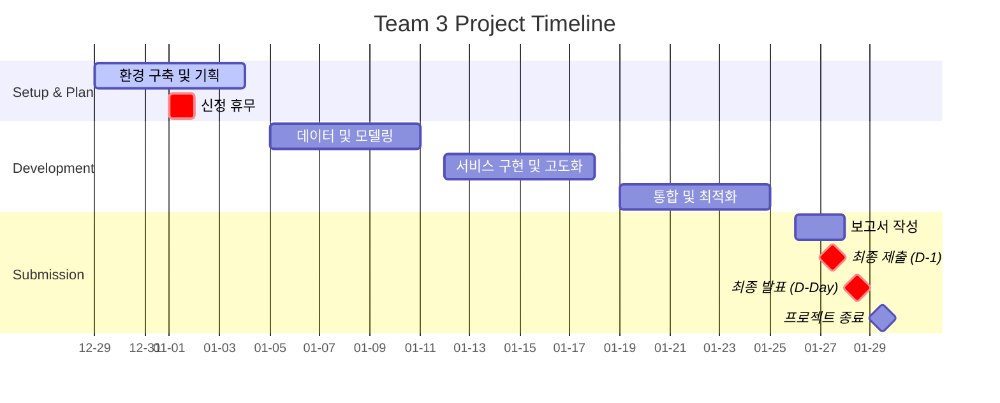

# 🏥 코드잇 AI 4기 3팀 고급 프로젝트
## 👥 팀원

| 역할 | 담당자 | 핵심 업무 |
|---|---|---|
| xxx | [김명환](https://c0z0c.github.io) | xxx |
| xxx | 김민혁 | xxx |
| xxx | 박지윤 | xxx |
| xxx | 이건희 | xxx |
| xxx | 이슬형 | xxx |

## 📝 협업일지

팀원별 개발 과정 및 학습 내용을 기록한 협업일지입니다.

- [김명환 협업일지 (Project Manager)](https://krapnuyij.github.io/codeit_ai_codeit-ai-3team-ad-content/협업일지/김명환/)
- [김민혁 협업일지 (Project Manager)](https://krapnuyij.github.io/codeit_ai_codeit-ai-3team-ad-content/협업일지/김민혁/)
- [박지윤 협업일지 (Project Manager)](https://krapnuyij.github.io/codeit_ai_codeit-ai-3team-ad-content/협업일지/박지윤/)
- [이건희 협업일지 (Project Manager)](https://krapnuyij.github.io/codeit_ai_codeit-ai-3team-ad-content/협업일지/이건희/)
- [이슬형 협업일지 (Project Manager)](https://krapnuyij.github.io/codeit_ai_codeit-ai-3team-ad-content/협업일지/이슬형/)

- [팀 회의록](https://krapnuyij.github.io/codeit_ai_codeit-ai-3team-ad-content/회의록/)

## 📅 프로젝트 기간
**2025.12.29(월) ~ 2026.01.29(목)**

**프로젝트 일정:**

---

## 폴더목록

  <!-- 폴더 목록이 JavaScript로 동적 생성됩니다 -->

---

**문서 버전**: 0.1
**최종 업데이트**: 2025.12.29
**작성자**: 프로젝트 팀

**주요 변경사항 (v0.1)**:

---

  <a href="{{- site.baseurl -}}/" class="nav-button home">
    🏠 홈으로
  </a>
  <a href="https://github.com/krapnuyij/codeit-ai-3team-ad-content" target="_blank">
    📱 GitHub 저장소
  </a>

