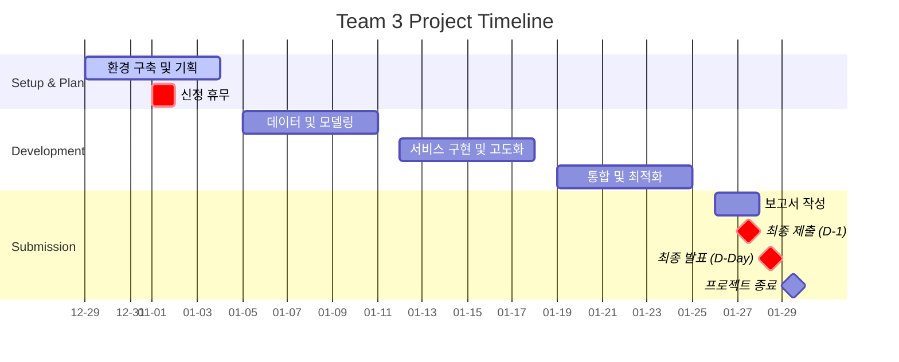

# 🏥 코드잇 AI 4기 3팀 고급 프로젝트
## 생성형 AI 기반 소상공인 광고 콘텐츠 제작 서비스

**프로젝트 목표**: 전통시장 소상공인을 위한 AI 광고 콘텐츠 자동 생성 서비스  
**1차 특화**: 건어물 상품 프롬프트 엔진 (확장 가능한 설계)

## 👥 팀원

| 역할 | 담당자 | 핵심 업무 |
|---|---|---|
| 아키텍처 & 파이프라인 | [김명환](https://c0z0c.github.io) | 시스템 아키텍처 설계, API 설계, 모델 서버 구성, 모델 관리 서버 |
| 모델 연구 (이미지 특성) | 김민혁 | 이미지 특성 추출 모델 개발, 데이터셋 전처리 |
| PM & 기획 | 박지윤 | 프로젝트 관리, 일정 조율, 문서화, QA |
| 백엔드 & 프론트엔드 | 이건희 | 백엔드(LLM 연동), 프론트엔드(Streamlit), VM 인프라 구성 |
| 모델 연구 (이미지 생성) | 이슬형 | 이미지 생성 및 조합 모델 개발, 프롬프트 엔지니어링 |

## 📝 협업일지

팀원별 개발 과정 및 학습 내용을 기록한 협업일지입니다.

- [김명환 협업일지 (아키텍처 & 파이프라인)]({{- site.baseurl -}}/협업일지/김명환/)
- [김민혁 협업일지 (이미지 특성 추출)]({{- site.baseurl -}}/협업일지/김민혁/)
- [박지윤 협업일지 (PM & 기획)]({{- site.baseurl -}}/협업일지/박지윤/)
- [이건희 협업일지 (백엔드 & 프론트엔드)]({{- site.baseurl -}}/협업일지/이건희/)
- [이슬형 협업일지 (이미지 생성 & 조합)]({{- site.baseurl -}}/협업일지/이슬형/)

- [팀 회의록]({{- site.baseurl -}}/회의록/)

## 📅 프로젝트 기간
**2025.12.29(월) ~ 2026.01.28(수)**

- **1차 목표**: 2026.01.15 - Hugging Face 모델 조합 서비스 구현
- **2차 목표**: 여유 시 모델 양자화 및 최적화
- **최종 제출**: 2026.01.27 19:00
- **최종 발표**: 2026.01.28

**주요 마일스톤:**
- 12.29: 프로젝트 킥오프, 역할 분담, 벤치마킹 (Gemini Veo2 나노바나나)
- 12.30: GCP VM 환경 구축 (IP: 34.44.205.198)
- 01.15: 1차 MVP 완성 (이미지 기반 광고 생성)
- 01.27: 최종 제출 및 발표 자료 완성

**프로젝트 일정:**

---

## 폴더목록

  <!-- 폴더 목록이 JavaScript로 동적 생성됩니다 -->

---

**문서 버전**: 0.2
**최종 업데이트**: 2025.12.29
**작성자**: 프로젝트 팀

**주요 변경사항**:
- v0.2 (2025.12.29): 팀원 역할 분담 확정, 프로젝트 특화 방향 설정 (전통시장/건어물)
- v0.1 (2025.12.28): 초기 문서 생성

**기술 스택**:
- Frontend: Streamlit
- Backend: FastAPI, LLM 연동
- Model: HuggingFace (Stable Diffusion), OpenAI API
- Infra: GCP VM (L4 GPU, us-central1)
- Storage: OS 20GB + 데이터 200GB (바인드 마운트)

---

  <a href="{{- site.baseurl -}}/" class="nav-button home">
    🏠 홈으로
  </a>
  <a href="https://github.com/krapnuyij/codeit-ai-3team-ad-content" target="_blank">
    📱 GitHub 저장소
  </a>

