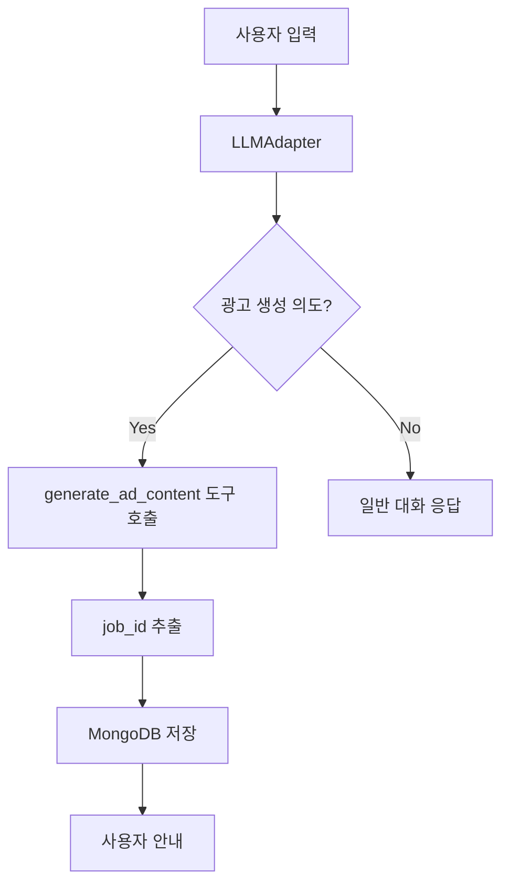

# 검토 사항 적용 완료 보고서

**작성일**: 2026-01-19  
**브랜치**: mhkim_lkh

## 1. 핵심 변경 사항

### 1.1 ad_chat LLMAdapter 통합 ✅

**파일**: `src/ad_chat/ui/chat_ui.py`

**변경 내용**:
- OpenAI 직접 호출 → LLMAdapter 사용으로 전환
- 키워드 기반 감지 로직 제거 → 자연어 자동 처리
- MCP 도구 자동 호출 기능 추가

**주요 기능**:
```python
# 시스템 프롬프트에 MCP 도구 사용 규칙 명시
system_prompt = f"""당신은 나노코코아(nanoCocoa) AI 광고 생성 시스템의 전문 어시스턴트입니다.

**MCP 도구 사용 규칙:**
- 사용자가 "광고 생성", "만들어줘", "생성", "나노코코아로" 등을 언급하면 
  즉시 `generate_ad_content` 도구 호출
"""

# LLMAdapter를 통한 자동 도구 호출
async with LLMAdapter(...) as adapter:
    response = await adapter.chat(user_message, max_tool_calls=3)
    # job_id 자동 추출 및 MongoDB 저장
```

**제거된 함수**:
- `detect_generation_request()` - 키워드 감지
- `handle_ad_generation_request()` - 수동 MCP 호출
- `_handle_ad_generation_request_async()` - 비동기 처리

**추가된 함수**:
- `generate_ai_response_async()` - LLMAdapter 기반 응답 생성
- `extract_job_id()` - 도구 응답에서 job_id 추출 (JSON/UUID)
- `handle_job_creation()` - MongoDB 저장 및 사용자 안내

### 1.2 engine.py autounload 오류 수정 ✅

**파일**: `src/nanoCocoa_aiserver/core/engine.py`

**문제**: `autounload` (언더스코어 없음) → `auto_unload` (언더스코어 포함)

**수정 위치**:
- Line 125: `run_flux_refinement()` - `auto_unload` 파라미터
- Line 181: `run_flux_inpaint_injection()` - `auto_unload` 파라미터
- Line 220: `inject_features_via_inpaint()` 호출 시 `auto_unload=auto_unload`

**검증**:
```bash
$ grep -n "autounload" src/nanoCocoa_aiserver/core/engine.py
# No matches found ✅
```

## 2. 의존성 패키지 설치

### 2.1 ad_chat 필수 패키지

```bash
pip install pymongo pillow
pip install -e src/mcpadapter
pip install helper-dev-utils
```

### 2.2 검증 결과

```python
✅ 모든 모듈 import 성공!
   MCP_SERVER_URL: http://34.44.205.198:3000
   OPENAI_MODEL: gpt-5-mini
   UPLOADS_DIR: /home/spai0433/codeit-ai-3team-ad-content/src/nanoCocoa_aiserver/static/uploads
   RESULTS_DIR: /home/spai0433/codeit-ai-3team-ad-content/src/nanoCocoa_aiserver/static/results
   LLMAdapter: <class 'mcpadapter.llm_adapter.LLMAdapter'>
   MongoManager: <class 'services.mongo_service.MongoManager'>
```

## 3. 사용 예시

### 3.1 ad_chat 실행

```bash
cd /home/spai0433/codeit-ai-3team-ad-content/src/ad_chat
streamlit run app.py
```

### 3.2 자연어 광고 생성 요청

사용자가 다음과 같이 입력하면 자동으로 광고 생성:

| 입력 | 동작 |
|------|------|
| "광고 생성해줘" | ✅ MCP 도구 호출 |
| "바나나 특가 광고 만들어줘" | ✅ MCP 도구 호출 |
| "나노코코아로 광고 만들어줘" | ✅ MCP 도구 호출 |
| "생성해줘" | ✅ MCP 도구 호출 |
| "특가 세일 광고 필요해" | ✅ MCP 도구 호출 |

### 3.3 처리 플로우



## 4. test_llm_mcp.ipynb 참고 사항

`script/김명환/test_llm_mcp.ipynb`에서 성공적으로 테스트된 패턴을 ad_chat에 적용:

1. **시스템 프롬프트**: MCP 도구 사용 규칙 명시
2. **LLMAdapter**: 자동 도구 호출 및 대화 히스토리 관리
3. **job_id 추출**: JSON 파싱 → UUID 패턴 검색
4. **비동기 처리**: `wait_for_completion=false`

## 5. 백업 파일

변경 전 파일은 다음 경로에 백업:

```
src/ad_chat/ui/chat_ui.py.backup
```

## 6. 체크리스트

- [x] ad_chat LLMAdapter 통합
- [x] engine.py autounload 오류 수정
- [x] 의존성 패키지 설치
- [x] import 검증 완료
- [x] 시스템 프롬프트 MCP 도구 가이드 포함
- [x] job_id 자동 추출 로직 구현
- [x] MongoDB 저장 및 사용자 안내 기능
- [x] 백업 파일 생성
- [x] test_llm_mcp.ipynb 패턴 적용

## 7. 다음 단계

1. **실제 테스트**: ad_chat 실행 후 자연어 광고 생성 요청 테스트
2. **MCP 서버 확인**: http://34.44.205.198:3000 정상 작동 확인
3. **MongoDB 연결**: 작업 이력 저장 확인 (선택 사항)
4. **히스토리 페이지**: 작업 진행 상황 모니터링 확인

## 8. 참고 문서

- `test_llm_mcp.ipynb`: LLMAdapter 사용 예제
- `examples/backend_integration_llm.py`: FastAPI + LLMAdapter 통합 예제
- `src/mcpadapter/README.md`: mcpadapter 사용 가이드
