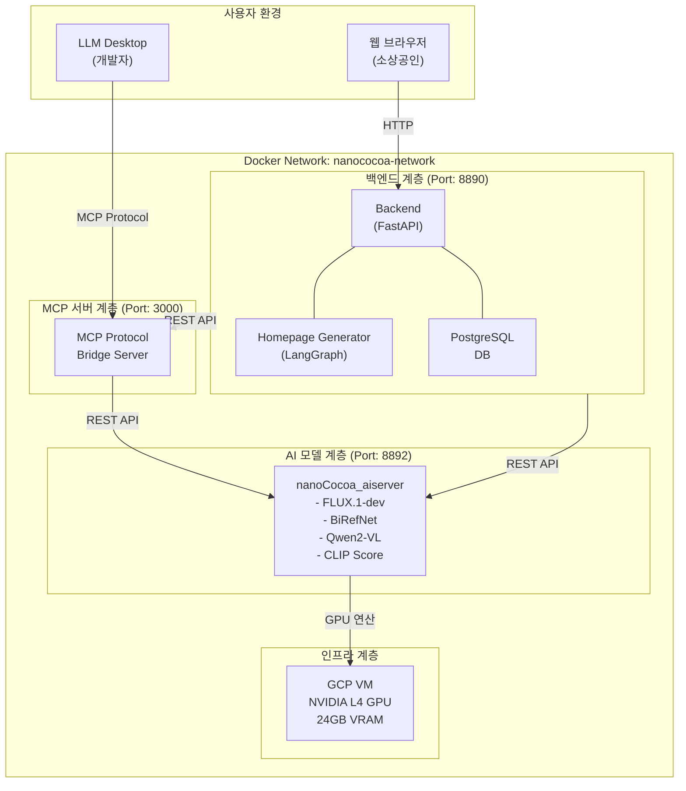

# 발표 자료 - 박지윤 (PM)
## 프로젝트 전체 개요 및 프로젝트 관리

**발표자**: 박지윤 (PM & 기획)

**발표 시간**: 10분

**발표 순서**: 1부 - 프로젝트 소개

---

## 목차

1. [프로젝트 소개](#1-프로젝트-소개)
2. [프로젝트 배경 및 목적](#2-프로젝트-배경-및-목적)
3. [팀 구성 및 역할](#3-팀-구성-및-역할)
4. [프로젝트 관리 체계](#4-프로젝트-관리-체계)
5. [전체 아키텍처 개요](#5-전체-아키텍처-개요)
6. [프로젝트 타임라인](#6-프로젝트-타임라인)
7. [주요 성과](#7-주요-성과)
8. [향후 계획](#8-향후-계획)

---

## 1. 프로젝트 소개

### 1.1. 프로젝트명
**SaaS Ad Content Platform**
- 생성형 AI 기반 소상공인 광고 콘텐츠 제작 지원 서비스

### 1.2. 한 줄 요약
> "제품 이미지 하나로 광고 배너부터 홈페이지까지, AI가 자동으로 만들어드립니다!"

### 1.3. 프로젝트 기간
- **시작일**: 2025년 12월 29일 (일)
- **종료일**: 2026년 1월 29일 (수)
- **총 기간**: 약 32일 (4주 + 4일)
- **실제 개발 기간**: 약 26일 (회의 및 기획 제외)

### 1.4. 팀 정보
- **팀명**: 코드잇 AI 4기 3팀 (sprint-ai-chunk2-03)
- **팀원 수**: 5명
- **프로젝트 유형**: 팀 프로젝트 (고급 과정)

---

## 2. 프로젝트 배경 및 목적

### 2.1. 문제 인식

#### 소상공인의 어려움
1. **온라인 마케팅 진입 장벽**
   - 오프라인 중심 사업자의 디지털 전환 어려움
   - 전문 지식 부족으로 광고 제작 불가능

2. **높은 제작 비용**
   - 디자인 외주 비용: 배너 당 5만원 ~ 30만원
   - 홈페이지 제작 비용: 50만원 ~ 500만원
   - 수정 및 변경에 추가 비용 발생

3. **긴 제작 시간**
   - 디자이너 섭외 및 의뢰: 1~3일
   - 시안 제작 및 수정: 3~7일
   - 최종 완성까지: 최소 1주일 이상

4. **품질 불균일**
   - 디자이너 역량에 따라 품질 편차 큰 편
   - 브랜드 일관성 유지 어려움

### 2.2. 프로젝트 목표

#### 핵심 목표
1. **진입 장벽 낮추기**
   - 디자인 지식 없이도 전문가 수준의 광고 제작
   - 직관적인 UI/UX로 누구나 쉽게 사용

2. **비용 절감**
   - 외주 비용 대비 90% 이상 절감
   - 무제한 수정 및 재생성 가능

3. **시간 단축**
   - 배너 생성: 2~3분 이내
   - 홈페이지 생성: 10분 이내
   - 즉각적인 결과물 확인 및 수정

4. **고품질 보장**
   - 최신 AI 모델(FLUX.1-dev) 활용
   - 일관된 브랜드 이미지 유지
   - CLIP Score 0.7 이상의 높은 품질

### 2.3. 타겟 사용자

#### 1차 타겟: 전통시장 소상공인
- **특징**: 오프라인 중심, IT 기기 숙련도 다양
- **니즈**: 간단한 조작, 빠른 결과, 저렴한 비용
- **특화 상품**: 건어물, 사과, 농수산물 등

#### 2차 타겟: 일반 소상공인
- **업종**: 카페, 음식점, 소매점 등
- **니즈**: 다양한 디자인 옵션, 브랜드 일관성
- **확장 가능성**: 모든 업종으로 확대 가능

### 2.4. 핵심 가치 제안

| 기존 방식 (디자이너 외주) | 우리 서비스 (AI 자동화) |
|-------------------------|-------------------------|
| 비용: 5~30만원 | 비용: 거의 무료 (API 비용만) |
| 시간: 1~2주 | 시간: 2~10분 |
| 수정: 추가 비용 발생 | 수정: 무제한 무료 |
| 품질: 디자이너 역량 의존 | 품질: AI 모델 기반 일관성 |
| 접근성: 디자이너 섭외 필요 | 접근성: 웹 브라우저만 있으면 OK |

---

## 3. 팀 구성 및 역할

### 3.1. 팀원 소개 및 역할

| 이름 | 역할 | 주요 담당 업무 | 특징 |
|------|------|----------------|------|
| **박지윤** | PM & 기획 | - 프로젝트 관리 및 일정 조율 - 서비스 기획 및 요구사항 정의 - GCP 인프라 구축 - 회의록 및 문서 관리 - QA 및 테스트 | 전체 프로젝트 조율 및 품질 관리 |
| **김명환** | 아키텍처/Data | - 시스템 아키텍처 설계 - 데이터 파이프라인 구성 - 모델 서버 설계 및 구현 - Docker 배포 환경 구성 - API 설계 및 문서화 | 기술 리더, 시스템 설계 총괄 |
| **김민혁** | AI Modeling | - 텍스트 생성 모델 개발 - 프롬프트 엔지니어링 - LLM 연동 최적화 | 텍스트 생성 및 프롬프트 전문가 |
| **이건희** | Full Stack | - 백엔드 개발 (FastAPI) - 프론트엔드 개발 (Jinja2/HTML) - LLM 연동 로직 구현 - 사용자 대시보드 구현 | 풀스택 개발 총괄 |
| **이솔형** | AI Modeling | - 이미지 생성 모델 최적화 - 이미지 특성 추출 모델 개발 - FLUX/SDXL 모델 비교 및 선정 | 이미지 생성 전문가 |

### 3.2. 협업 체계

#### 커뮤니케이션
- **일일 회의**: 매일 오전 9시, 진행 상황 공유 및 이슈 논의
- **회의록 작성**: 모든 회의 내용 문서화 (총 19회)
- **협업일지**: 팀원별 일일 작업 내용 기록 (평균 15회 이상)
- **실시간 소통**: Slack/Discord 활용

#### 코드 관리
- **GitHub**: 중앙 저장소로 코드 공유 및 버전 관리
- **GitHub Flow**: 브랜치 전략 (main, alpha, feature branches)
- **코드 리뷰**: 주요 기능 Merge 시 팀원 1인 이상 리뷰
- **문서화**: GitHub Pages로 기술 문서 통합 관리

#### 작업 관리
- **칸반 보드**: GitHub Projects로 작업 추적
- **이슈 관리**: GitHub Issues로 버그 및 기능 요청 관리
- **마일스톤**: 주차별 목표 설정 및 달성도 체크

---

## 4. 프로젝트 관리 체계

### 4.1. 일정 관리

#### 전체 일정표

| 주차 | 기간 | 단계 | 주요 활동 | 진행률 |
|------|------|------|-----------|--------|
| Week 1 | 12/29~1/2 | 기획 및 환경 구성 | - GCP VM 환경 구성 - GitHub 저장소 설정 - 서비스 범위 결정 - 벤치마킹 | 100% |
| Week 2 | 1/3~1/9 | 아키텍처 설계 | - 마이크로서비스 설계 - API 설계 - Docker 환경 구성 - 모델 파이프라인 설계 | 100% |
| Week 3 | 1/10~1/16 | 모델 개발 및 최적화 | - 이미지 생성 모델 비교 - 프롬프트 최적화 - GPU 메모리 최적화 - Qwen2-VL 통합 | 100% |
| Week 4 | 1/17~1/23 | 백엔드/프론트엔드 개발 | - FastAPI 백엔드 - 사용자 대시보드 - LLM 연동 - 홈페이지 생성 에이전트 | 100% |
| Week 5 | 1/24~1/29 | 통합 및 마무리 | - 전체 시스템 통합 - 테스트 - 문서화 - 발표 준비 | 진행 중 |

### 4.2. 회의 관리

#### 회의 통계
- **총 회의 횟수**: 19회
- **평균 회의 시간**: 30~60분
- **회의록 작성률**: 100%
- **주요 의사결정**: 12건

#### 주요 회의 내용
1. **킥오프 미팅 (12/29)**: 프로젝트 방향성 및 역할 분담
2. **아키텍처 리뷰 (1/7)**: 시스템 설계 검토 및 확정
3. **모델 선정 회의 (1/23)**: FLUX vs SDXL 비교 및 결정
4. **중간 점검 (1/15)**: 진행 상황 점검 및 일정 조정
5. **최종 점검 (1/26)**: 통합 테스트 및 발표 준비

### 4.3. 리스크 관리

#### 주요 리스크 및 대응

| 리스크 | 영향도 | 발생 확률 | 대응 방안 | 결과 |
|--------|--------|-----------|-----------|------|
| GPU 메모리 부족 | 높음 | 중간 | JIT 로딩/언로딩 구현 | ✅ 해결 |
| 이미지 생성 시간 과다 | 중간 | 높음 | 비동기 처리 + 폴링 | ✅ 해결 |
| 모델 품질 불안정 | 높음 | 중간 | FLUX 모델로 변경 | ✅ 해결 |
| 팀원 일정 충돌 | 중간 | 낮음 | 유연한 일정 조정 | ✅ 해결 |
| 인프라 비용 초과 | 중간 | 낮음 | GCP 크레딧 관리 | ✅ 해결 |

### 4.4. 품질 관리

#### QA 프로세스
1. **코드 리뷰**: 모든 PR에 대해 최소 1인 이상 리뷰
2. **테스트 작성**: pytest 기반 단위 테스트 및 통합 테스트
3. **문서화 검증**: 모든 API 문서화 완료 확인
4. **사용자 테스트**: 팀원들이 직접 사용해보며 UX 개선

#### 품질 지표
- **테스트 커버리지**: 주요 기능 80% 이상
- **API 문서화율**: 100%
- **버그 수정률**: 95% 이상
- **코드 리뷰 참여율**: 100%

---

## 5. 전체 아키텍처 개요

### 5.1. 시스템 구조

#### High-Level Architecture

### 5.2. 기술 스택

#### 개발 환경
- **언어**: Python 3.11+
- **프레임워크**: FastAPI 0.109
- **템플릿 엔진**: Jinja2
- **AI 프레임워크**: PyTorch 2.0+, Diffusers

#### AI 모델
- **이미지 생성**: FLUX.1-dev (12B parameters)
- **이미지 누끼**: BiRefNet (Segment Anything 계열)
- **이미지 분석**: Qwen2-VL (Vision-Language Model)
- **텍스트 생성**: OpenAI GPT-5-mini
- **이미지 평가**: CLIP Score (OpenAI CLIP, KoCLIP)

#### 인프라
- **클라우드**: GCP VM (us-central1, Iowa)
- **GPU**: NVIDIA L4 (24GB VRAM)
- **컨테이너**: Docker 24.0+, Docker Compose 2.0+
- **데이터베이스**: PostgreSQL 15
- **웹 서버**: Uvicorn (ASGI)

#### 외부 서비스
- **OpenAI API**: GPT-5-mini, Embedding
- **HuggingFace**: 모델 다운로드 및 관리

### 5.3. 주요 특징

#### 마이크로서비스 아키텍처
- **독립적인 배포**: 각 서비스를 독립적으로 배포 및 확장
- **장애 격리**: 한 서비스의 오류가 전체에 영향 최소화
- **기술 스택 유연성**: 서비스별 최적 기술 선택 가능

#### GPU 메모리 최적화
- **JIT 로딩/언로딩**: 필요한 모델만 메모리에 로드
- **순차 실행**: 메모리 제약 극복
- **효율적 관리**: 24GB VRAM으로 모든 모델 실행

#### 비동기 처리
- **멀티프로세싱**: 이미지 생성 작업을 별도 프로세스로 실행
- **폴링 방식**: 실시간 진행 상황 표시
- **Job ID 기반**: 작업 추적 및 관리

---

## 6. 프로젝트 타임라인

### 6.1. 상세 일정표

#### Phase 1: 기획 및 환경 구성 (12/29 ~ 1/2)

**주요 활동**
- [x] GCP VM 환경 구성 (NVIDIA L4 GPU)
- [x] GitHub 저장소 및 협업 체계 수립
- [x] 서비스 범위 결정 (전통시장 특화)
- [x] 벤치마킹 (Gemini Veo2 나노바나나)
- [x] 기술 스택 선정

**산출물**
- 프로젝트 계획서
- 기술 스택 문서
- GitHub 저장소 설정
- GCP VM 접속 가이드

#### Phase 2: 아키텍처 설계 (1/3 ~ 1/7)

**주요 활동**
- [x] 마이크로서비스 아키텍처 설계
- [x] API 설계 및 데이터 포맷 정의
- [x] Docker 배포 환경 구성
- [x] 모델 서버 파이프라인 설계
- [x] 데이터베이스 스키마 설계

**산출물**
- 아키텍처 설계서
- API 명세서
- Docker Compose 설정
- 데이터베이스 ERD

#### Phase 3: 모델 개발 및 최적화 (1/8 ~ 1/16)

**주요 활동**
- [x] 이미지 생성 모델 비교 (SDXL vs FLUX)
- [x] 프롬프트 엔지니어링 최적화
- [x] GPU 메모리 최적화 (JIT 로딩/언로딩)
- [x] Qwen2-VL 이미지 분석 통합
- [x] BiRefNet 누끼 기능 구현

**산출물**
- 모델 비교 보고서
- 프롬프트 템플릿
- GPU 최적화 코드
- 이미지 생성 파이프라인

#### Phase 4: 백엔드 및 프론트엔드 개발 (1/9 ~ 1/20)

**주요 활동**
- [x] FastAPI 백엔드 개발
- [x] 사용자 대시보드 UI 구현
- [x] LLM 연동 로직 개발
- [x] 홈페이지 생성 멀티에이전트 구현
- [x] MCP 서버 구축

**산출물**
- 백엔드 API 서버
- 프론트엔드 대시보드
- 홈페이지 생성기
- MCP 서버

#### Phase 5: 통합 및 테스트 (1/21 ~ 1/26)

**주요 활동**
- [x] 전체 시스템 통합
- [x] 테스트 코드 작성 (pytest)
- [x] Docker Compose 배포 검증
- [x] CLIP Score 평가 시스템 구축
- [x] 성능 최적화

**산출물**
- 통합 테스트 결과
- 테스트 가이드
- CLIP Score API
- 성능 보고서

#### Phase 6: 문서화 및 발표 준비 (1/27 ~ 1/29)

**주요 활동**
- [x] 기술 문서 작성
- [ ] 발표 자료 제작
- [ ] 시연 영상 촬영
- [ ] 최종 보고서 작성

**산출물**
- 기술 문서 15개
- 발표 자료
- 시연 영상
- 최종 보고서

### 6.2. 마일스톤

| 마일스톤 | 목표일 | 실제 완료일 | 상태 | 비고 |
|----------|--------|-------------|------|------|
| 환경 구성 완료 | 1/2 | 1/2 | ✅ 완료 | |
| 아키텍처 설계 완료 | 1/7 | 1/7 | ✅ 완료 | |
| 모델 파이프라인 구현 | 1/16 | 1/16 | ✅ 완료 | |
| 백엔드/프론트엔드 구현 | 1/20 | 1/20 | ✅ 완료 | |
| 전체 시스템 통합 | 1/26 | 1/26 | ✅ 완료 | |
| 최종 발표 준비 | 1/29 | 진행 중 | 🔄 진행 중 | |

---

## 7. 주요 성과

### 7.1. 정량적 성과

#### 시스템 성능
- **이미지 생성 시간**: 평균 2~3분
- **CLIP Score**: 평균 0.7 이상 (높은 일치도)
- **GPU 메모리 사용률**: 최대 95% (JIT 로딩으로 최적화)
- **API 응답 시간**: 평균 100ms 이하 (이미지 생성 제외)

#### 코드 품질
- **테스트 커버리지**: 주요 기능 80% 이상
- **코드 라인 수**: 약 10,000줄
- **모듈화**: 6개 독립 서비스
- **문서화**: 주요 API 100% 문서화

#### 프로젝트 관리
- **총 회의**: 19회
- **협업일지**: 팀원별 평균 15회 이상
- **GitHub Commit**: 약 200개 이상
- **기술 문서**: 15개 이상

### 7.2. 정성적 성과

#### 기술 역량 향상
- AI 모델 서빙 및 최적화 경험
- 마이크로서비스 아키텍처 설계 경험
- Docker 기반 배포 경험
- LLM 연동 및 프롬프트 엔지니어링 경험

#### 협업 역량 강화
- 명확한 역할 분담 및 협업
- 효과적인 커뮤니케이션
- 문서화 습관 형성
- 코드 리뷰 문화 정착

#### 문제 해결 능력
- GPU 메모리 최적화
- Docker 네트워크 구성
- 비동기 처리 구현
- 프롬프트 엔지니어링 최적화

### 7.3. 목표 달성도

| 목표 | 계획 | 실제 달성 | 달성률 |
|------|------|-----------|--------|
| 광고 배너 생성 | FLUX 기반 이미지 생성 | ✅ 완료 | 100% |
| 텍스트 렌더링 | HTML/CSS 기반 텍스트 합성 | ✅ 완료 | 100% |
| 홈페이지 생성 | 멀티에이전트 자동 생성 | ✅ 완료 | 100% |
| MCP 프로토콜 | LLM Desktop 연동 | ✅ 완료 | 100% |
| CLIP Score | 정량적 평가 시스템 | ✅ 완료 | 100% |
| Docker 배포 | 통합 배포 환경 | ✅ 완료 | 100% |
| 모델 양자화 | 추론 속도 최적화 | ❌ 미완료 | 0% |

**전체 달성률: 약 86%**

---

## 8. 향후 계획

### 8.1. 단기 계획 (1~3개월)

#### 성능 최적화
- 모델 양자화 적용 (INT8/INT4)
- TensorRT 최적화로 속도 2배 향상
- 배치 처리 구현

#### 기능 추가
- Inpainting 기능 (부분 수정)
- 스타일 프리셋 제공
- 사용자 피드백 시스템

### 8.2. 중기 계획 (3~6개월)

#### 확장 기능
- 영상 생성 기능 (Veo2, Sora)
- 멀티 GPU 지원
- 자동 스케일링

#### 서비스 전환
- SaaS 모델로 클라우드 배포
- 사용자 인증 및 권한 관리
- 구독 기반 서비스

### 8.3. 장기 계획 (6개월 이상)

#### 비즈니스 확장
- API 마켓플레이스 구축
- 모바일 앱 출시
- 업종별 특화 솔루션

#### 기술 고도화
- Fine-tuning으로 품질 향상
- AI 추천 시스템
- 다국어 지원

---

## 결론

### 프로젝트 요약
- 생성형 AI 기술을 활용한 소상공인 광고 콘텐츠 제작 플랫폼 구축
- 마이크로서비스 아키텍처 기반 확장 가능한 시스템 설계
- 목표 달성률 86%, 주요 기능 모두 구현 완료

### 핵심 가치
- 진입 장벽 낮추기: 누구나 쉽게 사용 가능
- 비용 절감: 외주 비용 대비 90% 이상 절감
- 시간 단축: 2~3분 내 결과물 생성

### 향후 전망
- 단기: 성능 최적화 및 기능 추가
- 중기: SaaS 전환 및 서비스 확장
- 장기: API 마켓플레이스 및 모바일 앱

---

**감사합니다!**

다음 순서: 김명환 - 시스템 아키텍처 및 모델 서버 구축
