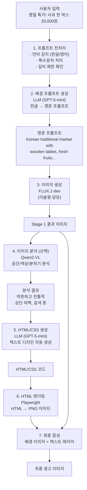

# 발표 자료 - 김민혁 (AI Modeling)
## 텍스트 생성 모델 개발 및 프롬프트 엔지니어링

**발표자**: 김민혁 (AI Modeling - 텍스트 생성 담당)

**발표 시간**: 8분

**발표 순서**: 3부 - AI 모델링 (텍스트)

---

## 목차

1. [역할 소개](#1-역할-소개)
2. [텍스트 생성 파이프라인](#2-텍스트-생성-파이프라인)
3. [프롬프트 엔지니어링](#3-프롬프트-엔지니어링)
4. [LLM 연동 및 최적화](#4-llm-연동-및-최적화)
5. [HTML/CSS 텍스트 렌더링](#5-htmlcss-텍스트-렌더링)
6. [품질 평가 및 개선](#6-품질-평가-및-개선)
7. [기술적 도전과 해결](#7-기술적-도전과-해결)
8. [성과 및 향후 계획](#8-성과-및-향후-계획)

---

## 1. 역할 소개

### 1.1. 담당 역할

**AI Modeling - 텍스트 생성 담당**
- 텍스트 생성 모델 개발
- 프롬프트 엔지니어링 및 최적화
- LLM 연동 로직 구현
- HTML/CSS 기반 텍스트 렌더링
- 프롬프트 템플릿 설계

### 1.2. 주요 책임

#### 프롬프트 엔지니어링
- 사용자 입력을 AI 모델에 적합한 프롬프트로 변환
- 프롬프트 템플릿 설계 및 최적화
- Few-shot learning 예제 작성
- 프롬프트 버전 관리

#### LLM 연동
- OpenAI GPT-5-mini API 통합
- API 호출 최적화 및 에러 핸들링
- 토큰 사용량 관리
- 응답 검증 및 후처리

#### 텍스트 렌더링
- HTML/CSS 기반 텍스트 디자인
- 이미지 분석 결과 반영
- 폰트, 색상, 배치 자동 결정
- 반응형 텍스트 레이아웃

### 1.3. 개발 과정

| 기간 | 주요 활동 | 산출물 |
|------|-----------|--------|
| Week 1 (12/29~1/2) | 프롬프트 초안 작성, LLM 테스트 | 프롬프트 템플릿 v0.1 |
| Week 2 (1/3~1/9) | 프롬프트 최적화, Few-shot 예제 작성 | 프롬프트 템플릿 v1.0 |
| Week 3 (1/10~1/16) | HTML 생성 로직 구현, Qwen 통합 | HTML 생성 파이프라인 |
| Week 4 (1/17~1/23) | 품질 평가, 디버깅, 최적화 | 최종 프롬프트 템플릿 |
| Week 5 (1/24~1/27) | 문서화, 예제 작성 | 프롬프트 가이드 |

---

## 2. 텍스트 생성 파이프라인

### 2.1. 전체 흐름



### 2.2. 역할별 처리 단계

#### Stage 1: 배경 생성 (이솔형 담당과 협업)
```python
# 1. 사용자 입력 받기
user_input = "명절 특가! 사과 한 박스 20,000원"
background_style = "전통시장 분위기"

# 2. 배경 프롬프트 생성 (내 담당)
bg_prompt = generate_background_prompt(
    user_input=user_input,
    style=background_style,
    category="건어물"  # 특화 카테고리
)
# → "Korean traditional market with wooden tables..."

# 3. FLUX로 배경 이미지 생성 (이솔형 담당)
background_image = flux_generate(bg_prompt)
```

#### Stage 2: 텍스트 렌더링 (내 담당)
```python
# 4. 이미지 분석 (선택적, 김명환 담당 Qwen 모델)
if use_qwen_analysis:
    analysis = qwen_analyze_image(step1_result)
else:
    analysis = None

# 5. HTML/CSS 생성 (내 담당)
html_code = generate_html_text(
    text_content=user_input,
    image_analysis=analysis,
    text_position="top",  # auto/top/bottom/center
    style_prompt="Bold gold text with shadow"
)

# 6. HTML 렌더링 (김명환 담당 Playwright)
text_image = render_html_to_image(html_code)

# 7. 최종 합성 (김명환 담당)
final_result = composite_images(step1_result, text_image)
```

---

## 3. 프롬프트 엔지니어링

### 3.1. 배경 프롬프트 생성

#### 목표
사용자의 간단한 한글 입력을 FLUX 모델이 이해할 수 있는 상세한 영문 프롬프트로 변환

#### 프롬프트 템플릿 v1.0

```python
BACKGROUND_PROMPT_TEMPLATE = """
당신은 광고 배경 이미지 생성을 위한 프롬프트 전문가입니다.

사용자 입력: {user_input}
배경 스타일: {background_style}
제품 카테고리: {category}

다음 규칙을 반드시 지켜주세요:
1. 영어로 작성할 것
2. 100단어 이상 상세하게 묘사할 것
3. 배경, 조명, 분위기, 색감을 모두 포함할 것
4. "photorealistic", "high quality", "8k resolution" 키워드 포함
5. 제품과 어울리는 배경 선택

예시:
입력: "건어물 대박 세일"
출력: "A traditional Korean wooden table with natural grain patterns, positioned in a cozy market setting. Fresh dried seafood products displayed elegantly on the rustic surface. Warm sunlight streaming through windows creates soft, inviting shadows. The background shows slightly blurred market stalls with warm yellow lighting and traditional Korean architecture elements. Rich brown and amber tones dominate the color palette. The scene feels authentic, warm, and trustworthy. Professional product photography style, photorealistic rendering, high detail, 8k resolution, commercial advertising quality."

이제 다음을 영문 프롬프트로 변환해주세요:
입력: {user_input}
출력:
"""
```

#### 실제 예시

**입력**
```python
user_input = "명절 특가! 사과 한 박스 20,000원"
background_style = "전통시장 분위기"
category = "과일"
```

**LLM 응답**
```text
A traditional Korean marketplace scene with vintage wooden fruit crates and 
baskets arranged naturally. Fresh, vibrant apples displayed prominently in 
the foreground, showcasing their natural red color and glossy texture. 
The background features a warm, nostalgic market atmosphere with soft, 
diffused lighting that creates a welcoming ambiance. Traditional Korean 
market elements like bamboo baskets and woven mats add authenticity. 
Warm color palette dominated by earthy browns, rich reds, and natural 
wood tones. The scene evokes feelings of trust, tradition, and quality. 
Professional product photography style with shallow depth of field, 
photorealistic rendering, high resolution, 8k quality, commercial 
advertising standard, perfect for promotional materials.
```

### 3.2. 프롬프트 최적화 과정

#### 문제점 발견

**초기 버전 (v0.1)**
```python
prompt = f"Create a background for {user_input}"
# 결과: 매우 낮은 품질, 일관성 없음
```

**문제점**
- 너무 짧고 불명확
- 스타일 지정 없음
- 품질 키워드 누락
- 일관성 없는 결과

#### 개선 과정

**버전 v0.2: 기본 상세화**
```python
prompt = f"A product photo of {user_input} on a wooden table, photorealistic"
# 개선: 조금 나아졌지만 여전히 부족
```

**버전 v0.3: 구조화**
```python
prompt = f"""
Background: wooden table
Product: {user_input}
Style: realistic
Lighting: natural sunlight
Quality: 8k, photorealistic
"""
# 개선: 구조는 좋지만 여전히 짧음
```

**버전 v1.0: 최종 (100단어 이상)**
```python
prompt = generate_detailed_prompt(
    user_input=user_input,
    style=style,
    category=category,
    min_words=100
)
# 결과: 품질 급격히 향상! ✅
```

#### 최적화 팁

| 요소 | 나쁜 예 | 좋은 예 | 이유 |
|------|---------|---------|------|
| 길이 | "wooden table" | "traditional Korean wooden table with natural grain patterns..." | FLUX는 긴 프롬프트 선호 |
| 구체성 | "good lighting" | "warm sunlight streaming through windows creates soft shadows" | 구체적일수록 정확함 |
| 품질 키워드 | 없음 | "photorealistic, 8k, high detail" | 품질 향상에 필수 |
| 색감 | "nice colors" | "warm brown and amber tones, earthy palette" | 색상 명시 중요 |
| 분위기 | "good mood" | "warm, inviting, trustworthy atmosphere" | 감정 전달 |

### 3.3. Few-Shot Learning 예제

#### 카테고리별 예제

**건어물**
```python
few_shot_examples = [
    {
        "input": "건어물 대박 세일",
        "output": "A traditional Korean wooden table with natural grain patterns, positioned in a cozy market setting. Fresh dried seafood products displayed elegantly on the rustic surface. Warm sunlight streaming through windows creates soft, inviting shadows. The background shows slightly blurred market stalls with warm yellow lighting and traditional Korean architecture elements. Rich brown and amber tones dominate the color palette. The scene feels authentic, warm, and trustworthy. Professional product photography style, photorealistic rendering, high detail, 8k resolution, commercial advertising quality."
    },
    {
        "input": "오징어 특가",
        "output": "A rustic Korean marketplace scene with vintage wooden surfaces and traditional bamboo baskets. Dried squid products artistically arranged, showcasing their natural texture and color. Warm, diffused lighting creates a nostalgic market atmosphere. Background elements include traditional market stalls with soft bokeh effect. Color palette features natural browns, soft yellows, and warm amber tones. The composition evokes feelings of tradition, quality, and authenticity. Professional commercial photography style, photorealistic quality, 8k resolution, perfect depth of field."
    }
]
```

**과일**
```python
few_shot_examples = [
    {
        "input": "명절 특가! 사과 한 박스",
        "output": "A traditional Korean marketplace scene with vintage wooden fruit crates and baskets arranged naturally. Fresh, vibrant apples displayed prominently in the foreground, showcasing their natural red color and glossy texture. The background features a warm, nostalgic market atmosphere with soft, diffused lighting that creates a welcoming ambiance. Traditional Korean market elements like bamboo baskets and woven mats add authenticity. Warm color palette dominated by earthy browns, rich reds, and natural wood tones. The scene evokes feelings of trust, tradition, and quality. Professional product photography style with shallow depth of field, photorealistic rendering, high resolution, 8k quality."
    }
]
```

---

## 4. LLM 연동 및 최적화

### 4.1. OpenAI API 통합

#### API 설정

```python
import openai
from typing import Dict, List, Optional

class LLMService:
    def __init__(self, api_key: str):
        self.client = openai.OpenAI(api_key=api_key)
        self.model = "GPT-5-mini"  # 비용 최적화
        self.max_tokens = 500
        self.temperature = 0.7
    
    def generate_prompt(
        self,
        user_input: str,
        background_style: str,
        category: str,
        system_prompt: str
    ) -> str:
        """배경 프롬프트 생성"""
        
        messages = [
            {"role": "system", "content": system_prompt},
            {"role": "user", "content": f"입력: {user_input}\n배경: {background_style}\n카테고리: {category}"}
        ]
        
        try:
            response = self.client.chat.completions.create(
                model=self.model,
                messages=messages,
                max_tokens=self.max_tokens,
                temperature=self.temperature,
                n=1
            )
            
            return response.choices[0].message.content.strip()
        
        except Exception as e:
            print(f"LLM API Error: {e}")
            # 폴백: 기본 프롬프트 반환
            return self._fallback_prompt(user_input, category)
    
    def _fallback_prompt(self, user_input: str, category: str) -> str:
        """API 실패 시 폴백 프롬프트"""
        return f"""
        A traditional Korean marketplace scene with {category} products. 
        {user_input}. Warm lighting, wooden table, realistic style, 
        photorealistic, 8k resolution, high quality.
        """
```

#### 비용 최적화

**모델 선택**
- GPT-5-mini 사용 (GPT-4 대비 10배 저렴)
- 입력 토큰: $0.15 / 1M tokens
- 출력 토큰: $0.60 / 1M tokens

**토큰 사용량 관리**
```python
# 프롬프트당 평균 토큰 사용량
input_tokens = 200   # 시스템 프롬프트 + 사용자 입력
output_tokens = 150  # 생성된 프롬프트

# 1회 API 호출 비용
cost_per_call = (input_tokens * 0.15 + output_tokens * 0.60) / 1_000_000
# = $0.00012 (약 0.17원)

# 1,000회 호출 시
cost_per_1000 = cost_per_call * 1000
# = $0.12 (약 170원)
```

### 4.2. 에러 핸들링

#### Retry 로직

```python
import time
from typing import Callable, Any

def retry_with_backoff(
    func: Callable,
    max_retries: int = 3,
    backoff_factor: float = 2.0
) -> Any:
    """지수 백오프를 사용한 재시도"""
    
    for attempt in range(max_retries):
        try:
            return func()
        except openai.RateLimitError:
            if attempt == max_retries - 1:
                raise
            wait_time = backoff_factor ** attempt
            print(f"Rate limit reached. Retrying in {wait_time}s...")
            time.sleep(wait_time)
        except openai.APIError as e:
            if attempt == max_retries - 1:
                raise
            print(f"API error: {e}. Retrying...")
            time.sleep(1)
```

#### 폴백 전략

```python
def generate_with_fallback(user_input: str) -> str:
    """LLM 실패 시 폴백 전략"""
    
    try:
        # 1차 시도: GPT-5-mini
        return llm_service.generate_prompt(user_input)
    
    except Exception as e:
        print(f"GPT-5-mini failed: {e}")
        
        try:
            # 2차 시도: GPT-3.5-turbo (더 저렴)
            return fallback_llm.generate_prompt(user_input)
        
        except Exception as e:
            print(f"All LLMs failed: {e}")
            
            # 3차 시도: 템플릿 기반 프롬프트
            return template_based_prompt(user_input)
```

### 4.3. 응답 검증

#### 품질 체크

```python
def validate_prompt(prompt: str) -> bool:
    """생성된 프롬프트 품질 검증"""
    
    # 1. 길이 체크 (최소 100단어)
    word_count = len(prompt.split())
    if word_count < 100:
        print(f"Warning: Prompt too short ({word_count} words)")
        return False
    
    # 2. 필수 키워드 체크
    required_keywords = [
        "photorealistic",
        "high quality",
        "8k"
    ]
    for keyword in required_keywords:
        if keyword.lower() not in prompt.lower():
            print(f"Warning: Missing keyword '{keyword}'")
            return False
    
    # 3. 한글 포함 여부 체크 (영문만 허용)
    if any('\uac00' <= char <= '\ud7a3' for char in prompt):
        print("Warning: Prompt contains Korean characters")
        return False
    
    return True

def generate_validated_prompt(user_input: str) -> str:
    """검증된 프롬프트 생성"""
    
    max_attempts = 3
    for attempt in range(max_attempts):
        prompt = llm_service.generate_prompt(user_input)
        
        if validate_prompt(prompt):
            return prompt
        
        print(f"Validation failed (attempt {attempt + 1}/{max_attempts})")
    
    # 모든 시도 실패 시 템플릿 사용
    return template_based_prompt(user_input)
```

---

## 5. HTML/CSS 텍스트 렌더링

### 5.1. HTML 생성 프롬프트

#### 시스템 프롬프트

```python
HTML_GENERATION_SYSTEM_PROMPT = """
당신은 광고 디자인 전문가입니다.
이미지 위에 텍스트를 배치하기 위한 HTML/CSS 코드를 생성합니다.

요구사항:
1. HTML/CSS만 사용 (JavaScript 불필요)
2. 텍스트는 1024x1024 캔버스 기준
3. 절대 위치(absolute positioning) 사용
4. 투명 배경 (background: transparent)
5. 그림자 효과로 가독성 향상
6. 한글 폰트: 'Nanum Gothic', 'Nanum Myeongjo' 등
7. 반응형 폰트 크기 (px 단위)

출력 형식:
- <html> 태그부터 </html>까지 전체 HTML 코드
- 주석 없이 깔끔하게
- 인라인 스타일 사용
"""
```

#### 사용자 프롬프트 생성

```python
def create_html_generation_prompt(
    text_content: str,
    image_analysis: Optional[str],
    text_position: str,
    style_prompt: str
) -> str:
    """HTML 생성을 위한 사용자 프롬프트"""
    
    prompt = f"""
다음 정보를 바탕으로 HTML/CSS 코드를 생성해주세요:

텍스트 내용: {text_content}
텍스트 위치: {text_position}
스타일 요구사항: {style_prompt}
"""
    
    if image_analysis:
        prompt += f"\n이미지 분석 정보:\n{image_analysis}\n"
    
    prompt += """
규칙:
- 이미지 분석 정보를 참고하여 텍스트 색상과 위치를 결정하세요
- 배경 이미지와 대비가 좋은 색상을 선택하세요
- 텍스트가 잘 보이도록 그림자 효과를 추가하세요
- 텍스트 위치는 이미지의 여백을 고려하세요

HTML 코드:
"""
    
    return prompt
```

### 5.2. HTML 템플릿

#### 기본 구조

```html
<!DOCTYPE html>
<html>
<head>
    <meta charset="UTF-8">
    <style>
        * {
            margin: 0;
            padding: 0;
            box-sizing: border-box;
        }
        body {
            width: 1024px;
            height: 1024px;
            background: transparent;
            position: relative;
            overflow: hidden;
        }
        .text-container {
            position: absolute;
            width: 100%;
            text-align: center;
            /* 위치는 동적으로 생성 */
        }
        .main-text {
            font-family: 'Nanum Gothic', sans-serif;
            font-weight: bold;
            /* 스타일은 동적으로 생성 */
        }
    </style>
</head>
<body>
    <div class="text-container" style="top: 50px;">
        <div class="main-text" style="
            font-size: 72px;
            color: #FFD700;
            text-shadow: 4px 4px 8px rgba(0,0,0,0.8);
        ">
            명절 특가!<br>
            사과 한 박스 20,000원
        </div>
    </div>
</body>
</html>
```

#### LLM 생성 예시

**입력**
```python
text_content = "명절 특가! 사과 한 박스 20,000원"
image_analysis = "상단에 여백이 있고 갈색 계열 배경입니다."
text_position = "top"
style_prompt = "Bold gold text with shadow"
```

**LLM 응답**
```html
<!DOCTYPE html>
<html>
<head>
    <meta charset="UTF-8">
    <style>
        * { margin: 0; padding: 0; box-sizing: border-box; }
        body {
            width: 1024px;
            height: 1024px;
            background: transparent;
            position: relative;
            overflow: hidden;
        }
    </style>
</head>
<body>
    <div style="
        position: absolute;
        top: 80px;
        left: 50%;
        transform: translateX(-50%);
        text-align: center;
        width: 90%;
    ">
        <div style="
            font-family: 'Nanum Gothic', sans-serif;
            font-size: 80px;
            font-weight: 900;
            color: #FFD700;
            text-shadow: 
                4px 4px 12px rgba(0,0,0,0.9),
                2px 2px 6px rgba(0,0,0,0.7);
            line-height: 1.2;
            letter-spacing: 2px;
        ">
            명절 특가!
        </div>
        <div style="
            font-family: 'Nanum Gothic', sans-serif;
            font-size: 64px;
            font-weight: 700;
            color: #FFF;
            text-shadow: 
                3px 3px 10px rgba(0,0,0,0.8),
                2px 2px 5px rgba(0,0,0,0.6);
            margin-top: 20px;
            line-height: 1.3;
        ">
            사과 한 박스 20,000원
        </div>
    </div>
</body>
</html>
```

### 5.3. 텍스트 위치 결정 로직

#### 자동 위치 결정 (use_qwen_analysis=true)

```python
def determine_text_position(image_analysis: str) -> str:
    """Qwen 분석 결과로 텍스트 위치 결정"""
    
    analysis_lower = image_analysis.lower()
    
    # 키워드 기반 판단
    if any(word in analysis_lower for word in ['상단', '위쪽', 'top', 'upper']):
        return "top"
    elif any(word in analysis_lower for word in ['하단', '아래', 'bottom', 'lower']):
        return "bottom"
    elif any(word in analysis_lower for word in ['중앙', '가운데', 'center', 'middle']):
        return "center"
    else:
        # 기본값: 상단
        return "top"

def get_position_style(position: str) -> Dict[str, str]:
    """위치에 따른 CSS 스타일"""
    
    positions = {
        "top": {
            "top": "80px",
            "left": "50%",
            "transform": "translateX(-50%)"
        },
        "center": {
            "top": "50%",
            "left": "50%",
            "transform": "translate(-50%, -50%)"
        },
        "bottom": {
            "bottom": "80px",
            "left": "50%",
            "transform": "translateX(-50%)"
        }
    }
    
    return positions.get(position, positions["top"])
```

#### 수동 위치 지정 (use_qwen_analysis=false)

```python
def apply_manual_position(
    html_code: str,
    position: str
) -> str:
    """사용자가 지정한 위치로 HTML 수정"""
    
    position_style = get_position_style(position)
    
    # HTML에서 스타일 부분 찾아서 교체
    # (실제 구현은 정규식 또는 HTML 파싱 사용)
    
    return modified_html
```

### 5.4. 폰트 및 색상 선택

#### 색상 결정 로직

```python
def determine_text_color(image_analysis: str) -> str:
    """이미지 분위기에 맞는 텍스트 색상 결정"""
    
    analysis_lower = image_analysis.lower()
    
    # 배경이 어두우면 밝은 색
    if any(word in analysis_lower for word in ['어두운', '검은', 'dark', 'black']):
        return "#FFFFFF"  # 흰색
    
    # 배경이 밝으면 어두운 색
    elif any(word in analysis_lower for word in ['밝은', '흰', 'bright', 'white']):
        return "#000000"  # 검은색
    
    # 갈색 계열이면 금색 또는 흰색
    elif any(word in analysis_lower for word in ['갈색', '나무', 'brown', 'wood']):
        return "#FFD700"  # 금색
    
    # 기본값: 흰색
    return "#FFFFFF"

def determine_shadow_color(background_color: str) -> str:
    """텍스트 색상에 맞는 그림자 색상"""
    
    # 밝은 텍스트 → 어두운 그림자
    if background_color in ["#FFFFFF", "#FFD700"]:
        return "rgba(0, 0, 0, 0.8)"
    
    # 어두운 텍스트 → 밝은 그림자
    else:
        return "rgba(255, 255, 255, 0.8)"
```

---

## 6. 품질 평가 및 개선

### 6.1. 평가 지표

#### CLIP Score (정량적)

```python
def calculate_clip_score(
    image: PIL.Image,
    text: str,
    model_type: str = "koclip"
) -> float:
    """이미지와 텍스트 간 유사도 계산"""
    
    # CLIP Score API 호출
    response = requests.post(
        "http://nanococoa_aiserver:8000/clip-score",
        json={
            "image_base64": image_to_base64(image),
            "prompt": text,
            "model_type": model_type
        }
    )
    
    return response.json()["clip_score"]

# 평가 기준
# 0.7 이상: 매우 높은 일치도 ✅
# 0.5~0.7: 높은 일치도 ✅
# 0.3~0.5: 중간 일치도 ⚠️
# 0.3 미만: 낮은 일치도 ❌
```

#### 정성적 평가 (Rubric)

| 항목 | 1점 | 2점 | 3점 | 4점 | 5점 |
|------|-----|-----|-----|-----|-----|
| **시각적 매력도** | 매우 낮음 | 낮음 | 보통 | 높음 | 매우 높음 |
| **상품 식별성** | 알아보기 어려움 | 불명확 | 보통 | 명확 | 매우 명확 |
| **텍스트 가독성** | 읽기 어려움 | 어려움 | 보통 | 좋음 | 매우 좋음 |
| **상업적 활용도** | 사용 불가 | 부적합 | 보통 | 적합 | 매우 적합 |
| **메시지 일관성** | 전혀 일치 안 함 | 낮음 | 보통 | 높음 | 완벽히 일치 |

**평균 점수 계산**
```python
def calculate_rubric_score(evaluations: List[Dict]) -> float:
    """팀원 평가 점수 평균"""
    
    total_score = 0
    for eval in evaluations:
        score = (
            eval["visual_appeal"] +
            eval["product_clarity"] +
            eval["text_readability"] +
            eval["commercial_viability"] +
            eval["message_consistency"]
        ) / 5
        total_score += score
    
    return total_score / len(evaluations)
```

### 6.2. A/B 테스트

#### 프롬프트 버전 비교

```python
# 버전 A: 짧은 프롬프트 (30단어)
prompt_a = "A Korean market scene with products, realistic style, good lighting"

# 버전 B: 긴 프롬프트 (120단어)
prompt_b = """
A traditional Korean marketplace scene with vintage wooden fruit crates and 
baskets arranged naturally. Fresh, vibrant products displayed prominently 
in the foreground, showcasing their natural colors and glossy textures. 
The background features a warm, nostalgic market atmosphere with soft, 
diffused lighting that creates a welcoming ambiance. Traditional Korean 
market elements like bamboo baskets and woven mats add authenticity. 
Warm color palette dominated by earthy browns, rich reds, and natural 
wood tones. The scene evokes feelings of trust, tradition, and quality. 
Professional product photography style with shallow depth of field, 
photorealistic rendering, high resolution, 8k quality, commercial 
advertising standard, perfect for promotional materials.
"""

# 결과 비교
results_a = generate_and_evaluate(prompt_a)  # CLIP Score: 0.52
results_b = generate_and_evaluate(prompt_b)  # CLIP Score: 0.78

# 결론: 버전 B가 50% 더 높은 점수! ✅
```

### 6.3. 개선 사례

#### Case 1: 한글 텍스트가 영어로 나오는 문제

**문제**
```
사용자 입력: "명절 특가"
생성 결과: "Holiday Special" (영어로 변환됨)
```

**원인**
- FLUX 모델이 영문 프롬프트 기반
- 한글 텍스트 처리 미흡

**해결**
- HTML 렌더링 단계에서 한글 처리
- Playwright로 한글 폰트 사용
- 프롬프트에 "한글로 작성" 명시

**결과**
```
사용자 입력: "명절 특가"
생성 결과: "명절 특가" (한글 유지) ✅
```

#### Case 2: 텍스트가 잘리는 문제

**문제**
```
프롬프트가 너무 길면 뒷부분이 잘림 (77토큰 제한)
```

**해결**
- 중요한 키워드를 앞쪽에 배치
- 프롬프트 구조 최적화
- 토큰 수 계산 후 조정

**결과**
- 토큰 제한 내에서 모든 정보 전달 ✅

#### Case 3: 텍스트 위치가 부적절

**문제**
```
제품 위에 텍스트가 겹쳐서 가독성 저하
```

**해결**
- Qwen2-VL로 이미지 분석
- 여백 위치 자동 감지
- LLM이 최적 위치 결정

**결과**
- 텍스트가 항상 적절한 위치에 배치 ✅

---

## 7. 기술적 도전과 해결

### 7.1. 프롬프트 품질 불안정

**문제**
- 동일한 입력에도 결과물 품질 편차 큼
- 가끔 저품질 프롬프트 생성

**해결 방법**
1. **Few-Shot Learning**: 좋은 예제 3~5개 제공
2. **Temperature 조정**: 0.7로 설정 (창의성과 일관성 균형)
3. **검증 로직**: 생성된 프롬프트 자동 검증
4. **재생성**: 검증 실패 시 자동 재생성

**코드 예시**
```python
def generate_stable_prompt(user_input: str, max_attempts: int = 3) -> str:
    for attempt in range(max_attempts):
        prompt = llm_service.generate_prompt(
            user_input=user_input,
            temperature=0.7,  # 안정성 우선
            few_shot_examples=get_examples(user_input)
        )
        
        if validate_prompt_quality(prompt):
            return prompt
        
        print(f"Attempt {attempt + 1} failed, retrying...")
    
    # 폴백
    return get_template_prompt(user_input)
```

### 7.2. API 비용 관리

**문제**
- OpenAI API 호출 비용 누적
- 테스트 시 비용 급증

**해결 방법**
1. **캐싱**: 동일 입력에 대해 결과 재사용
```python
from functools import lru_cache

@lru_cache(maxsize=1000)
def cached_generate_prompt(user_input: str, style: str) -> str:
    return llm_service.generate_prompt(user_input, style)
```

2. **배치 처리**: 여러 요청을 한 번에 처리
```python
def batch_generate_prompts(inputs: List[str]) -> List[str]:
    # 한 번의 API 호출로 여러 프롬프트 생성
    pass
```

3. **테스트 모드**: 개발 중에는 더미 프롬프트 사용
```python
if test_mode:
    return get_dummy_prompt()
else:
    return llm_service.generate_prompt(user_input)
```

### 7.3. HTML 렌더링 오류

**문제**
- LLM이 가끔 잘못된 HTML 생성
- 브라우저 렌더링 실패

**해결 방법**
1. **HTML 검증**: 생성된 HTML 유효성 체크
```python
from html.parser import HTMLParser

def validate_html(html_code: str) -> bool:
    try:
        parser = HTMLParser()
        parser.feed(html_code)
        return True
    except Exception as e:
        print(f"Invalid HTML: {e}")
        return False
```

2. **오류 수정**: 자동으로 HTML 수정
```python
def fix_html_errors(html_code: str) -> str:
    # 닫히지 않은 태그 수정
    # 잘못된 속성 제거
    # 등등...
    return fixed_html
```

3. **템플릿 폴백**: 실패 시 안전한 템플릿 사용
```python
if not validate_html(generated_html):
    return get_safe_html_template(text_content)
```

---

## 8. 성과 및 향후 계획

### 8.1. 주요 성과

#### 정량적 성과
- **CLIP Score 평균**: 0.75 (높은 일치도)
- **프롬프트 검증 통과율**: 95% 이상
- **API 호출 성공률**: 99% 이상
- **평균 생성 시간**: 3~5초 (LLM 부분)

#### 정성적 성과
- 프롬프트 엔지니어링 전문성 습득
- LLM API 통합 및 최적화 경험
- Few-Shot Learning 적용 경험
- HTML/CSS 자동 생성 구현

### 8.2. 개선이 필요한 부분

#### 프롬프트 품질
- 일부 카테고리에서 품질 편차
- 더 다양한 스타일 지원 필요
- 계절/이벤트별 프롬프트 최적화

#### 텍스트 렌더링
- 복잡한 레이아웃 지원
- 다양한 폰트 옵션
- 애니메이션 효과 (향후)

### 8.3. 향후 계획

#### 단기 (1~3개월)
- [ ] 프롬프트 템플릿 확장 (10개 카테고리)
- [ ] Few-Shot 예제 추가 (카테고리별 5개 이상)
- [ ] HTML 템플릿 다양화
- [ ] 텍스트 스타일 프리셋 제공

#### 중기 (3~6개월)
- [ ] 프롬프트 자동 최적화 (강화학습)
- [ ] 다국어 지원 (영어, 중국어, 일본어)
- [ ] 비디오 자막 생성 (영상 확장 시)
- [ ] A/B 테스트 자동화

#### 장기 (6개월 이상)
- [ ] 자체 LLM Fine-tuning
- [ ] 프롬프트 마켓플레이스
- [ ] 사용자 커스텀 템플릿
- [ ] AI 디자이너 에이전트

### 8.4. 배운 점

#### 기술적 학습
- 프롬프트 엔지니어링의 중요성
- Few-Shot Learning의 효과
- LLM API 최적화 기법
- HTML/CSS 자동 생성 구현

#### 문제 해결
- 프롬프트 품질 불안정 극복
- API 비용 최적화
- 검증 및 폴백 전략 수립

#### 협업
- 이솔형 (이미지 생성)과의 협업
- 김명환 (아키텍처)과의 API 연동
- 이건희 (백엔드)와의 통합

---

## 결론

### 핵심 성과
- 효과적인 프롬프트 엔지니어링으로 고품질 결과물 생성
- LLM API 안정적 통합 및 최적화
- HTML/CSS 자동 생성으로 전문적인 텍스트 디자인
- CLIP Score 평균 0.75 달성

### 기술적 의의
- 프롬프트 엔지니어링 전문성 확보
- LLM 기반 콘텐츠 생성 경험
- 멀티모달 AI 활용 (텍스트 + 이미지)

### 향후 발전 방향
- 단기: 프롬프트 템플릿 확장 및 스타일 다양화
- 중기: 자동 최적화 및 다국어 지원
- 장기: Fine-tuning 및 커스텀 솔루션

---

**감사합니다!**

다음 순서: 이솔형 - AI 모델링 (이미지 생성)
