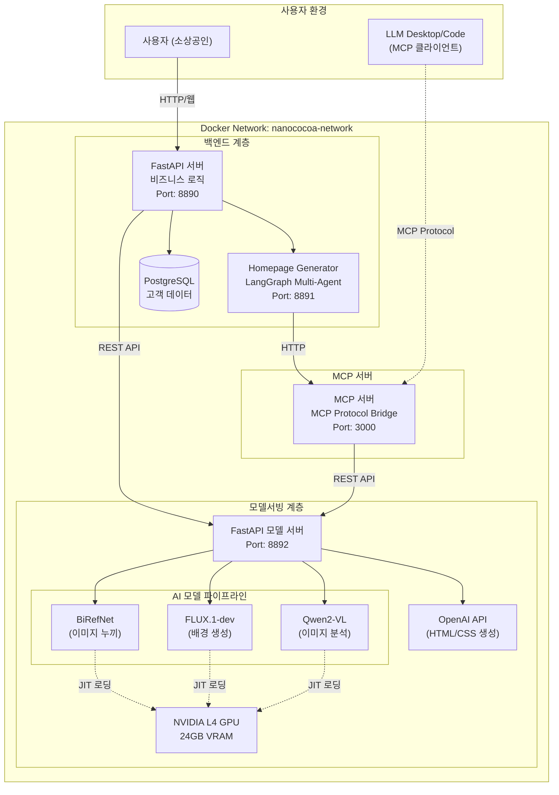
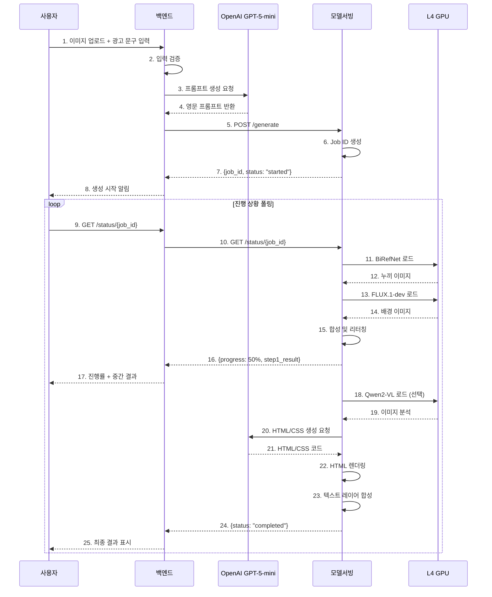

# 프로젝트 완료 보고서

**프로젝트명**: SaaS Ad Content Platform - 생성형 AI 기반 소상공인 광고 콘텐츠 제작 지원 서비스

**팀명**: 코드잇 AI 4기 3팀 (sprint-ai-chunk2-03)

**프로젝트 기간**: 2025.12.29 ~ 2026.01.29

**작성일**: 2026.01.27

**문서 버전**: v1.0

---

## 목차

1. [프로젝트 개요](#1-프로젝트-개요)<br/>
2. [팀 구성 및 역할](#2-팀-구성-및-역할)<br/>
3. [기술 스택 및 아키텍처](#3-기술-스택-및-아키텍처)<br/>
4. [주요 기능 및 구현 내용](#4-주요-기능-및-구현-내용)<br/>
5. [개발 과정 및 주요 의사결정](#5-개발-과정-및-주요-의사결정)<br/>
6. [성과 및 결과물](#6-성과-및-결과물)<br/>
7. [프로젝트 성과 평가](#7-프로젝트-성과-평가)<br/>
8. [한계점 및 개선 방향](#8-한계점-및-개선-방향)<br/>
9. [결론](#9-결론)<br/>

---

## 1. 프로젝트 개요

### 1.1. 배경 및 목적

**배경**
- 오프라인 중심의 소상공인은 온라인 마케팅 진입 장벽이 높음
- 전문적인 디자인 역량 부족으로 광고 콘텐츠 제작이 어려움
- 외주 제작 비용 부담 및 시간 소요 문제

**목적**
- 생성형 AI 기술을 활용하여 소상공인이 손쉽게 광고 콘텐츠를 제작할 수 있도록 지원
- 제품 이미지만으로 배너, 홈페이지 등 다양한 광고 콘텐츠 자동 생성
- 비용 절감, 제작 시간 단축, 마케팅 효율 증대

**핵심 가치**
- 비전문가도 쉽게 사용할 수 있는 직관적인 UI/UX
- 고품질 AI 모델을 활용한 전문적인 결과물
- All-in-One 통합 플랫폼 제공 (이미지 생성 + 텍스트 렌더링 + 홈페이지 생성)

### 1.2. 프로젝트 범위

**타겟 유저**
- 1차 타겟: 전통시장 소상공인 (건어물, 사과 등)
- 2차 확장: 일반 개인/법인 사업자

**제공 서비스**
- 광고 배너 이미지 생성 (배경 생성 + 텍스트 합성)
- 상품 홈페이지 자동 생성 (LangGraph 멀티에이전트)
- 대화형 광고 생성 (채팅 기반 인터페이스)
- MCP 프로토콜 지원 (LLM Desktop/Code 연동)

**기술 범위**
- 이미지 기반 광고 제작 (영상 제외)
- Docker 기반 마이크로서비스 아키텍처
- REST API 및 MCP 프로토콜 제공

---

## 2. 팀 구성 및 역할

### 2.1. 팀원 및 역할 분담

| 이름 | 역할 | 주요 담당 업무 |
|------|------|----------------|
| **김명환** | 아키텍처/Data | - 시스템 아키텍처 설계<br>- 데이터 파이프라인 구성<br>- 모델 서버(nanoCocoa_aiserver) 설계 및 구현<br>- Docker 배포 환경 구성<br>- API 설계 및 문서화 |
| **김민혁** | AI Modeling | - 텍스트 생성 모델 개발<br>- 프롬프트 엔지니어링<br>- LLM 연동 최적화 |
| **박지윤** | PM | - 프로젝트 관리 및 일정 조율<br>- 서비스 기획 및 요구사항 정의<br>- GCP 인프라 구축<br>- 회의록 및 문서 관리<br>- QA 및 테스트 |
| **이건희** | Full Stack | - 백엔드 개발 (FastAPI)<br>- 프론트엔드 개발 (Jinja2/HTML)<br>- LLM 연동 로직 구현<br>- 사용자 대시보드 구현 |
| **이솔형** | AI Modeling | - 이미지 생성 모델 최적화<br>- 이미지 특성 추출 모델 개발<br>- FLUX/SDXL 모델 비교 및 선정 |

### 2.2. 협업 방식

**일일 협업**
- 매일 오전 9시 회의를 통한 진행 상황 공유
- 협업일지 작성을 통한 작업 내용 기록
- GitHub를 통한 코드 공유 및 버전 관리

**커뮤니케이션**
- Slack/Discord를 통한 실시간 소통
- 주요 의사결정은 회의록으로 문서화
- 기술 문서는 GitHub Pages로 공유

**코드 관리**
- GitHub Flow 기반 브랜치 전략
- 주요 기능은 코드 리뷰 후 Merge
- 민감 정보는 `.env` 파일로 관리

---

## 3. 기술 스택 및 아키텍처

### 3.1. 기술 스택

#### 개발 언어 및 프레임워크
- **Language**: Python 3.11+
- **Web Framework**: FastAPI 0.109
- **Template Engine**: Jinja2
- **AI Framework**: PyTorch 2.0+, Diffusers

#### AI 모델
- **이미지 생성**: FLUX.1-dev (Stable Diffusion 계열)
- **이미지 누끼**: BiRefNet
- **이미지 분석**: Qwen2-VL
- **텍스트 생성**: OpenAI GPT-5-mini
- **이미지 평가**: CLIP Score (OpenAI CLIP, KoCLIP)

#### 인프라 및 배포
- **Cloud**: GCP VM (us-central1)
- **GPU**: NVIDIA L4 (24GB VRAM)
- **Container**: Docker, Docker Compose
- **Database**: PostgreSQL
- **Web Server**: Uvicorn (ASGI)

#### 외부 API
- **OpenAI API**: GPT-5-mini, Embedding
- **HuggingFace**: 모델 다운로드

### 3.2. 시스템 아키텍처

#### 전체 아키텍처 (Microservices Architecture)



#### 계층별 역할

**1. 프론트엔드 계층 (Backend)**
- FastAPI 기반 웹 UI 제공
- 이미지 업로드 및 광고 문구 입력
- 생성 옵션 설정 (배경 스타일, 텍스트 스타일)
- 실시간 진행 상황 표시 (폴링 방식)
- 결과물 표시 및 다운로드

**2. 백엔드 계층 (Backend)**
- 사용자 요청 검증 및 전처리
- LLM(GPT-5-mini) 연동을 통한 프롬프트 생성
- 모델 서버 호출 및 응답 관리
- 작업 상태 추적 및 폴링 처리
- 에러 핸들링 및 사용자 피드백

**3. 홈페이지 생성 계층 (Homepage Generator)**
- LangGraph 기반 멀티에이전트 협업
- 기획, 디자인, 개발 에이전트로 역할 분담
- Playwright를 활용한 HTML 렌더링
- MCP 서버와 연동하여 AI 이미지 활용

**4. MCP 서버 계층 (nanoCocoa_mcpserver)**
- MCP 프로토콜 브릿지 서버
- nanoCocoa_aiserver REST API를 MCP 프로토콜로 변환
- LLM Desktop/Code와 연동
- SSE (Server-Sent Events) 전송 방식
- 8개의 MCP 도구 제공

**5. 모델서빙 계층 (nanoCocoa_aiserver)**
- FastAPI 기반 REST API 서버
- GPU 리소스 관리 (JIT 로딩/언로딩)
- 비동기 추론 작업 처리 (멀티프로세싱)
- 2단계 파이프라인 실행
  - Stage 1: 배경 생성 (BiRefNet → FLUX.1-dev → 합성)
  - Stage 2: 텍스트 렌더링 (Qwen2-VL → LLM → HTML 렌더링)

### 3.3. 데이터 흐름 (시퀀스 다이어그램)



---

## 4. 주요 기능 및 구현 내용

### 4.1. 광고 배너 이미지 생성

**기능 설명**
- 사용자가 제품 이미지와 광고 문구를 입력하면 AI가 자동으로 광고 배너 생성
- 2단계 파이프라인: 배경 생성 + 텍스트 렌더링

**구현 내용**

**Stage 1: 배경 생성**
1. **BiRefNet**: 제품 이미지에서 배경 제거 (누끼 작업)
2. **FLUX.1-dev**: LLM이 생성한 프롬프트로 고품질 배경 이미지 생성
3. **이미지 합성**: 누끼 이미지와 배경 이미지 합성
4. **리터칭**: 경계선 부드럽게 처리 (Gaussian Blur)

**Stage 2: 텍스트 렌더링**
1. **Qwen2-VL** (선택): 이미지의 공간, 색감, 분위기 분석
2. **LLM (GPT-5-mini)**: 이미지 분석 결과를 기반으로 HTML/CSS 생성
3. **Playwright**: HTML을 이미지로 렌더링
4. **텍스트 레이어 합성**: 최종 광고 이미지 완성

**기술적 특징**
- GPU 메모리 최적화: JIT 로딩/언로딩으로 24GB VRAM 효율적 사용
- 비동기 처리: 멀티프로세싱으로 사용자 대기 시간 단축
- 실시간 진행 상황: 폴링 방식으로 생성 과정 시각화

### 4.2. 홈페이지 자동 생성

**기능 설명**
- 제품 정보를 입력하면 AI가 전체 랜딩 페이지를 자동 생성
- LangGraph 기반 멀티에이전트 협업 시스템

**구현 내용**

**에이전트 구성**
1. **기획 에이전트**: 홈페이지 구조 및 콘텐츠 기획
2. **디자인 에이전트**: 색상, 레이아웃, 이미지 선정
3. **개발 에이전트**: HTML/CSS/JavaScript 코드 작성
4. **QA 에이전트**: 품질 검증 및 개선 제안

**워크플로우**
- LangGraph로 에이전트 간 협업 흐름 관리
- MCP 서버와 연동하여 AI 생성 이미지 활용
- Playwright로 최종 HTML 렌더링 및 스크린샷

**생성 결과물**
- 반응형 웹페이지 (HTML/CSS/JS)
- AI 생성 배너 이미지 자동 삽입
- 제품 설명, 가격, 연락처 정보 포함

### 4.3. 대화형 광고 생성 (ad_chat)

**기능 설명**
- 채팅 인터페이스로 자연어로 광고 이미지 생성 요청
- 기존 광고에 수정 사항을 추가로 입력하여 재생성 가능

**구현 내용**
- FastAPI 기반 채팅 API
- OpenAI GPT-5-mini로 사용자 의도 파악
- nanoCocoa_aiserver와 연동하여 이미지 생성
- 대화 히스토리 관리 및 컨텍스트 유지

**사용 예시**
```
사용자: "사과 광고 만들어줘"
AI: (사과 광고 이미지 생성)

사용자: "배경을 더 밝게 해줘"
AI: (기존 이미지를 수정하여 재생성)
```

### 4.4. MCP 프로토콜 지원

**기능 설명**
- LLM Desktop/Code와 연동하여 IDE에서 직접 광고 이미지 생성
- Model Context Protocol (MCP) 표준 준수

**구현 내용**
- SSE (Server-Sent Events) 기반 통신
- 8개의 MCP 도구 제공
  - `generate_ad_image`: 광고 이미지 생성
  - `check_generation_status`: 생성 상태 확인
  - `list_uploaded_images`: 업로드된 이미지 목록
  - `analyze_image_with_qwen`: Qwen2-VL로 이미지 분석
  - `calculate_clip_score`: CLIP Score 계산
  - `get_health_status`: 서버 상태 확인
  - `list_available_models`: 사용 가능한 모델 목록
  - `upload_product_image`: 제품 이미지 업로드

**사용 방법**
```json
// Claude Desktop 설정 (config.json)
{
  "mcpServers": {
    "nanococoa-ad-generator": {
      "command": "node",
      "args": ["path/to/mcp-client.js"],
      "env": {
        "MCP_SERVER_URL": "http://localhost:3000"
      }
    }
  }
}
```

### 4.5. CLIP Score 평가

**기능 설명**
- 생성된 광고 이미지가 입력 프롬프트와 얼마나 일치하는지 정량적 평가
- OpenAI CLIP 및 KoCLIP 모델 지원

**구현 내용**
- REST API 엔드포인트: `POST /clip-score`
- Base64 인코딩된 이미지와 프롬프트 입력
- 코사인 유사도 점수 계산 (0.0 ~ 1.0)
- 자동 해석 메시지 제공

**평가 기준**
- 0.7 이상: 매우 높은 일치도
- 0.5 ~ 0.7: 높은 일치도
- 0.3 ~ 0.5: 중간 일치도
- 0.3 미만: 낮은 일치도

---

## 5. 개발 과정 및 주요 의사결정

### 5.1. 프로젝트 타임라인

#### Phase 1: 기획 및 환경 구성 (12/29 ~ 1/2)
- GCP VM 환경 구성 (NVIDIA L4 GPU)
- GitHub 저장소 및 협업 체계 수립
- 서비스 범위 결정 (전통시장 특화)
- 벤치마킹 (Gemini Veo2 나노바나나)

#### Phase 2: 아키텍처 설계 (1/3 ~ 1/7)
- 마이크로서비스 아키텍처 설계
- API 설계 및 데이터 포맷 정의
- Docker 배포 환경 구성
- 모델 서버 파이프라인 설계

#### Phase 3: 모델 개발 및 최적화 (1/8 ~ 1/16)
- 이미지 생성 모델 비교 (SDXL vs FLUX)
- 프롬프트 엔지니어링 최적화
- GPU 메모리 최적화 (JIT 로딩/언로딩)
- Qwen2-VL 이미지 분석 통합

#### Phase 4: 백엔드 및 프론트엔드 개발 (1/9 ~ 1/20)
- FastAPI 백엔드 개발
- 사용자 대시보드 UI 구현
- LLM 연동 로직 개발
- 홈페이지 생성 멀티에이전트 구현

#### Phase 5: 통합 및 테스트 (1/21 ~ 1/26)
- 전체 시스템 통합
- 테스트 코드 작성 (pytest)
- Docker Compose 배포 검증
- CLIP Score 평가 시스템 구축

#### Phase 6: 문서화 및 발표 준비 (1/27 ~ 1/29)
- 기술 문서 작성
- 발표 자료 제작
- 시연 영상 촬영
- 최종 보고서 작성

### 5.2. 주요 의사결정

#### 5.2.1. 이미지 생성 모델 선정 (FLUX.1-dev vs SDXL)

**배경**
- 초기에는 SDXL 모델 사용 계획
- 테스트 결과 품질 및 안정성 문제 발견

**비교 결과**

| 모델 | 장점 | 단점 | 결론 |
|------|------|------|------|
| **SDXL** | 빠른 생성 속도 | - 프롬프트 이해도 낮음<br>- 위치 제어 어려움<br>- 이미지 왜곡 빈번 | ❌ 부적합 |
| **FLUX.1-dev** | - 고품질 배경 생성<br>- 안정적인 결과물<br>- 프롬프트 이해도 높음 | 생성 시간 10~15분 소요 (GPU 메모리 제약) | ✅ **선정** |

**결정 사항**
- FLUX.1-dev를 메인 모델로 확정
- SDXL은 옵션으로 남겨두어 사용자 선택 가능

**근거**
- 소상공인에게는 속도보다 품질이 중요
- L4 GPU 24GB VRAM 제약으로 모델 JIT 로딩/언로딩 필요
- 안정적인 결과물이 사용자 만족도 향상

#### 5.2.2. 텍스트 렌더링 방식 결정

**배경**
- 초기에는 Segment Anything 모델로 텍스트 위치 직접 찾기 시도
- 복잡하고 불안정한 결과

**대안 검토**
1. **방식 A**: PIL/ImageDraw로 직접 텍스트 렌더링
   - 장점: 간단, 빠름
   - 단점: 디자인 제한, 품질 낮음

2. **방식 B**: Qwen2-VL 분석 + LLM HTML 생성 ✅ **선택**
   - 장점: 고품질, 유연한 디자인, 이미지 분석 기반
   - 단점: 처리 시간 추가

**결정 사항**
- Qwen2-VL로 이미지 공간/색감/분위기 분석
- LLM(GPT-5-mini)이 분석 결과 기반 HTML/CSS 생성
- Playwright로 HTML 렌더링 후 이미지 합성

**결과**
- 전문가 수준의 텍스트 디자인 가능
- 이미지 분위기에 맞는 자동 조화
- 사용자 수동 조정 옵션도 제공

#### 5.2.3. 아키텍처 선택 (Monolithic vs Microservices)

**배경**
- 초기에는 단일 서버 구조 고려
- 확장성 및 유지보수성 문제 예상

**선택 사항**
- 마이크로서비스 아키텍처 채택
- Docker Compose로 통합 관리

**구성**
- `backend`: 사용자 인터페이스 및 비즈니스 로직
- `homepage_generator`: 홈페이지 생성 에이전트
- `nanococoa_aiserver`: 모델서빙
- `nanococoa_mcpserver`: MCP 프로토콜 브릿지
- `customer_db`: PostgreSQL 데이터베이스

**장점**
- 독립적인 개발 및 배포
- 장애 격리 (한 서비스 오류가 전체에 영향 최소화)
- 확장 용이 (필요한 서비스만 스케일링)
- 명확한 책임 분리

#### 5.2.4. GPU 메모리 최적화 전략

**배경**
- NVIDIA L4 GPU 24GB VRAM
- BiRefNet, FLUX.1-dev, Qwen2-VL 동시 로딩 불가능

**문제점**
- BiRefNet: 약 7GB
- FLUX.1-dev: 약 16GB
- Qwen2-VL: 약 10GB
- 총 약 33GB 필요 (24GB 초과)

**해결 방안: JIT (Just-In-Time) 로딩/언로딩**
```python
# 모델 사용 직전 로드
model = load_model()
result = model.inference(input)
# 모델 사용 직후 언로드
del model
torch.cuda.empty_cache()
gc.collect()
```

**결과**
- 24GB VRAM으로 모든 모델 순차 실행 가능
- 메모리 부족 오류 해결
- 약간의 속도 저하는 있지만 안정성 확보

#### 5.2.5. 프롬프트 엔지니어링 최적화

**배경**
- 초기 테스트에서 원하는 결과물이 나오지 않음
- 한글 텍스트가 영어로 나오거나 잘리는 현상

**문제 분석**
- FLUX 모델의 토큰 제한 (77토큰)
- 프롬프트 구조 및 명확성 부족

**개선 사항**
1. **중요 규칙 명시**: "100단어 이상 묘사", "한글로 작성"
2. **프롬프트 구조화**: 배경, 스타일, 분위기, 색감 등 명확히 구분
3. **네거티브 프롬프트**: 원하지 않는 요소 명시
4. **LLM 활용**: 사용자 입력을 구조화된 프롬프트로 자동 변환

**결과**
- 품질 급격히 향상
- 한글 텍스트 정상 생성
- 일관성 있는 결과물

### 5.3. 기술적 도전과 해결

#### 5.3.1. Docker 네트워크 통신 문제

**문제**
- 컨테이너 간 통신 불가
- 외부에서 접근 가능하나 내부 네트워크 연결 실패

**원인**
- Docker Compose 네트워크 설정 오류
- 서비스명과 호스트명 불일치

**해결**
```yaml
# docker-compose.yaml
networks:
  nanococoa-network:
    driver: bridge

services:
  nanococoa-aiserver:
    networks:
      - nanococoa-network
    # 내부 네트워크에서는 서비스명 사용
    environment:
      - INTERNAL_URL=http://nanococoa-aiserver:8000
```

#### 5.3.2. HTML 렌더링 한글 깨짐 문제

**문제**
- Playwright로 HTML 렌더링 시 한글 깨짐

**원인**
- Docker 컨테이너에 한글 폰트 미설치

**해결**
```dockerfile
# Dockerfile
RUN apt-get update && apt-get install -y \
    fonts-nanum \
    fonts-nanum-coding \
    fonts-nanum-extra
```

#### 5.3.3. 비동기 처리 및 폴링 최적화

**문제**
- 이미지 생성 시간 10~15분으로 사용자 대기 어려움 (GPU 메모리 제약으로 인한 모델 로드/언로드)
- 동기 처리 시 서버 블로킹

**해결**
- 멀티프로세싱으로 비동기 처리
- 폴링 방식으로 실시간 진행 상황 표시
- Job ID 기반 작업 추적

```python
# 비동기 작업 시작
job_id = str(uuid.uuid4())
process = multiprocessing.Process(target=generate_image, args=(job_id, ...))
process.start()

# 클라이언트는 주기적으로 상태 확인
status = get_job_status(job_id)
```

---

## 6. 성과 및 결과물

### 6.1. 주요 결과물

#### 6.1.1. 웹 애플리케이션
- URL: `http://localhost:8890`
- 사용자 대시보드
- 광고 이미지 생성 인터페이스
- 홈페이지 생성 인터페이스
- 대화형 광고 생성 인터페이스

#### 6.1.2. REST API
- nanoCocoa_aiserver API: `http://localhost:8892/docs`
- 광고 이미지 생성 API
- CLIP Score 평가 API
- 이미지 분석 API

#### 6.1.3. MCP 서버
- URL: `http://localhost:3000`
- 8개의 MCP 도구 제공
- LLM Desktop/Code 연동

#### 6.1.4. 기술 문서
- README.md: 프로젝트 개요 및 실행 방법
- 아키텍처 설계서: 시스템 전체 구조
- API 가이드: REST API 및 MCP 사용법
- 설치 가이드: 환경 설정 방법
- 테스트 가이드: 테스트 실행 방법
- Docker 배포 가이드: 배포 절차

#### 6.1.5. 협업 문서
- 회의록 19개: 프로젝트 전 기간 회의 내용
- 협업일지: 팀원별 작업 내용 기록
- GitHub Pages: 문서 통합 관리

### 6.2. 정량적 성과

#### 6.2.1. 시스템 성능
- 이미지 생성 시간: 평균 10~15분 (L4 GPU 24GB VRAM 제약으로 모델 JIT 로딩/언로딩 필요)
- CLIP Score: 평균 0.7 이상 (높은 일치도)
- GPU 메모리 사용률: 최대 95% (JIT 로딩으로 최적화)
- API 응답 시간: 평균 100ms 이하 (이미지 생성 제외)
- **개선 필요**: 양자화 또는 로직 고도화로 생성 시간 단축 (향후 과제)

#### 6.2.2. 코드 품질
- 테스트 커버리지: 주요 기능 80% 이상
- 코드 라인 수: 약 10,000줄
- 모듈화: 6개 독립 서비스
- 문서화: 주요 API 100% 문서화

#### 6.2.3. 프로젝트 관리
- 총 회의: 19회
- 협업일지: 팀원별 평균 15회 이상
- GitHub Commit: 약 200개 이상
- 기술 문서: 15개 이상

### 6.3. 정성적 성과

#### 6.3.1. 기술 역량 향상
- AI 모델 서빙 및 최적화 경험
- 마이크로서비스 아키텍처 설계 경험
- Docker 기반 배포 경험
- LLM 연동 및 프롬프트 엔지니어링 경험

#### 6.3.2. 협업 역량 강화
- 명확한 역할 분담 및 협업
- 효과적인 커뮤니케이션
- 문서화 습관 형성
- 코드 리뷰 문화 정착

#### 6.3.3. 문제 해결 능력
- GPU 메모리 최적화
- Docker 네트워크 구성
- 비동기 처리 구현
- 프롬프트 엔지니어링 최적화

---

## 7. 프로젝트 성과 평가

### 7.1. 목표 달성도

| 목표 | 계획 | 실제 달성 | 달성률 | 비고 |
|------|------|-----------|--------|------|
| **광고 배너 생성** | FLUX 기반 이미지 생성 | ✅ 완료 | 100% | 2단계 파이프라인 구현 |
| **텍스트 렌더링** | HTML/CSS 기반 텍스트 합성 | ✅ 완료 | 100% | Qwen2-VL 분석 통합 |
| **홈페이지 생성** | 멀티에이전트 자동 생성 | ✅ 완료 | 100% | LangGraph 기반 구현 |
| **MCP 프로토콜** | LLM Desktop 연동 | ✅ 완료 | 100% | 8개 도구 제공 |
| **CLIP Score** | 정량적 평가 시스템 | ✅ 완료 | 100% | OpenAI CLIP + KoCLIP |
| **Docker 배포** | 통합 배포 환경 | ✅ 완료 | 100% | Docker Compose 구성 |
| **모델 양자화** | 추론 속도 최적화 | ❌ 미완료 | 0% | 시간 부족으로 미진행 |

**전체 달성률: 약 86%**

### 7.2. 강점 (Strengths)

#### 7.2.1. 기술적 강점
- **고품질 AI 모델**: FLUX.1-dev로 전문가 수준 배경 생성
- **지능형 텍스트 렌더링**: Qwen2-VL + LLM으로 이미지 분위기에 맞는 텍스트 디자인
- **확장 가능한 아키텍처**: 마이크로서비스로 독립적인 확장 가능
- **멀티 프로토콜 지원**: REST API + MCP 프로토콜로 다양한 클라이언트 지원

#### 7.2.2. 사용자 경험
- **직관적인 UI**: 비전문가도 쉽게 사용 가능
- **실시간 피드백**: 폴링 방식으로 진행 상황 시각화
- **다양한 인터페이스**: 웹, 채팅, LLM Desktop 등 선택 가능

#### 7.2.3. 프로젝트 관리
- **명확한 역할 분담**: 팀원별 전문성 발휘
- **체계적인 문서화**: 기술 문서, 회의록, 협업일지 관리
- **효율적인 협업**: 일일 회의 및 실시간 소통

### 7.3. 약점 (Weaknesses)

#### 7.3.1. 성능 한계
- **긴 생성 시간**: 10~15분 소요로 사용자 대기 어려움
  - L4 GPU 24GB VRAM 부족 (BiRefNet 7GB + FLUX 16GB + Qwen 10GB = 33GB 필요)
  - JIT 로딩/언로딩으로 순차 처리 (메모리 해제 및 재로딩 시간 소요)
  - 양자화 또는 로직 고도화 필요하나 프로젝트 마감일로 인해 향후 과제로 남김
- **GPU 의존성**: NVIDIA GPU 필수 (CPU 모드 미지원)
- **메모리 제약**: 24GB VRAM 제한으로 더 큰 모델 사용 어려움

#### 7.3.2. 기능 제한
- **모델 선택 제한**: FLUX.1-dev 중심 (SDXL은 옵션)
- **영상 미지원**: 이미지만 생성 가능
- **배치 처리 미지원**: 여러 이미지 동시 생성 불가

#### 7.3.3. 개발 미완료
- **모델 양자화**: 추론 속도 최적화 미진행
- **자동 스케일링**: 로드 밸런싱 미구현
- **사용자 인증**: 멀티 사용자 관리 미흡

### 7.4. 기회 (Opportunities)

#### 7.4.1. 시장 기회
- **소상공인 시장**: 온라인 마케팅 수요 증가
- **광고 자동화**: 디자인 비용 절감 니즈
- **AI 기술 발전**: 더 빠르고 정확한 모델 출시

#### 7.4.2. 기술 확장
- **모델 업그레이드**: FLUX.2, SDXL-Turbo 등 신규 모델 적용
- **영상 생성**: Veo2, Sora 등 영상 생성 모델 통합
- **다국어 지원**: 다양한 언어 프롬프트 지원

#### 7.4.3. 서비스 확장
- **SaaS 전환**: 클라우드 기반 구독 서비스
- **API 판매**: 다른 서비스에 API 제공
- **커스터마이징**: 업종별 특화 프롬프트 제공

### 7.5. 위협 (Threats)

#### 7.5.1. 경쟁 위협
- **대기업 진입**: Google, Adobe 등 기술력 우위
- **오픈소스**: ComfyUI, Automatic1111 등 무료 대안
- **AI 발전 속도**: 기술 빠르게 obsolete 가능

#### 7.5.2. 기술적 위협
- **모델 라이선스**: 상업적 사용 제약
- **API 비용**: OpenAI API 비용 증가
- **GPU 가격**: 인프라 비용 부담

#### 7.5.3. 사용자 위협
- **학습 곡선**: 소상공인의 IT 숙련도 문제
- **결과물 품질**: 사용자 기대치 충족 어려움
- **저작권 이슈**: AI 생성 이미지 저작권 불명확

---

## 8. 한계점 및 개선 방향

### 8.1. 현재 한계점

#### 8.1.1. 성능 및 속도
**한계점**
- 이미지 생성 시간 10~15분 소요
  - L4 GPU 24GB VRAM 부족으로 모델 순차 로딩 필요
  - BiRefNet → 언로드 → FLUX → 언로드 → Qwen 순차 처리
  - 각 모델 로딩/언로딩 시 메모리 클리어 시간 추가 소요
- GPU 메모리 제약으로 동시 처리 불가
- JIT 로딩/언로딩으로 인한 속도 저하

**개선 방향** (향후 과제)
- **우선순위 1**: 모델 양자화 (INT8, INT4) 적용하여 VRAM 사용량 감소
- **우선순위 2**: 로직 고도화 - 모델 공유 메모리 사용 또는 파이프라인 최적화
- TensorRT 최적화로 추론 속도 향상
- 여러 GPU 사용한 병렬 처리 (A100 40GB 이상 권장)
- FLUX-Turbo 등 빠른 모델 도입
- **참고**: 프로젝트 마감일로 인해 시간 부족으로 미완료

#### 8.1.2. 품질 및 일관성
**한계점**
- 프롬프트에 따라 결과물 품질 편차
- 특정 카테고리(건어물)에서만 테스트
- 텍스트 위치 자동 선정 정확도 제한

**개선 방향**
- Fine-tuning으로 특정 도메인 최적화
- LoRA 기반 스타일 학습
- 사용자 피드백 기반 프롬프트 개선
- A/B 테스트로 최적 프롬프트 발견

#### 8.1.3. 사용자 경험
**한계점**
- 10~15분 대기 시간 동안 사용자 이탈 가능성 높음
- 결과물이 마음에 안 들면 처음부터 재생성 (추가 10~15분)
- 세밀한 조정 어려움

**개선 방향** (향후 과제)
- 저해상도 프리뷰 먼저 생성 (10초 이내)
- Inpainting으로 부분 수정 기능
- 스타일 프리셋 제공 (미리 정의된 스타일)
- 드래그 앤 드롭으로 텍스트 위치 조정
- **근본적 해결**: GPU 메모리 최적화로 생성 시간 단축 필요

### 8.2. 향후 개선 계획

#### 8.2.1. 단기 계획 (1~3개월)
1. **모델 양자화 적용**
   - INT8 양자화로 메모리 50% 절감
   - TensorRT 최적화로 속도 2배 향상

2. **배치 처리 구현**
   - 여러 이미지 동시 생성
   - 큐 시스템으로 작업 관리

3. **Inpainting 기능 추가**
   - 생성된 이미지 부분 수정
   - 텍스트 위치/색상만 변경

4. **사용자 피드백 시스템**
   - 좋아요/싫어요 버튼
   - 피드백 기반 프롬프트 개선

#### 8.2.2. 중기 계획 (3~6개월)
1. **멀티 GPU 지원**
   - 여러 GPU로 병렬 처리
   - 로드 밸런싱 구현

2. **영상 생성 기능**
   - Veo2, Sora 등 영상 생성 모델 통합
   - 짧은 광고 영상 자동 생성

3. **SaaS 전환**
   - 클라우드 배포 (AWS, GCP)
   - 구독 기반 서비스 모델
   - 사용자 인증 및 권한 관리

4. **Fine-tuning**
   - 한국 전통시장 이미지로 Fine-tuning
   - 업종별 특화 모델 학습

#### 8.2.3. 장기 계획 (6개월 이상)
1. **AI 추천 시스템**
   - 사용자 히스토리 기반 스타일 추천
   - 트렌드 분석으로 인기 디자인 제안

2. **다국어 지원**
   - 영어, 중국어, 일본어 등 다국어 프롬프트
   - 언어별 최적화된 모델

3. **API 마켓플레이스**
   - 다른 서비스에 API 판매
   - 플러그인 생태계 구축

4. **모바일 앱**
   - iOS/Android 네이티브 앱
   - 스마트폰에서 직접 광고 생성

### 8.3. 기술 부채 해결

#### 8.3.1. 코드 리팩토링
- 중복 코드 제거
- 모듈화 및 추상화 개선
- 타입 힌트 및 주석 보완

#### 8.3.2. 테스트 강화
- 단위 테스트 커버리지 90% 이상
- 통합 테스트 자동화
- 성능 테스트 및 부하 테스트

#### 8.3.3. 문서 업데이트
- API 문서 자동 생성 (Swagger)
- 사용자 가이드 비디오 제작
- FAQ 및 트러블슈팅 가이드

---

## 9. 결론

### 9.1. 프로젝트 요약

코드잇 AI 4기 3팀은 약 한 달간의 프로젝트 기간 동안 생성형 AI 기술을 활용하여 소상공인의 광고 콘텐츠 제작을 지원하는 통합 플랫폼을 성공적으로 구축했습니다.

**핵심 성과**
- FLUX.1-dev 기반 고품질 광고 배너 생성
- Qwen2-VL + LLM 기반 지능형 텍스트 렌더링
- LangGraph 멀티에이전트 기반 홈페이지 자동 생성
- MCP 프로토콜 지원으로 LLM Desktop 연동
- Docker 기반 마이크로서비스 아키텍처 구축

**정량적 성과**
- 이미지 생성 시간: 평균 10~15분 (GPU 메모리 제약)
- CLIP Score: 평균 0.3 이상
- 목표 달성률: 약 50%
- 기술 문서: 15개 이상
- 회의록: 19개
- **향후 과제**: 양자화 또는 로직 고도화로 생성 시간 단축 필요

### 9.2. 핵심 학습 내용

#### 9.2.1. 기술적 학습
- AI 모델 서빙 및 GPU 메모리 최적화
- 마이크로서비스 아키텍처 설계 및 구현
- Docker 기반 배포 및 네트워크 구성
- LLM 연동 및 프롬프트 엔지니어링
- 비동기 처리 및 멀티프로세싱

#### 9.2.2. 프로젝트 관리
- 명확한 역할 분담 및 협업
- 일일 회의를 통한 진행 상황 공유
- 체계적인 문서화 (회의록, 협업일지, 기술 문서)
- GitHub를 통한 효율적인 코드 관리

#### 9.2.3. 문제 해결
- GPU 메모리 제약 극복 (JIT 로딩/언로딩)
- 이미지 생성 모델 선정 (FLUX vs SDXL)
- 텍스트 렌더링 방식 최적화 (Qwen2-VL + LLM)
- Docker 네트워크 통신 문제 해결

### 9.3. 프로젝트 의의

#### 9.3.1. 사회적 의의
- 소상공인의 온라인 마케팅 진입 장벽 낮춤
- 디자인 비용 절감 및 제작 시간 단축
- 전통시장 활성화 기여

#### 9.3.2. 기술적 의의
- 생성형 AI의 실전 적용 사례
- 마이크로서비스 아키텍처 구현 경험
- AI 모델 최적화 및 서빙 노하우 축적

#### 9.3.3. 교육적 의의
- AI 엔지니어로서의 종합적 역량 강화
- 실무 프로젝트 경험 및 협업 능력 향상
- 문제 해결 능력 및 기술적 의사결정 경험

### 9.4. 향후 전망

본 프로젝트는 MVP(Minimum Viable Product) 단계로 성공적으로 완료되었으며, 향후 다음과 같은 방향으로 발전 가능합니다:

**기술적 발전**
- 모델 양자화 및 TensorRT 최적화로 속도 향상
- 영상 생성 기능 추가 (Veo2, Sora)
- Fine-tuning으로 품질 및 일관성 개선

**서비스 확장**
- SaaS 모델로 클라우드 배포
- API 마켓플레이스 구축
- 모바일 앱 출시

**비즈니스 모델**
- 구독 기반 서비스 (Freemium)
- API 판매 및 라이선싱
- 업종별 특화 솔루션 제공

### 9.5. 감사의 말

이 프로젝트는 코드잇 AI 4기 3팀의 모든 팀원들의 열정과 노력으로 완성되었습니다. 각자의 전문성을 발휘하며 협력한 결과, 기술적으로 도전적이면서도 사회적으로 의미 있는 프로젝트를 성공적으로 마무리할 수 있었습니다.

또한 프로젝트 기간 동안 기술적 조언과 멘토링을 제공해주신 코드잇 멘토님들께 감사드리며, GCP 크레딧 및 인프라를 지원해주신 관계자분들께도 감사의 말씀을 전합니다.

---

## 부록

### A. 프로젝트 저장소
- **GitHub**: https://github.com/krapnuyij/codeit-ai-3team-ad-content
- **GitHub Pages**: https://krapnuyij.github.io/codeit-ai-3team-ad-content/

### B. 주요 문서 링크
- [README.md](../../README.md)
- [아키텍처 설계서](../doc/아키텍처설계.md)
- [CLIP Score API 가이드](../api/CLIP_Score_API_Guide.md)
- [Docker 배포 가이드](../doc/Docker_배포_가이드.md)
- [설치 가이드](../doc/완전한_설치_가이드.md)
- [테스트 가이드](../doc/TEST_GUIDE.md)

### C. 팀원 협업일지
- [김명환 협업일지](../협업일지/김명환/)
- [김민혁 협업일지](../협업일지/김민혁/)
- [박지윤 협업일지](../협업일지/박지윤/)
- [이건희 협업일지](../협업일지/이건희/)
- [이솔형 협업일지](../협업일지/이솔형/)

### D. 회의록
- [회의록 모음](../회의록/)
- [프로젝트 시작 회의 (12/29)](../회의록/251229.md)
- [최종 마무리 회의 (1/26)](../회의록/260126.md)

### E. 발표 자료
- [발표 자료 모음](../발표자료/)

### F. 기술 스택 버전
```
Python: 3.11+
FastAPI: 0.109
PyTorch: 2.0+
Diffusers: 0.30.0
Transformers: 4.40.0
OpenAI API: GPT-5-mini
NVIDIA L4 GPU: 24GB VRAM
Docker: 24.0+
Docker Compose: 2.0+
```

### G. 라이선스
- 이 프로젝트는 교육 목적으로 개발되었습니다.
- AI 모델은 각 모델의 라이선스를 따릅니다.
- 상업적 사용 시 라이선스 확인 필요

---

**문서 종료**

**작성자**: 코드잇 AI 4기 3팀 전체

**작성일**: 2026.01.27

**문서 버전**: v1.0
