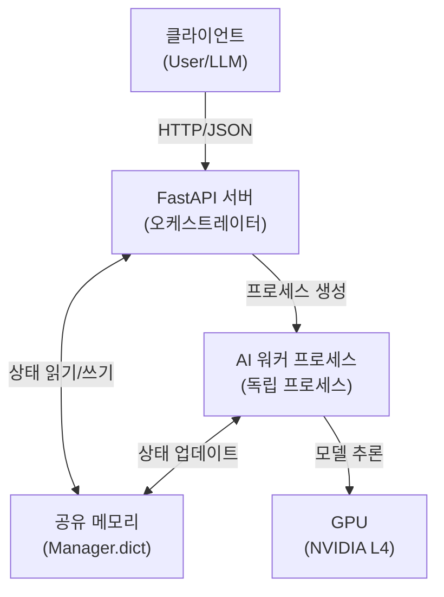

# nanoCocoa AI 광고 생성 서버 - 프로젝트 가이드

## 1. 프로젝트 개요

### 1.1. 배경 및 목적
- **주제**: 생성형 AI (Generative AI, 생성형 인공지능) 기술을 활용한 소상공인 광고 콘텐츠 제작 지원 서비스
- **목표**: 디자인 역량이 부족한 소상공인이 제품 이미지, 배너, 광고 문구 등을 손쉽게 생성하여 온라인 마케팅 진입 장벽을 낮출 수 있도록 지원
- **핵심 가치**: 비용 절감, 콘텐츠 제작 시간 단축, 마케팅 효율 증대
- **특화 타겟**: 전통시장 소상공인 (1차 특화: 건어물 상품 프롬프트 엔진)

### 1.2. 서비스 범위
- **타겟 유저**: 오프라인 중심의 개인/법인 사업자 (소상공인)
- **필수 기능**: 생성형 AI를 활용한 이미지 생성 기능 구현
- **제공 형태**:
  - FastAPI 기반 REST API 서버
  - MCP (Model Context Protocol, 모델 컨텍스트 프로토콜) 서버 (LLM 에이전트 연동)
  - FastAPI 기반 웹 애플리케이션 (향후 구현)

## 2. 프로젝트 구조

### 2.1. 디렉토리 구조

```
codeit-ai-3team-ad-content/
├── src/nanoCocoa_aiserver/          # 메인 서버 애플리케이션
│   ├── api/                         # FastAPI 라우터 및 앱
│   │   ├── app.py                   # FastAPI 앱 초기화
│   │   ├── middleware.py            # 미들웨어 설정
│   │   └── routers/
│   │       ├── generation.py        # 생성 관련 엔드포인트
│   │       ├── resources.py         # 리소스 확인 엔드포인트
│   │       ├── help.py              # 도움말 엔드포인트
│   │       └── dev_dashboard.py     # 개발 대시보드
│   ├── core/                        # 핵심 비즈니스 로직
│   │   ├── engine.py                # AI 모델 엔진
│   │   ├── processors.py            # 단계별 처리 로직
│   │   └── worker.py                # 멀티프로세싱 워커
│   ├── models/                      # AI 모델 래퍼
│   │   ├── base.py                  # 기본 모델 클래스
│   │   ├── segmentation.py          # BiRefNet (배경 제거)
│   │   ├── flux_generator.py        # FLUX (이미지 생성)
│   │   ├── sdxl_text.py             # SDXL ControlNet (3D 텍스트)
│   │   └── CompositionEngine.py     # 합성 엔진
│   ├── schemas/                     # Pydantic 스키마
│   │   ├── request.py               # 요청 스키마
│   │   ├── response.py              # 응답 스키마
│   │   └── metrics.py               # 메트릭 스키마
│   ├── services/                    # 비즈니스 서비스
│   │   ├── monitor.py               # 시스템 모니터링
│   │   ├── stats.py                 # 통계 관리
│   │   └── fonts.py                 # 폰트 관리
│   ├── utils/                       # 유틸리티 함수
│   │   ├── images.py                # 이미지 처리
│   │   └── MaskGenerator.py         # 마스크 생성
│   ├── mcp_server.py                # MCP 서버 구현
│   ├── setup_mcp.py                 # MCP 설정 도구
│   ├── config.py                    # 설정 및 상수
│   └── main.py                      # 서버 실행 엔트리포인트
├── tests/                           # 테스트 코드
│   ├── units/                       # 단위 테스트
│   │   ├── test_image_utils.py
│   │   ├── test_font_manager.py
│   │   ├── test_stats_manager.py
│   │   ├── test_sdxl.py
│   │   ├── test_flux.py
│   │   └── test_segmentation.py
│   ├── integration/                 # 통합 테스트
│   │   ├── test_api.py
│   │   └── test_concurrency.py
│   ├── mcp/                         # MCP 테스트
│   │   └── test_mcp_dummy.py
│   ├── conftest.py                  # pytest 설정
│   └── pytest.ini                   # pytest 옵션
├── docs/                            # 프로젝트 문서
│   └── doc/
│       ├── README.md                # 문서 목차
│       ├── 환경설정_가이드.md
│       ├── 완전한_설치_가이드.md
│       ├── MCP서버_사용가이드.md
│       ├── REFACTORING_SUMMARY.md
│       └── nanoCocoa_AI_Server_아키텍처설계.md
└── .claude/
    ├── project.md                   # 이 문서
    └── context.md                   # 컨텍스트 정보
```

## 3. 아키텍처 설계

### 3.1. 설계 목표

1. **자원 최적화 (Resource Optimization)**: 제한된 24GB VRAM 환경에서 거대 모델 (FLUX, SDXL)을 운용하기 위해 JIT (Just-In-Time, 적시 컴파일) 로딩 및 언로딩 전략 채택
2. **비동기 처리 (Asynchronous Processing)**: FastAPI 메인 스레드의 블로킹을 방지하기 위해 멀티프로세싱 (multiprocessing, 멀티프로세싱)을 활용하여 추론 작업 격리
3. **상태 보존 및 제어 (State Persistence & Control)**: 외부 데이터베이스 없이 인메모리 (In-Memory, 인메모리) 공유 객체를 통해 작업 단계별 결과물 저장 및 중간 재시작 (Resume, 재시작) 기능 제공
4. **MCP 호환성 (MCP Compatibility)**: LLM 에이전트가 도구로서 쉽게 호출할 수 있도록 명확한 API 스키마 (schema, 스키마)와 상태 코드 정의
5. **테스트 주도 개발 (TDD)**: 모든 기능은 단위 테스트 및 통합 테스트를 통과해야 함

### 3.2. 3단계 파이프라인

#### 3.2.1. Step 1: 배경 생성 (Background Generation)
1. BiRefNet으로 제품 배경제거 (배경 제거, segmentation, 세그멘테이션)
2. FLUX로 배경 이미지 생성 (T2I, Text-to-Image)
3. CPU에서 합성 (compositing, 합성) 및 그림자 생성
4. FLUX Img2Img로 리터칭 (refinement, 정제)
- **출력**: step1_result (배경과 합성된 상품 이미지)
- **진행률**: 0% → 33%

#### 3.2.2. Step 2: 텍스트 자산 생성 (Text Asset Generation)
1. CPU/PIL로 텍스트 레이아웃 및 Canny Map 생성
2. SDXL ControlNet으로 3D 텍스트 생성
3. BiRefNet으로 텍스트 배경 제거
- **출력**: step2_result (배경 제거된 3D 텍스트 이미지)
- **진행률**: 33% → 66%

#### 3.2.3. Step 3: 최종 합성 (Final Composition)
1. Step 1 결과 (배경)와 Step 2 결과 (텍스트) 합성
2. FLUX Inpainting을 사용한 지능형 합성
3. CPU/PIL로 최종 레이어 합성
- **출력**: final_result (최종 광고 이미지)
- **진행률**: 66% → 100%

### 3.3. 멀티프로세싱 아키텍처



### 3.4. GPU 메모리 관리 전략

- **JIT 로딩**: 모델을 필요할 때만 GPU에 로드
- **즉시 언로딩**: 사용 후 즉시 `del model` 및 `flush_gpu()` 호출
- **단일 작업 정책**: 동시에 하나의 작업만 처리하여 메모리 경합 방지
- **OOM 복구**: OutOfMemoryError 발생 시 자동 GPU 플러시 (flush, 플러시) 및 재시도

## 4. API 엔드포인트

### 4.1. 생성 관련

- **POST /generate**: AI 광고 생성 작업 시작 (Non-blocking)
- **GET /status/{job_id}**: 작업 상태 및 결과 조회
- **POST /stop/{job_id}**: 작업 강제 중단
- **GET /jobs**: 모든 작업 목록 조회
- **DELETE /jobs/{job_id}**: 작업 삭제

### 4.2. 리소스 확인

- **GET /health**: 서버 상태 및 GPU 가용성 확인
- **GET /fonts**: 사용 가능한 폰트 목록 조회
- **GET /help**: API 사용 가이드
- **GET /help/parameters**: 파라미터 레퍼런스
- **GET /help/examples**: 사용 예시

### 4.3. 개발 도구

- **GET /example_generation** (개발 모드): HTML 대시보드

## 5. 테스트 전략

### 5.1. 테스트 구조

- **단위 테스트 (Unit Tests)**: `tests/units/`
  - 개별 함수 및 클래스 테스트
  - GPU 미사용 (더미 모드)
  - 빠른 실행 (2-3초)

- **통합 테스트 (Integration Tests)**: `tests/integration/`
  - API 엔드포인트 테스트
  - 실제 FastAPI 서버 사용
  - 더미 모드 및 실제 모드 지원

- **MCP 테스트**: `tests/mcp/`
  - MCP 서버 인터페이스 테스트
  - 도구 및 리소스 검증

### 5.2. pytest 실행 옵션

```bash
# 기본 실행 (더미 모드 - GPU 미사용)
pytest

# 실제 AI 엔진 사용 (GPU 필요)
pytest --no-dummy

# 특정 마커만 실행
pytest -m unit          # 단위 테스트만
pytest -m integration   # 통합 테스트만
pytest -m slow          # 느린 테스트만

# HTML 리포트 생성
pytest --html=reports/report.html --self-contained-html

# 커버리지 측정
pytest --cov=src/nanoCocoa_aiserver --cov-report=html
```

### 5.3. 테스트 작성 규칙

1. **모든 새 기능은 테스트 필수**: 기능 구현 전 또는 후에 테스트 작성
2. **더미 모드 지원**: `@pytest.mark.dummy` 마커 사용
3. **명확한 테스트명**: `test_<function_name>_<scenario>` 형식
4. **독립적인 테스트**: 테스트 간 의존성 없음
5. **적절한 타임아웃**: 멀티프로세싱 테스트는 충분한 대기 시간 설정

## 6. 개발 워크플로우

### 6.1. 기본 개발 순서

1. **이슈 생성**: GitHub Issues에 작업 내용 등록
2. **브랜치 생성**: `feature/<기능명>` 또는 `fix/<버그명>`
3. **테스트 작성**: 기능 구현 전 테스트 작성 (TDD)
4. **기능 구현**: 실제 코드 작성
5. **테스트 실행**: 로컬에서 모든 테스트 통과 확인
6. **코드 리뷰**: PR 생성 및 팀원 리뷰
7. **병합**: main 브랜치에 병합

### 6.2. 로컬 개발 환경 설정

```bash
# 1. Conda 환경 생성
conda env create -f environment.yml
conda activate py311_ad

# 2. 서버 실행
cd src/nanoCocoa_aiserver
python main.py

# 3. 테스트 실행
cd tests
pytest -v

# 4. MCP 서버 설정 (선택)
python setup_mcp.py --install
```

### 6.3. 코드 스타일 가이드

- **PEP 484**: 타입 힌트 (type hint, 타입 힌트) 사용
- **Docstring**: 모든 함수 및 클래스에 문서 문자열 작성
- **명확한 변수명**: 약어 대신 전체 단어 사용
- **모듈 분리**: SRP (Single Responsibility Principle, 단일 책임 원칙) 준수
- **에러 처리**: 명시적인 예외 처리 및 로깅

## 7. 현재 구현 상태

### 7.1. 완료된 기능

- [x] 3단계 AI 광고 생성 파이프라인
- [x] FastAPI REST API 서버
- [x] MCP 서버 구현
- [x] 멀티프로세싱 아키텍처
- [x] GPU 메모리 관리
- [x] 동적 ETA 계산
- [x] 실시간 시스템 메트릭
- [x] 단계별 재시작 기능
- [x] 지능형 합성 엔진
- [x] 30+ 단위 테스트
- [x] API 통합 테스트
- [x] MCP 테스트
- [x] 개발 대시보드
- [x] 한글 폰트 지원
- [x] 리팩토링 완료 (모듈 분리, SRP 준수)

### 7.2. 향후 개발 계획

#### 7.2.1. Phase 1: UI/UX 개선 (우선순위: 높음)

- [ ] **FastAPI 웹 애플리케이션 개발**
  - 사용자 친화적 인터페이스
  - 드래그 앤 드롭 이미지 업로드
  - 실시간 진행률 표시
  - 결과 이미지 다운로드
  - 히스토리 관리

- [ ] **프롬프트 템플릿 시스템**
  - 업종별 프롬프트 템플릿 (건어물, 의류, 음식점 등)
  - 사용자 정의 템플릿 저장
  - 템플릿 공유 기능

#### 7.2.2. Phase 2: 기능 확장 (우선순위: 중간)

- [ ] **배치 처리 (Batch Processing)**
  - 여러 이미지 동시 처리
  - 큐 시스템 구현
  - 우선순위 관리

- [ ] **결과물 캐싱 (Caching)**
  - 중간 결과물 자동 저장
  - 디스크 캐시 관리
  - 캐시 유효성 검사

- [ ] **스타일 프리셋 (Style Presets)**
  - 자주 사용하는 스타일 저장
  - 프리셋 라이브러리 구축
  - 커뮤니티 프리셋 공유

- [ ] **다국어 지원**
  - 영어, 중국어, 일본어 텍스트 생성
  - UI 다국어화
  - 폰트 자동 선택

#### 7.2.3. Phase 3: 성능 최적화 (우선순위: 중간)

- [ ] **모델 최적화**
  - LoRA 파인튜닝 (Fine-tuning, 파인 튜닝)
  - 양자화 (Quantization, 양자화) 적용
  - 추론 속도 개선

- [ ] **동시성 개선**
  - 다중 작업 처리 (멀티 워커)
  - 작업 큐 시스템
  - 로드 밸런싱 (Load Balancing, 부하 분산)

- [ ] **메모리 효율화**
  - 더 작은 모델 버전 지원
  - 동적 배치 크기 조정
  - 메모리 프로파일링 (Profiling, 프로파일링)

#### 7.2.4. Phase 4: 프로덕션 준비 (우선순위: 낮음)

- [ ] **데이터베이스 연동**
  - 작업 히스토리 영구 저장
  - 사용자 관리
  - 통계 데이터 수집

- [ ] **인증 및 권한 관리**
  - JWT 토큰 기반 인증
  - API 키 관리
  - 사용량 제한 (Rate Limiting, 레이트 리미팅)

- [ ] **모니터링 및 로깅**
  - Prometheus 메트릭 수집
  - Grafana 대시보드
  - Sentry 에러 추적

- [ ] **Docker 및 CI/CD**
  - Docker 이미지 최적화
  - GitHub Actions 자동화
  - 자동 배포 파이프라인

- [ ] **성능 테스트**
  - 부하 테스트 (Load Testing)
  - 스트레스 테스트 (Stress Testing)
  - 벤치마킹 (Benchmarking, 벤치마킹)

#### 7.2.5. Phase 5: 고급 기능 (우선순위: 낮음)

- [ ] **AI 기반 자동 프롬프트 생성**
  - 이미지 분석 기반 프롬프트 추천
  - GPT-4V 연동
  - 자동 스타일 매칭

- [ ] **A/B 테스트 지원**
  - 여러 버전 자동 생성
  - 결과 비교 UI
  - 통계 분석

- [ ] **비디오 생성 지원**
  - AnimateDiff 연동
  - 짧은 광고 영상 생성
  - GIF 애니메이션 생성

## 8. 중요 참고사항

### 8.1. AI 바이브 코딩을 위한 가이드

1. **문서 우선**: 기능 구현 전 아키텍처 문서 작성
2. **테스트 주도**: 테스트를 먼저 작성하고 기능 구현
3. **점진적 개선**: 작은 단위로 커밋하고 자주 푸시
4. **명확한 커밋 메시지**: 변경 사항을 명확히 설명
5. **코드 리뷰**: 모든 PR은 최소 1명의 리뷰 필요
6. **보안 주의**: API 키, 비밀번호 등을 절대 커밋하지 않음

### 8.2. 디버깅 팁

- **로그 확인**: `logs/` 폴더의 로그 파일 검토
- **GPU 메모리**: `nvidia-smi` 명령으로 VRAM 사용량 확인
- **프로세스 상태**: `ps aux | grep python`으로 워커 프로세스 확인
- **테스트 격리**: 문제가 있는 테스트만 실행 (`pytest tests/units/test_specific.py::test_function`)
- **더미 모드**: GPU 없이 빠르게 테스트 (`pytest --dummy`)

### 8.3. 성능 벤치마크

**Nvidia L4 GPU 기준 예상 시간:**
- Step 1 (배경 생성): ~80초
- Step 2 (텍스트 생성): ~35초
- Step 3 (합성): ~5초
- **전체 파이프라인**: ~120초

### 8.4. 주의사항

1. **script 폴더 무시**: 기본적으로 무시 (레거시 코드)
2. **단일 작업만 지원**: 현재 버전은 동시에 하나의 작업만 처리
3. **VRAM 부족 시**: 다른 GPU 프로세스 종료 필요
4. **테스트 환경**: 반드시 `py311_ad` Conda 환경 사용
5. **브랜치 전략**: main 브랜치는 항상 배포 가능한 상태 유지

## 9. 문서 참조

### 9.1. 설치 및 설정
- [환경설정_가이드.md](../docs/doc/환경설정_가이드.md): 크로스 플랫폼 환경 설정
- [완전한_설치_가이드.md](../docs/doc/완전한_설치_가이드.md): FastAPI 및 MCP 서버 설치

### 9.2. 아키텍처 및 설계
- [nanoCocoa_AI_Server_아키텍처설계.md](../docs/doc/nanoCocoa_AI_Server_아키텍처설계.md): 상세 아키텍처 설계
- [REFACTORING_SUMMARY.md](../docs/doc/REFACTORING_SUMMARY.md): 리팩토링 요약

### 9.3. API 및 사용법
- [MCP서버_사용가이드.md](../docs/doc/MCP서버_사용가이드.md): MCP 서버 사용 가이드
- API 문서: http://localhost:8000/docs (서버 실행 후)

### 9.4. 개발 문서
- [TODO_DOCUMENTATION.md](../docs/doc/TODO_DOCUMENTATION.md): pytest 실행 옵션 가이드
- [MCP_IMPLEMENTATION_SUMMARY.md](../src/nanoCocoa_aiserver/MCP_IMPLEMENTATION_SUMMARY.md): MCP 구현 상세

## 10. 연락처 및 지원

- **프로젝트 관리**: 박지윤 (PM)
- **아키텍처**: 김명환
- **백엔드/프론트엔드**: 이건희
- **모델 연구 (이미지 특성 추출)**: 김민혁
- **모델 연구 (이미지 생성)**: 이솔형
- **GitHub**: https://github.com/krapnuyij/codeit-ai-3team-ad-content
- **이슈 트래커**: GitHub Issues
